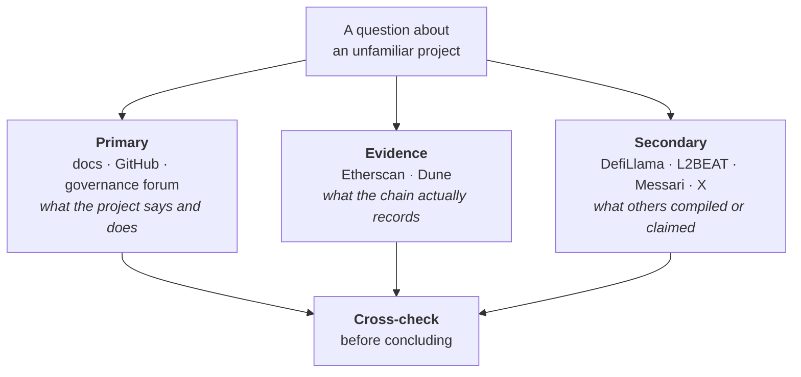

# Week 0 · Part 3 — The Web3 tool map

[Part 2](./day-2-glossary.md) gave you the words. This gives you the places those
words point to.

::: important The instinct this page is building
When someone asks *"is this project actually used, or does it just have a good
website?"*, an experienced person does not know the answer — they know **which
tab to open**.

That is most of what separates someone who can navigate this industry from
someone who can only repeat what they heard on X.
:::

You are not learning to use these tools today. You are learning that they exist
and what each is for.

## Learning objectives

- Name the right category of tool for a given question, without being told
- Explain what a block explorer shows you and why that matters
- Distinguish a primary source from an aggregator
- Recognise the tools this programme will actually put in your hands

## Core

### The map

Do not memorise this. Recognise it. **Bold** tools are ones you will personally
use.

| Tool | What do I open it for? | We use it in |
|---|---|---|
| <Icon name="logos:metamask-icon" /> **MetaMask** | Create a wallet, sign and send transactions | Week 1 |
| **Etherscan** | Check what actually happened on Ethereum | Weeks 1–3 |
| Solscan | The same, for Solana | Landscape |
| <Icon name="simple-icons:github" /> **GitHub** | Read a protocol's code, and store your Proof of Work | Weeks 0, 4–8 |
| **Remix** | Write and deploy a simple smart contract | Week 3 |
| **DefiLlama** | Compare protocols and chains by size | Weeks 2, 4 |
| **Dune** | Explore on-chain data and dashboards | Week 4 |
| L2BEAT | Understand Layer 2 security and trust assumptions | Weeks 2, 4 |
| Messari Research | Read structured professional research | Week 4 |
| Snapshot, governance forums | See how a change gets decided | Week 4 |
| <Icon name="simple-icons:x" /> X, Discord, Telegram | Find out what is happening right now | Week 4 |

::: important The teaching idea is one arrow
> **Question → Tool**

You are not memorising a directory. You are building the reflex of knowing which
tab to open when you have a specific question.
:::

### The one idea that makes the map make sense

Everything above sorts into three kinds of source. Knowing which kind you are
looking at is more useful than knowing any individual tool.

::: warning The practical rule
**Use social media for discovery, not as the final evidence for an important
claim.** X is excellent for finding out that something happened. It is a poor
place to confirm it happened the way someone says it did.
:::

### The tools you'll actually touch

:::: tabs
@tab Wallets

A wallet does not hold your coins. It holds the **keys** that let you authorise
changes to a shared record — the coins were never anywhere but the blockchain.
Week 1 covers this properly.

| Wallet | Chains | Note |
|---|---|---|
| <Icon name="logos:metamask-icon" /> **MetaMask** | Ethereum and EVM chains | The default for this programme |
| <Icon name="token-branded:phantom" /> Phantom | Solana, plus others | The Solana equivalent |
| <Icon name="token-branded:rabby" /> Rabby | Ethereum and EVM chains | Shows more clearly what you are about to sign |

You will install MetaMask in Week 1, **not today** — and it will be a fresh
wallet holding testnet assets only.

@tab Block explorers

A search engine for a blockchain. Every transaction, address, contract and fee —
all public, readable by anyone, no account required.

::: tip This is a genuinely unusual property
You cannot look up a stranger's bank transfer. You *can* look up any transaction
that has ever happened on Ethereum.
:::

On [Etherscan](https://etherscan.io/) you can check:

- whether a transaction succeeded or failed, and what it cost
- everything an address has ever done
- the **verified source code** of a contract, if its developers published it
- which tokens an address holds

That third one is the quiet one. A contract with unverified source code is a
program nobody outside the team can inspect. You will use this in Week 3.

Solana's equivalent is [Solscan](https://solscan.io/).

@tab Aggregators

Two sites answer "how big is this thing, compared to that thing" faster than
anything else:

| Site | Answers |
|---|---|
| **[DefiLlama](https://defillama.com/)** | Value deposited across protocols and chains |
| **[L2BEAT](https://l2beat.com/)** | Ethereum Layer 2s, with an unusually honest treatment of each one's risks and trust assumptions |

::: warning Aggregators are interpretations
Someone chose what counts as "value locked" and what does not. Useful for
comparison, not for settling a disputed claim.
:::
::::

## Landscape

Recognise these; you will not use them before Week 4.

| Tool | What it's for |
|---|---|
| **Dune** | Write SQL against blockchain data and publish charts |
| **Messari Research** | Structured, professional sector and protocol research |
| **Snapshot** | Off-chain governance voting, used by most DAOs |
| **Governance forums** | Where proposals get argued before anyone votes. Often the most informative thing about a protocol |
| **The Graph** | Indexes chain data so applications can query it |
| **OpenZeppelin** | Audited standard contract libraries, used almost everywhere |
| **Alchemy / Infura** | Infrastructure providers running nodes so applications don't have to |
| **Foundry / Hardhat** | Professional developer toolkits. Not needed in Foundation |

## Worked example

> **"Is Base actually used, or is the activity mostly marketing?"**

Watch which tab opens at each step.

| Step | Tool | What it tells you | What it doesn't |
|---|---|---|---|
| 1. What does it claim to be? | [base.org](https://base.org) + docs | An Ethereum L2 built by Coinbase | Whether any of it is used |
| 2. What is the trust model? | [L2BEAT](https://l2beat.com/) | Who can upgrade it, how withdrawals are secured | Usage |
| 3. Is value actually on it? | [DefiLlama](https://defillama.com/) | Value deposited, and the trend | Whether it's a few whales |
| 4. Who is doing the activity? | [Dune](https://dune.com/) | Active addresses over time | Intent |
| 5. What are people saying? | X, Discord | Current narrative, complaints | Anything verified |

::: important Notice the ordering
Steps 1–2 are primary. Steps 3–4 are evidence. Step 5 is discovery.

A beginner starts at step 5 and stops there, because it is the loudest and
easiest. This workflow starts with what can be **checked** and uses social media
last, for context rather than proof.
:::

Also notice what no tool told you: **whether Base is a good investment.** No tool
on this page answers that, and nothing in this programme is financial advice.

::: details Further exploration — optional, not assessed
- [ethereum.org — Block explorers](https://ethereum.org/developers/docs/data-and-analytics/block-explorers/) — what explorers index and how
- [L2BEAT](https://l2beat.com/) — read one network's risk summary. The clearest public writing on trust assumptions you will find
- [Dune](https://dune.com/) — browse public dashboards. No account needed to look
:::

::: details Sources and attribution
- [ethereum.org — Wallets](https://ethereum.org/wallets/) — Reuse (CC BY 4.0), adapted
- [ethereum.org — Block explorers](https://ethereum.org/developers/docs/data-and-analytics/block-explorers/) — Reuse (CC BY 4.0), adapted
- [Etherscan](https://etherscan.io/) · [L2BEAT](https://l2beat.com/) · [DefiLlama](https://defillama.com/) · [Dune](https://dune.com/) · [Remix IDE](https://remix.ethereum.org/) — Link, referenced only
:::
