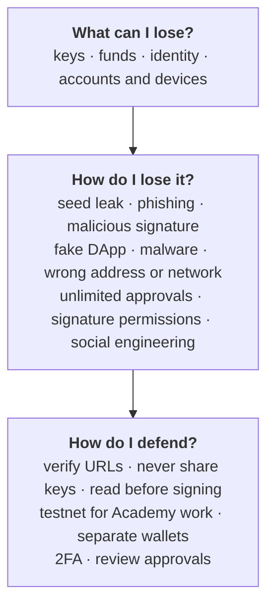

# Week 0 · Part 4 — Staying safe: what you can lose and how

::: danger This is the most important page in Week 0
Everything else you learn here is recoverable. Misunderstand consensus and you
read another explanation. **Misunderstand a signature request and the loss is
permanent** — no support line, no chargeback, no reversal.

The property that makes blockchains useful — nobody can undo a valid
transaction — is exactly the property that makes mistakes final.
:::

The good news: the attacks are boring. Almost nobody loses assets to
sophisticated cryptography being broken. They lose them to a fake website, a
signature they did not read, or a message from someone pretending to be helpful.

## Learning objectives

- List what is actually at risk, and which losses are permanent
- Recognise the common attack patterns before they reach the point of decision
- Explain why signing a message can be as dangerous as sending funds
- Apply the testnet-only and no-keys rules without needing to be reminded

## Core

### A threat model in three questions

### What can I lose

| Asset | Recoverable? |
|---|---|
| **Keys** — your seed phrase or private key | **Never.** Whoever holds them *is* you, permanently |
| **Funds** — assets in a wallet you control | **Never**, once a valid transaction confirms |
| **Identity** — the reputation tied to your address | Hard. Your address history is permanent and public |
| **Accounts and devices** — email, GitHub, Telegram, your machine | Usually, with effort. But they are the route to everything above |

::: important Two things follow from that table
Your seed phrase is **not like a password** — a password can be reset, and this
cannot.

And securing your email and your laptop **is** Web3 security, because that is
how attackers reach the rest.
:::

### How people actually lose things

:::: tabs
@tab Seed phrase leak

The seed phrase is 12 or 24 words that regenerate your entire wallet. Anyone
holding it holds your assets, from anywhere, forever.

It leaks in unremarkable ways: typed into a fake "wallet validation" page, saved
in a screenshot or cloud note, pasted into a chat, or entered into a "support
tool".

::: danger No exceptions exist, and that is the whole point
**No legitimate website, app, wallet, or person ever needs your seed phrase.**
Not to help you, not to verify you, not to fix a stuck transaction.

The belief that there might be one exception is what the entire attack depends
on.
:::

@tab Phishing and fake DApps

A near-perfect copy of a real site, reached through a sponsored search result, a
Discord link, a reply to a support post, or a lookalike domain. The site works
exactly as expected until the moment you approve something.

**Fake contracts** are the same idea one layer down: an application that looks
real but whose contract does something other than advertised. Verified source
code on a block explorer is one check — it is not proof of good intent.

@tab Malicious signatures

**This is the one beginners never see coming.**

You can lose assets **without sending a transaction**. Some signature requests
are not payments — they are permissions. Sign the wrong one and you have
authorised someone to move your tokens later, at a time of their choosing.

There is no visible loss at the moment you sign. Week 3 covers the mechanics;
for now, know that "just signing a message" is not automatically safe.

@tab Approvals and malware

**Unlimited approvals.** When you let an application spend a token, many request
an *unlimited* allowance for convenience. That permission persists indefinitely.
If that contract is compromised months after you last used it, the allowance is
still live. Old approvals are a standing liability.

**Malware.** Clipboard hijackers that swap a copied address for the attacker's.
Fake wallet extensions in browser stores. Cracked software.

**Wrong address or network.** Send to a mistyped address and it is gone. Send an
asset over the wrong network and recovery ranges from difficult to impossible.

@tab Social engineering

The most effective of all, and the one that does not look technical. A helpful
stranger in a group chat. A "team member" who DMs first. A job offer with a test
file. An urgent deadline on a free airdrop.

::: warning Notice the shared ingredient
**Urgency plus helpfulness.** Real support does not DM you first, does not rush
you, and does not need your keys. Anything combining those three is an attack,
regardless of how convincing the profile picture is.
:::
::::

### Basic defence

| Habit | Why |
|---|---|
| **Verify the URL every time** | Bookmark the real site and use the bookmark. Never reach a wallet or protocol through a search ad, a DM, or a forwarded link |
| **Never share keys** | No exceptions. Nobody needs them |
| **Read before signing** | Which network, which contract, which token, how much, what permission. If the wallet cannot explain it plainly, reject it |
| **Use testnet for Academy work** | Every required activity here is testnet only. A mistake costs nothing |
| **Separate wallets** | One for learning. A different one for anything you would mind losing. They should share nothing |
| **Turn on 2FA** | Email, GitHub, exchange accounts. An authenticator app, not SMS |
| **Review approvals** | Periodically revoke old allowances at [revoke.cash](https://revoke.cash/) |
| **Write the seed phrase on paper** | Offline. Not a screenshot, not a cloud note |

### The Academy's rules

::: danger These hold for all eight weeks and have no exceptions
**1. Testnet only.** Every hands-on activity uses a test network. Testnet coins
are free and worth nothing. No Academy mission will ever require real money,
mainnet, or a wallet holding real assets.

**2. Nobody asks for your keys.** No reviewer, organiser or committee member
will ever ask for your seed phrase or private key. Anyone who asks is an
impersonator, regardless of what their profile says.
:::

If a submission ever seems to require real money, stop and ask. You are not
missing something — either we made an error, or the instruction is not from us.

## Landscape

- **Hardware wallet** — a device keeping keys offline. The standard for meaningful value; not needed for testnet work
- **Multisig** — a wallet requiring several signers
- **Smart contract audit** — a paid security review. Reduces risk; audited protocols still get exploited
- **Blind signing** — approving a request your wallet cannot decode. Avoid
- **Address poisoning** — an attacker sends dust from an address resembling one you use, hoping you copy it from your history later
- **Rug pull** — a project's own team removing value or abandoning it

## Guided walkthrough

No wallet yet — that is Week 1. Do the account hardening now instead.

::: steps
1. **Turn on 2FA**

   For your email, GitHub, and any exchange account, using an authenticator app
   rather than SMS. *Each should now prompt for a code at login.* Your email is
   the recovery path for everything else, so it matters most.

2. **Bookmark the real sites**

   [metamask.io](https://metamask.io), [etherscan.io](https://etherscan.io),
   [remix.ethereum.org](https://remix.ethereum.org). Reach them only through
   these bookmarks from now on.

3. **Decide where your seed phrase will live**

   Before Week 1 creates one. Paper, offline, somewhere you will not lose it.
   Decide now, while nothing is at stake.

4. **Practise the pause**

   Before approving anything in a wallet, ask: *which network, which contract,
   what am I actually authorising?* Building the habit on testnet, where errors
   are free, is the entire point of doing this on testnet.
:::

<figure class="academy-shot">
  

    Screenshot needed
    A MetaMask signature request, with the network, contract address and requested permission each circled.
  

  <figcaption>The three things to read before you approve anything. Practise on testnet, where getting it wrong is free.</figcaption>
</figure>

## Worked example

Two requests. One is a payment. One is a permission. Both arrive as a wallet
pop-up.

::: tabs
@tab Request A — a payment

> Send 0.05 ETH to `0x742d…f44e` on Ethereum Mainnet.
> Estimated fee: 0.0012 ETH.

**Bounded.** Worst case, you lose 0.05 ETH plus the fee.

Check the network, check the address character by character against your source,
confirm.

@tab Request B — a permission

> Allow `0x9c8a…21b7` to spend your USDC. Amount: **Unlimited**.

Nothing moves when you sign. No funds leave. Nothing appears to happen.

You have granted permission to move **all your USDC, at any point in the
future**. If that contract is malicious, your balance is gone in the next block.
If it is honest but compromised in six months, your balance is gone then — and
you will have forgotten this moment entirely.

Permissions like this arrive two ways, and **both matter**:

| | What it looks like |
|---|---|
| **On-chain approval** | A transaction. Costs gas. Sets an allowance on-chain |
| **Signature-based permission** | Often no gas at all. Someone else submits it later |

The second one can feel harmless precisely because it costs nothing.
:::

::: important Request B is the more dangerous one, and it looks like nothing happened
That is the entire lesson of this page.

**"No gas" does not mean "safe."** Cost is not the signal. What you are
authorising is the signal.

**The defence:** set a spending cap instead of unlimited where the wallet allows
it, and revoke permissions you no longer use.
:::

::: details Further exploration — optional, not assessed
- [ethereum.org — Security](https://ethereum.org/security/) — a fuller treatment of the same threats
- [Revoke.cash](https://revoke.cash/) — inspect and revoke token approvals. Worth looking at before you have any to revoke
- [MetaMask support — security basics](https://support.metamask.io/) — wallet-specific guidance from the vendor
:::

::: details Sources and attribution
- [ethereum.org — Security](https://ethereum.org/security/) — Reuse (CC BY 4.0), adapted
- [ethereum.org — Smart contract security](https://ethereum.org/developers/docs/smart-contracts/security/) — Reuse (CC BY 4.0), adapted
- [MetaMask — Support](https://support.metamask.io/) — Link, referenced only
- [Revoke.cash](https://revoke.cash/) — Link, referenced only
:::
