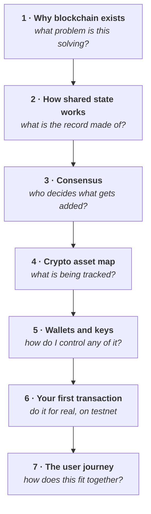

# Week 1 — Web3, blockchain, crypto assets and wallets

<Badge type="info" text="7 parts" /> <Badge type="tip" text="100 points" /> <Badge type="warning" text="Testnet only" />

> **Core question — why does Web3 exist, and how do blockchain assets and
> accounts actually work?**

This is where Week 0's vocabulary turns into a working mental model, and the
week you first touch a wallet. It ends with you having sent a real transaction
on a test network and being able to explain what happened.

| Part | Page | Reading |
|---|---|---|
| 1 | [Why blockchain exists](./day-1-why-blockchain-exists.md) | 12 min |
| 2 | [How shared state works](./day-2-how-shared-state-works.md) | 15 min |
| 3 | [Consensus, and how chains agree](./day-3-consensus.md) | 16 min |
| 4 | [What crypto assets actually are](./day-4-crypto-asset-map.md) | 15 min |
| 5 | [Wallets, accounts and keys](./day-5-wallets-and-accounts.md) | 16 min |
| 6 | [Your first transaction](./day-6-your-first-transaction.md) | 30 min hands-on |
| 7 | [How it all connects: one user journey](./day-7-the-user-journey.md) | 12 min |

**Anchor Mission:** [Week 1 mission](./anchor-mission.md) · 100 points

## The arc

Each part answers the question the previous one leaves open.

## Before you start

::: warning Part 6 needs a wallet — but not yet
You install one **during** that page, and it will be a fresh wallet holding
testnet assets only. If you have not read
[Week 0 Part 4](../week-0/day-4-safety.md), read it before Part 5.
:::

::: details Structural note — why Week 1 has seven parts, not six
The Foundation v1.2 keep-list placed blocks, transactions, nodes, cryptography
intuition, consensus intuition and PoW vs PoS on a single page. That is five to
six concepts in a programme built on light workload, so consensus and PoW vs PoS
were split onto Part 3. No page in this week now exceeds the weight of Part 1.
:::
