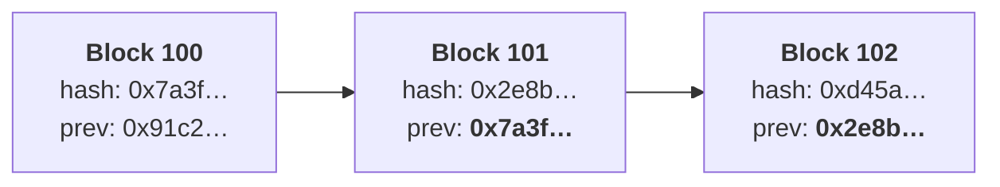

# Week 1 · Part 2 — How shared state works

[Part 1](./day-1-why-blockchain-exists.md) ended with a claim: many independent
computers can maintain one shared record without any of them being in charge.
That is easy to say and not at all obvious how to build.

Today is the machinery. [Part 3](./day-3-consensus.md) answers the remaining
question — *who decides what gets added next* — but none of that makes sense
until you know what is being added.

## Learning objectives

- Describe what a transaction is and what makes one valid
- Explain what a block is and why transactions are batched
- Explain what a node does and why thousands of them exist
- Explain, without maths, how a hash makes tampering detectable

## Core

### State is just "how things are right now"

Strip away the jargon and a blockchain maintains one thing: **state**.

```text
Address 0xAB…  →  4.2 ETH
Address 0xCD…  →  0.1 ETH, 300 USDC
Contract 0xEF… →  a list of who owns which NFT
```

A blockchain is a machine for changing that, by agreed rules, in a way everyone
can verify. **Only one thing changes state: a transaction.**

### Transactions

A transaction is a **signed instruction to change state**. Not a payment,
exactly — payments are one kind. Others deploy programs, call functions, or
grant permissions.

| Field | What it is |
|---|---|
| **From** | The address requesting the change |
| **To** | The recipient address, or a contract being called |
| **Value** | How much of the native asset to move, if any |
| **Data** | What to run, for a contract call. Empty for a plain transfer |
| **Nonce** | A counter, so the same transaction can't be replayed |
| **Fee fields** | What you'll pay for the work — Part 6, and Week 2 |
| **Signature** | Cryptographic proof the sender authorised this |

::: important That last field carries the whole security model
No signature, no valid transaction. And crucially, **the signature can be
checked by anyone** — without contacting the sender, and without any authority
confirming their identity.
:::

A transaction is valid if it is correctly signed, the sender has the balance, the
nonce is right, and it obeys the rules. Every participant checks this
independently. **Nobody takes anyone's word for it.**

### Blocks

Transactions are gathered into **blocks** — a batch, plus a header, added as a
unit. Two reasons, and the second is the interesting one:

| | Why |
|---|---|
| **Efficiency** | Agreeing once on a batch of hundreds beats agreeing hundreds of times |
| **Ordering** | Order determines outcome. If an address holds 1 ETH and two transactions each try to spend it, which succeeds depends entirely on which comes first |

Each block references the one before it, which is what makes it a chain:



Ethereum produces a block roughly every 12 seconds. Bitcoin, roughly every 10
minutes. Week 2 covers why they differ.

### Hashing, without the maths

A **hash function** takes any input and produces a fixed-length fingerprint.

```text
"blockchain"   →  ef7797e13d3a75526946a3bcf00daec9fc9c9c4d51ddc7cc5df888f74dd434d1
"blockchain."  →  62cbcc24a6f9c60fdb8f32183cf3a10ab4b28d66aa8167043027a81d51a0b392
```

These are real SHA-256 values. You can check them yourself — on macOS or Linux:

```bash
printf '%s' 'blockchain' | shasum -a 256
```

Three properties are all you need:

| Property | Why it matters |
|---|---|
| Same input, same output, always | Anyone can independently verify a hash |
| Any change, however tiny, changes the output completely | Tampering is detectable |
| You cannot work backwards from the output | The fingerprint reveals nothing about the input |

Now combine that with the chain of blocks.

Change one transaction in block 100 and block 100's hash changes. But block 101
stored the *old* hash as its "previous" field — so block 101 no longer matches.
Fix block 101 and its own hash changes, breaking block 102. And so on, to the
present, on every copy held by every participant worldwide.

::: important This is why blockchains are described as immutable
Not because the data is locked, but because **altering anything invalidates
everything after it**, publicly and instantly.
:::

::: details Two related terms, at recognition level
A **digital signature** uses related maths to prove a message came from the
holder of a specific key without revealing that key. Part 5 returns to this.

A **Merkle tree** hashes transactions together in pairs so a whole block reduces
to one fingerprint — and so you can prove one transaction is in a block without
downloading the block. Further Exploration.
:::

### Nodes

A **node** is a computer running the network's software. Each one:

- holds a copy of the chain and current state
- receives new transactions and blocks and independently checks every rule
- discards anything invalid, no matter who sent it
- relays what's valid to its peers

::: important The third point is the one to sit with
A node does not trust the block producer. It **re-executes and re-verifies
everything itself**. An invalid block is not rejected by a committee — it is
independently ignored by everyone at once, because every participant checked.
:::

This is also where Part 1's honesty about cost returns. Thousands of machines
independently redoing identical work is the opposite of efficient. **That
redundancy is the product** — it is what you are buying when you remove the
operator.

## Landscape

- **Full node** — verifies everything and holds recent state. What most people run
- **Archive node** — keeps every historical state. Storage-heavy; used by explorers
- **Light client** — verifies block headers without holding the full chain. One way to check the chain without running a full node
- **Mempool** — the waiting room of submitted-but-not-yet-included transactions
- **Genesis block** — block zero, the start of the chain
- **Fork** — when the chain temporarily splits, or when the rules themselves change
- **Merkle tree** — the hash structure summarising a block's transactions

## Worked example

Follow one transaction from your screen to permanence.

| Step | What happens | Who's involved |
|---|---|---|
| 1 | You request: send 0.05 ETH to Ben | You |
| 2 | Your wallet signs it with your private key | Your wallet, locally |
| 3 | It's broadcast to a node, which checks signature, balance and nonce | One node |
| 4 | Valid, so it's relayed to peers. It sits in the mempool | The network |
| 5 | A block producer selects it and includes it in a block | One producer |
| 6 | The block is broadcast. **Every node re-verifies every transaction in it** | Every node |
| 7 | Nodes apply it. Your balance drops, Ben's rises | Everyone |

Now the counterfactual. Suppose at step 5 the producer quietly edits your
transaction to send 5 ETH to themselves instead.

The edit breaks your signature — and your signature is checkable by anyone
holding your public address. At step 6, every node checks it, finds it invalid,
and **discards the entire block**. The producer wasted their effort and gained
nothing.

::: important Nobody adjudicated. No authority intervened.
The block was rejected everywhere simultaneously because everyone verified
independently.

That is what "trustless" actually means, and it is much less mystical than it
sounds: **you don't have to trust anyone, because you can check.**
:::

::: details Further exploration — optional, not assessed
- [ethereum.org — Blocks](https://ethereum.org/developers/docs/blocks/) — full block structure
- [ethereum.org — Transactions](https://ethereum.org/developers/docs/transactions/) — every field, precisely
- [ethereum.org — Merkle trees](https://ethereum.org/developers/docs/data-structures-and-encoding/patricia-merkle-trie/) — how a block reduces to one hash. Genuinely elegant, entirely optional
:::

::: details Sources and attribution
- [ethereum.org — Blocks](https://ethereum.org/developers/docs/blocks/) — Reuse (CC BY 4.0), adapted
- [ethereum.org — Transactions](https://ethereum.org/developers/docs/transactions/) — Reuse (CC BY 4.0), adapted
- [ethereum.org — Nodes and clients](https://ethereum.org/developers/docs/nodes-and-clients/) — Reuse (CC BY 4.0), adapted
- [ethereum.org — Intro to Ethereum](https://ethereum.org/developers/docs/intro-to-ethereum/) — Reuse (CC BY 4.0), adapted
:::
