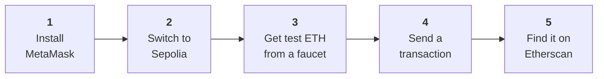

# Week 1 · Part 6 — Your first transaction

::: danger Testnet only
Everything on this page uses free test assets with no monetary value. **Never
use real funds for an Academy activity.**
:::

Five parts of theory. Today you use it.



By the end you will have sent a transaction and found it on a public block
explorer, where it will sit permanently, readable by anyone, without you having
an account anywhere.

::: important This is also your Anchor Mission evidence
Work carefully and keep what you produce — the address, the hash, and the link.
:::

## Learning objectives

- Install and set up a wallet, and secure its recovery phrase
- Obtain testnet ETH and explain why it is free and worthless
- Send a transaction and explain each field you confirmed
- Read your own transaction on a block explorer

## Core

### Gas, briefly

You pay a fee for every transaction, called **gas**. Two reasons: it compensates
whoever does the work, and it stops anyone flooding the network with junk for
free.

| Term | Meaning |
|---|---|
| **Gas used** | How much computation the transaction took. A plain transfer always costs 21,000 units |
| **Gas price** | What you pay per unit, in **gwei** (one billionth of an ETH) |
| **Transaction fee** | Gas used × gas price. What actually leaves your balance |

::: tip The key idea
**Complexity costs more.** Sending ETH is the cheapest thing you can do. Calling
a contract costs more. Deploying one costs much more — you will feel this in
Week 3.
:::

## Guided walkthrough

Take your time. Nothing here is timed, and the habits matter more than the speed.

:::: steps
1. **Install MetaMask**

   Go to **[metamask.io](https://metamask.io)** — type it or use the bookmark
   you made in Week 0.

   ::: danger Do not reach it through a search advert
   Fake wallet extensions are a routine attack and they look correct.
   :::

   Install the browser extension and choose **Create a new wallet**. Set a
   strong password — this encrypts the wallet on *this device only*. It is not
   your recovery phrase.

2. **Write down your recovery phrase**

   You will be shown a **12-word recovery phrase**.

   ::: danger Stop here — this is the irreversible one
   Write the twelve words on paper, in order.

   **Never:** a screenshot · a cloud note · a message to yourself

   Anyone who obtains these words controls this wallet permanently, from
   anywhere. This is a fresh wallet that will only ever hold worthless test
   assets — so practise storing the phrase properly **now**, while the stakes
   are zero.
   :::

   Confirm the phrase when prompted. *You should now see a wallet with one
   account and a balance of 0 ETH.*

3. **Switch to Sepolia**

   MetaMask opens on Ethereum Mainnet. Open the network dropdown at the top
   left, enable **Show test networks** in settings if needed, and select
   **Sepolia**.

   *Your balance should read 0 SepoliaETH, with the network name visible on the
   main screen.*

   ::: warning Check this every single time from now on
   **Which network am I on** is the first question of every transaction.
   Confusing the two is a classic and expensive mistake.
   :::

4. **Get test ETH from a faucet**

   A **faucet** gives out free testnet ETH. It is free because it is worth
   nothing — that is the design.

   Copy your address from MetaMask (`0x`, 42 characters), then:

   | Faucet | Note |
   |---|---|
   | [Google Cloud Web3](https://cloud.google.com/application/web3/faucet/ethereum/sepolia) | **Try this first.** Needs a Google account |
   | [Alchemy Sepolia](https://www.alchemy.com/faucets/ethereum-sepolia) | Typically requires a small Ethereum **Mainnet** balance to qualify, which you may not have |

   *Funds usually arrive within a minute. Your balance should change from 0 to
   something like 0.05 SepoliaETH.*

   ::: warning Faucets break constantly
   They run dry, change rules, or add requirements. If one fails, try another —
   do not assume you did something wrong. Ask in the Telegram group; someone
   will know which one is working today.
   :::

   ::: danger Never pay for testnet ETH
   Testnet ETH is worthless by definition, so anyone selling it is running a
   scam. There is also **no way to move assets between testnet and mainnet**,
   and anyone offering that is also running a scam. Never connect a wallet
   holding real assets to a faucet.
   :::

5. **Send a transaction**

   You will send a small amount to yourself. It is a real transaction in every
   respect, and it needs no second person.

   In MetaMask choose **Send**, paste **your own address** as the recipient, and
   enter a small amount such as **0.001**.

   On the confirmation screen, **read every line before confirming**:

   | Check | Should say |
   |---|---|
   | Network | Sepolia |
   | To | Your address |
   | Amount | 0.001 SepoliaETH |
   | Estimated fee | A small amount of SepoliaETH |

   This is the pause from [Week 0 Part 4](../week-0/day-4-safety.md). Practise
   it here, where it is free.

   Choose **Confirm**. *The status should move from Pending to Confirmed within
   about 15 seconds.*

   **Copy the transaction hash** — `0x`, 66 characters. You need it for the
   Anchor Mission.

6. **Find it on the explorer**

   Go to **[sepolia.etherscan.io](https://sepolia.etherscan.io)** and paste your
   transaction hash into the search box.

   Your transaction appears — permanently, publicly, with no account required.
::::

<figure class="academy-shot">
  <div class="academy-shot-pending" role="img" aria-label="Screenshot pending: the MetaMask send confirmation screen with network, recipient, amount and estimated fee highlighted.">
    <span class="academy-shot-label">Screenshot needed</span>
    <span class="academy-shot-what">The MetaMask confirmation screen at step 5, with Network, To, Amount and Estimated fee each highlighted.</span>
  </div>
  <figcaption>Four fields, every time, before you confirm. On Sepolia this habit is free to build.</figcaption>
</figure>

### Reading the explorer

Every field is something you now understand.

| Field | What it tells you |
|---|---|
| **Status** | Success or failed. Failed transactions still cost gas |
| **Block** | Which block included it, and how many have followed |
| **From / To** | The addresses involved |
| **Value** | How much moved |
| **Transaction Fee** | What you actually paid |
| **Gas Used** | 21,000 for a plain transfer — always |
| **Nonce** | Your account's counter |

*You should be able to point at each field and say what it means.* If any is
unclear, that is the signal to reread [Part 2](./day-2-how-shared-state-works.md).

::: important Notice what just happened
You looked up a financial transaction on a public website, with no login, no
permission, and no relationship with anyone. Anyone in the world can do the same
with your hash.

That is what "public ledger" means in practice — and it is worth deciding how
you feel about it, because it applies to everything you do on-chain.
:::

## Landscape

- **Pending / dropped / replaced** — a transaction can wait, be discarded, or be superseded by one with a higher fee
- **Speed up / cancel** — resubmitting with a higher fee and the same nonce
- **Nonce ordering** — transactions from one address execute in strict nonce order, so a stuck low nonce blocks everything behind it
- **Wei / gwei / ether** — units. 1 ether = 10⁹ gwei = 10¹⁸ wei
- **Failed transactions still cost gas** — the work was done even though the outcome reverted

## Worked example

A completed transaction, field by field.

```text
Status:            Success
Block:             4,782,109  (37 block confirmations)
From:              0x3f7a…c214   ← your address
To:                0x3f7a…c214   ← also your address
Value:             0.001 ETH
Transaction Fee:   0.000021 ETH
Gas Used:          21,000
Nonce:             0
```

Read it back in plain English:

> Address `0x3f7a…c214` sent 0.001 test ETH to itself. It was included in block
> 4,782,109, and 37 blocks have followed — so it is settled. It used exactly
> 21,000 gas, the fixed cost of a plain transfer. Nonce 0 means this was the
> first transaction this address ever made.

Now connect it to the theory:

| What you see | Which part explains it |
|---|---|
| **You signed it** with your private key, so the network accepted it as authorised | [Part 5](./day-5-wallets-and-accounts.md) |
| **Every node independently verified** the signature, balance and nonce | [Part 2](./day-2-how-shared-state-works.md) |
| **Consensus** put it in one agreed position in one agreed history | [Part 3](./day-3-consensus.md) |
| **The ETH** is a native asset, which is why it could pay its own fee | [Part 4](./day-4-crypto-asset-map.md) |

::: important That is Week 1 in a single transaction
The [Anchor Mission](./anchor-mission.md) asks you to explain exactly this, in
your own words, about your own hash.
:::

::: details Further exploration — optional, not assessed
- [ethereum.org — Gas and fees](https://ethereum.org/developers/docs/gas/) — how fees are actually calculated
- Look up a **failed** transaction on Etherscan and work out why. Understanding failure teaches more than success
- Find a large, busy address and scroll its history. A useful sense of what *public* really means
:::

::: warning Maintainer note — testnet end-of-life
**Sepolia has a scheduled end-of-life of approximately 30 September 2026.** A
successor testnet is expected to run in parallel during a grace period.

Verify the current recommended Ethereum application testnet before each cohort
and update this page, [Part 5](./day-5-wallets-and-accounts.md), the
[Week 1 Anchor Mission](./anchor-mission.md) and all of Week 3 together — they
share this dependency. Faucet eligibility rules also change frequently and
should be re-tested before each cohort.
:::

::: details Sources and attribution
- [ethereum.org — Networks](https://ethereum.org/developers/docs/networks/) — Reuse (CC BY 4.0), adapted
- [ethereum.org — Gas and fees](https://ethereum.org/developers/docs/gas/) — Reuse (CC BY 4.0), adapted
- [ethereum.org — Block explorers](https://ethereum.org/developers/docs/data-and-analytics/block-explorers/) — Reuse (CC BY 4.0), adapted
- [MetaMask — Support](https://support.metamask.io/) — Link, referenced only
- [Google Cloud Web3 — Ethereum Sepolia faucet](https://cloud.google.com/application/web3/faucet/ethereum/sepolia) — Link, referenced only
:::
