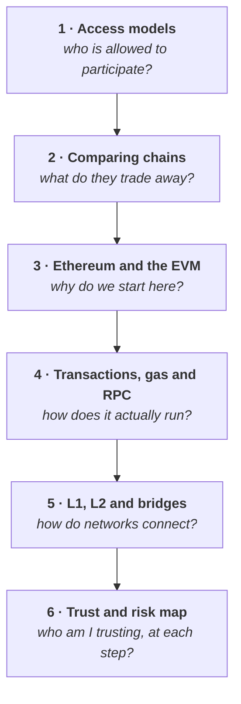

# Week 2 — Blockchain architectures, Ethereum and interoperability

<Badge type="info" text="6 parts" /> <Badge type="tip" text="100 points" /> <Badge type="warning" text="No wallet work" />

> **Core question — why are there many different blockchains, and how do they
> connect?**

Week 1 taught you what a blockchain is, using Ethereum as the example. That
leaves an obvious question: if this works, why are there thousands of them, and
why do they keep making different choices?

**Because there is no single best design — only trade-offs.** This week teaches
you to see them, which is the skill that lets you evaluate any network you meet
from here on.

| Part | Page | Reading |
|---|---|---|
| 1 | [Public, private and consortium chains](./day-1-access-models.md) | 12 min |
| 2 | [Comparing blockchains and their trade-offs](./day-2-comparing-blockchains.md) | 16 min |
| 3 | [Why we start with Ethereum and the EVM](./day-3-why-ethereum-and-evm.md) | 15 min |
| 4 | [Transactions, state, gas and RPC](./day-4-transactions-and-gas.md) | 16 min |
| 5 | [L1, L2, sidechains and bridges](./day-5-l1-l2-and-bridges.md) | 17 min |
| 6 | [The trust and risk map](./day-6-trust-and-risk-map.md) | 13 min |

**Anchor Mission:** [Week 2 mission](./anchor-mission.md) · 100 points

## The arc

::: important Part 6 is the shortest page and the one the rest of the Foundation leans on hardest
Give it proper attention.
:::

## What this week is not

This week is **analytical, not technical**. No wallet work and no code — that
returns in Week 3.

Depth is deliberately capped. Bridge verification mechanisms, modular
architecture, data availability layers and ZK internals are **Further
Exploration**, not Core. You are building a map, not mastering a subfield.

::: details Scope note — the Week 2 Parts 3/4/5 boundary
The Ethereum material from Foundation v1.2 §11 is split on a fixed boundary so
the three pages do not overlap each other or Week 3:

| Part | Owns |
|---|---|
| 3 | Why EVM, Ethereum as a state machine, EOA vs contract accounts |
| 4 | Transaction lifecycle, gas, RPC, read vs write, events and logs |
| 5 | L1, L2, sidechains, appchains, bridges, DApp architecture |

Events and logs are introduced in Part 4 at recognition level and deepened in
Week 3 alongside the ABI.
:::
