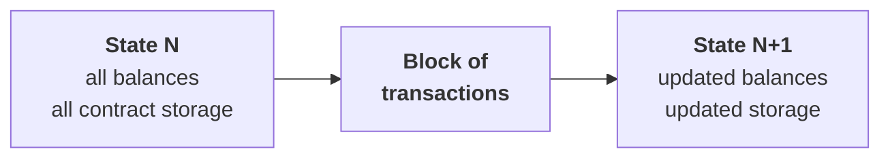
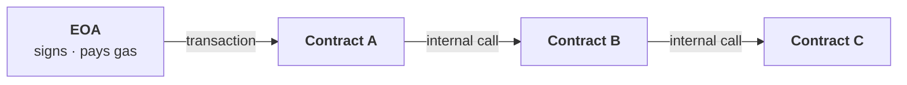

# Week 2 · Part 3 — Why we start with Ethereum and the EVM

[Part 2](./day-2-comparing-blockchains.md) showed five chains making five
different choices and deliberately did not crown a winner. So it is fair to ask
why the rest of this programme is built on Ethereum.

::: important The answer is not that Ethereum is best
It is that the EVM is the most useful **first** environment to learn. What you
learn transfers to dozens of other networks, the documentation is unusually
good, and the tooling is free.
:::

## Learning objectives

- Give three concrete reasons for learning the EVM first
- Explain what "Ethereum is a state machine" actually means
- Distinguish an EOA from a contract account
- Explain why a contract cannot act on its own

## Core

### Why the EVM first

| Reason | Why it matters |
|---|---|
| **What you learn transfers** | Base, Arbitrum, Optimism, Polygon, Avalanche's C-Chain, BNB Chain and many others run the EVM or a close variant. Few skills in this industry have that reach |
| **The standards are everywhere** | ERC-20 for tokens, ERC-721 for NFTs and their relatives began here and were adopted almost universally |
| **The ecosystem is the largest** | More applications, documentation, answered questions and audited open-source code. When you are stuck at 11pm, the odds someone hit your exact error and wrote it down are far higher here |
| **The free tooling is excellent** | Remix runs a full development environment in a browser tab with nothing installed. Week 3 uses it |

None of this makes Ethereum technically superior. It makes it the best place to
build a foundation you can carry elsewhere — a different and more useful claim.

### Ethereum is a state machine

::: important The most important sentence on this page
**Ethereum is a single shared computer whose state everyone agrees on, and
transactions are the only way to change it.**
:::

Week 1 Part 2 introduced state as "who owns what". Ethereum extends it
considerably: every account balance, every contract's stored data, and every
contract's code.



Apply a block to the current state and you get exactly one new state. Every node
computes it independently and they all arrive at the same answer, because the
rules are **deterministic** — the same input always produces the same output, on
every machine, everywhere.

That determinism is not a detail. It is why thousands of independent computers
agree without communicating about the result. It is also why smart contracts
cannot do certain ordinary things:

::: warning No random numbers. No reading a web page. No checking the time from an outside source.
Any of those would let two nodes compute different results, and consensus would
collapse.

**This is where oracles come from** (Week 3). If a contract needs outside data,
that data has to be *put on-chain by a transaction* first, so every node sees the
identical value. There is no other way.
:::

### The EVM

The **Ethereum Virtual Machine** is the part of each node that executes contract
code. You do not need its internals. Three properties matter:

| Property | Consequence |
|---|---|
| **Deterministic** | Same input, same output, on every node |
| **Sandboxed** | Contract code cannot reach the host machine, the internet, or anything outside chain state |
| **Metered** | Every operation costs gas. Run out and execution stops and reverts |

That third one answers a genuinely hard problem: how do you let strangers run
arbitrary programs on your computer without them running forever? **You charge
per step and stop when the money runs out.**

### Two kinds of account

| | **EOA** (Externally Owned Account) | **Contract account** |
|---|---|---|
| Controlled by | A private key | Its own code |
| Has a recovery phrase | Yes | **No** |
| Can start a transaction | **Yes** | **No** |
| Has code | No | Yes |
| Has storage | No | Yes |
| Created by | Generating a key | Being deployed by a transaction |

Both have a `0x` address. On an explorer they look similar. They are
fundamentally different things.

### The rule that surprises everyone

::: important A contract cannot do anything on its own
**Every action on Ethereum begins with an EOA signing a transaction.**

A contract has no key, so it cannot sign. It cannot wake up on a schedule, poll
for changes, or react to the outside world. It is entirely dormant until called.
:::

Contracts *can* call other contracts — but only inside a chain of calls that some
EOA started.



One signature, one fee, one atomic outcome: either the whole chain succeeds or
all of it reverts.

::: tip So when an application appears to act automatically…
A loan liquidated the moment collateral falls, a scheduled payment — **something
off-chain is watching and sending a transaction.** Usually a bot, paid a fee for
doing so.

The automation is real; it is just not the contract acting alone. Knowing this
prevents a whole family of misunderstandings about what DeFi actually is.
:::

## Landscape

- **EVM-compatible / EVM-equivalent** — runs Ethereum contracts with minor differences, or none
- **Bytecode** — what Solidity compiles to and what the EVM actually runs
- **opcode** — one EVM instruction, each with a fixed gas cost. See [evm.codes](https://www.evm.codes/)
- **Solidity** — the dominant contract language. Week 3
- **Vyper** — an alternative, deliberately more restricted
- **World state** — the complete set of all accounts and their data
- **Account abstraction** — letting accounts be programmable, softening the EOA/contract split
- **Precompiles** — cryptographic operations built into the EVM for efficiency

## Worked example

Two addresses on an explorer. Tell them apart.

::: tabs
@tab Address A — an EOA

```text
Address:        0x3f7a…c214
Balance:        0.048 ETH
Transactions:   3 (sent)
Contract:       No
Code:           —
```

It has **sent** transactions, so it holds a private key and someone signed with
it. No code. This is what your wallet from Week 1 looks like.

@tab Address B — a contract

```text
Address:        0xA0b8…eB48
Balance:        0 ETH
Transactions:   0 (sent)
Contract:       Yes ✓
Code:           0x60806040523480156100...
Token Tracker:  USD Coin (USDC)
```

Note **0 transactions sent** — as expected, since contracts cannot initiate
anything. But it has code, storage, and it is the ledger for billions of dollars
of USDC.

Everything USDC "does" happens when an EOA calls this contract.
:::

::: important Now connect it to Week 1 Part 4
This is the concrete reason a token differs structurally from a coin.

- **ETH** is tracked by the protocol itself. Its balance is a field on your account
- **USDC** is tracked by contract B's storage. Your USDC balance is a row in one program's table

If contract B has a bug, USDC balances can be affected. **No bug in any contract
can affect your ETH balance**, because ETH does not live in a contract.

That is not a difference in branding. It is a difference in what has to be true
for you to still own the thing tomorrow — exactly what
[Part 6](./day-6-trust-and-risk-map.md) turns into a reusable tool.
:::

::: details Further exploration — optional, not assessed
- [ethereum.org — Ethereum Virtual Machine](https://ethereum.org/developers/docs/evm/) — a fuller treatment
- [evm.codes](https://www.evm.codes/) — every opcode with its gas cost, interactively
- Open a contract you have heard of on Etherscan and look at its **Contract** tab. You will not understand the code yet; notice that you *can read it at all*
:::

::: details Sources and attribution
- [ethereum.org — Intro to Ethereum](https://ethereum.org/developers/docs/intro-to-ethereum/) — Reuse (CC BY 4.0), adapted
- [ethereum.org — Ethereum Virtual Machine (EVM)](https://ethereum.org/developers/docs/evm/) — Reuse (CC BY 4.0), adapted
- [ethereum.org — Ethereum accounts](https://ethereum.org/developers/docs/accounts/) — Reuse (CC BY 4.0), adapted
- [ethereum.org — Smart contracts](https://ethereum.org/developers/docs/smart-contracts/) — Reuse (CC BY 4.0), adapted
:::
