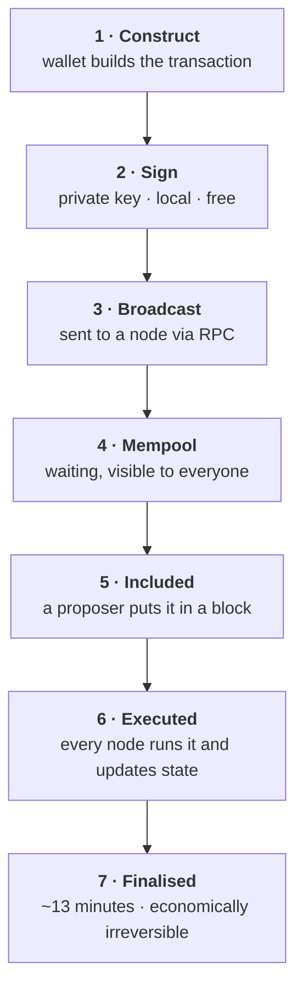
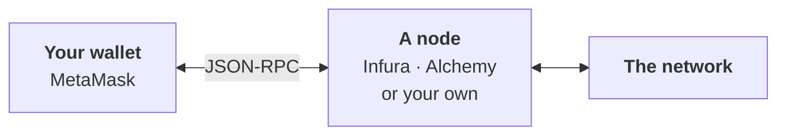

# Week 2 · Part 4 — Transactions, state, gas and RPC

[Part 3](./day-3-why-ethereum-and-evm.md) established that Ethereum is a state
machine and transactions are the only way to change it. Today is how that
actually runs — plus the piece nobody explains to beginners: **how your wallet
talks to the blockchain at all.**

## Learning objectives

- Trace a transaction from signature to finality and name each stage
- Explain gas, gas limit and base fee, and why fees rise when the network is busy
- Explain what an RPC endpoint is and why reading is free but writing is not
- Explain what events are for, and why applications rely on them

## Core

### The lifecycle



::: warning Step 4 is public
Between broadcast and inclusion, your pending transaction is visible to
everyone. Someone can see what you are about to do **before it happens**. This
is the root of MEV — Further Exploration, but the reason it exists is right here.
:::

**Step 6 happens on every node**, not just the proposer's. Week 1 Part 2's
verification, now applied to contract code as well as transfers.

### Gas

| Term | What it is |
|---|---|
| **Gas used** | Units of computation actually consumed. A plain ETH transfer is always 21,000 |
| **Gas limit** | The maximum you authorise. Protects you from a runaway contract |
| **Base fee** | Set by the protocol, rises and falls with demand. **Burned** |
| **Priority fee** | Your tip to the proposer for including you sooner |
| **Max fee** | The most you are willing to pay per unit |

```text
fee = gas used × (base fee + priority fee)
```

**Why fees spike.** The base fee adjusts automatically — blocks fuller than
target push it up, emptier blocks push it down. It is a congestion price, and it
is not set by anyone. It is set by how many people want in.

**Gas limit versus gas used.** You authorise a limit; you pay for what is used
and the rest is returned. But if execution needs *more* than your limit, it runs
out of gas, reverts, and **you still pay**.

::: warning Two things beginners find unfair — worth understanding rather than resenting
**Failed transactions still cost gas**, because nodes really did the computation.

**You pay for complexity, not value.** Moving $10,000 costs exactly the same as
moving $1, because the work is identical.
:::

### RPC — how your wallet reaches the chain

::: important The thing nobody tells beginners
**Your wallet is not connected to Ethereum.** It has no copy of the chain and no
direct link to the network. It sends requests to a **node**, over an interface
called **JSON-RPC**, and that node does the actual talking.
:::



An **RPC endpoint** is just a URL that accepts these requests. MetaMask ships
with defaults, which is why it works immediately — you are quietly relying on a
provider.

Three consequences worth knowing:

| | |
|---|---|
| **You are trusting that provider** | To report state honestly and relay your transactions. They cannot forge your signature or steal funds — but they can show you wrong data or drop your transaction |
| **They can see your requests** | Including which addresses you ask about, and from what IP |
| **When wallets "go down", it is usually the RPC provider** | The chain is fine; your window onto it is not |

You can run your own node and remove this dependency. Almost nobody does — worth
knowing this is a convenience trade, not how the system has to work.

### Reading versus writing

| | **Read** (call) | **Write** (transaction) |
|---|---|---|
| Changes state | No | Yes |
| Costs gas | **No** | Yes |
| Needs a signature | No | **Yes** |
| Speed | Immediate | Wait for a block |
| Executed by | One node, for you | Every node |

**Reads are free** because one node computes the answer from its own copy.
Nothing is broadcast, nothing changes, so nobody else needs to care.

**Writes cost** because they change state for everyone.

::: tip Watch a DApp with this in mind and it becomes legible
Loading a page and seeing your balances, prices and positions — all reads, all
free, all instant. **The moment something asks you to confirm in your wallet,
that is a write.**
:::

::: details A subtle point that pays off in Week 3
Before sending a write, wallets often perform a **simulation** — a read that runs
the transaction against current state to estimate gas and predict success. That
is how your wallet warns you a transaction is likely to fail before you pay for
it.
:::

### Events and logs

Contracts can emit **events** — records written to the transaction's log
alongside the state change. Two facts explain why they exist:

- Events are much **cheaper** than storing data in contract storage
- Contracts **cannot read** logs — logs are for the outside world only

So events are a contract's way of **announcing what it did**, for applications
watching from outside. Every token transfer you have seen listed in a wallet or
on an explorer came from a `Transfer` event, not from anyone reading contract
storage.

Without events, an application showing your transaction history would have to
re-execute the entire chain. With them, it subscribes to a filtered feed.

::: tip That is enough for now
**Week 3 covers events properly**, alongside the ABI — the description that
makes a contract's functions and events readable.
:::

## Landscape

- **EIP-1559** — the 2021 change introducing the burned base fee and predictable pricing
- **gwei** — 10⁻⁹ ETH, the unit gas prices are quoted in
- **Nonce** — the per-account counter. Transactions execute in strict nonce order
- **Mempool** — the public waiting room
- **Speed up / cancel** — resubmitting with the same nonce and a higher fee
- **Revert** — execution failing and state changes being undone. Gas is still consumed
- **Node providers** — Infura, Alchemy, QuickNode and others
- **MEV** — value extracted by choosing transaction order, made possible by the public mempool

## Worked example

The same swap, with every read and write labelled.

| # | What happens | Read or write | Gas | Signature |
|---|---|---|---|---|
| 1 | Page loads, shows your USDC balance | Read | Free | No |
| 2 | You enter an amount; it quotes a rate | Read | Free | No |
| 3 | It checks whether the DEX may spend your USDC | Read | Free | No |
| 4 | **Approve the DEX to spend your USDC** | **Write** | Paid | **Yes** |
| 5 | It re-checks the allowance | Read | Free | No |
| 6 | It simulates the swap to estimate gas | Read | Free | No |
| 7 | **Execute the swap** | **Write** | Paid | **Yes** |
| 8 | Contract emits `Swap` and `Transfer` events | — | In 7 | — |
| 9 | Interface updates from those events | Read | Free | No |

::: important Nine steps. Two cost anything, and both asked you to sign.
That is the shape of nearly every DApp interaction, and it tells you exactly
where the risk is: everything free and instant is harmless, and **the two moments
your wallet interrupts you are the two that matter.**
:::

Note also that step 4 is [Week 0 Part 4](../week-0/day-4-safety.md)'s approval in
its natural habitat. It costs gas, changes nothing you can see, and grants a
permission that outlives the swap.

::: details Further exploration — optional, not assessed
- [ethereum.org — Gas and fees](https://ethereum.org/developers/docs/gas/) — full mechanics
- [EIP-1559](https://eips.ethereum.org/EIPS/eip-1559) — the actual specification. Surprisingly readable, and a good introduction to what an EIP is
- Open a busy contract on Etherscan and look at its **Events** tab. You are watching announcements meant for applications
- **MEV** — why the public mempool creates an entire industry
:::

::: details Sources and attribution
- [ethereum.org — Transactions](https://ethereum.org/developers/docs/transactions/) — Reuse (CC BY 4.0), adapted
- [ethereum.org — Gas and fees](https://ethereum.org/developers/docs/gas/) — Reuse (CC BY 4.0), adapted
- [ethereum.org — Nodes and clients](https://ethereum.org/developers/docs/nodes-and-clients/) — Reuse (CC BY 4.0), adapted
- [ethereum.org — Events and logs](https://ethereum.org/developers/docs/smart-contracts/anatomy/#events-and-logs) — Reuse (CC BY 4.0), adapted
- [EIP-1559](https://eips.ethereum.org/EIPS/eip-1559) — Reuse (CC0), referenced
:::
