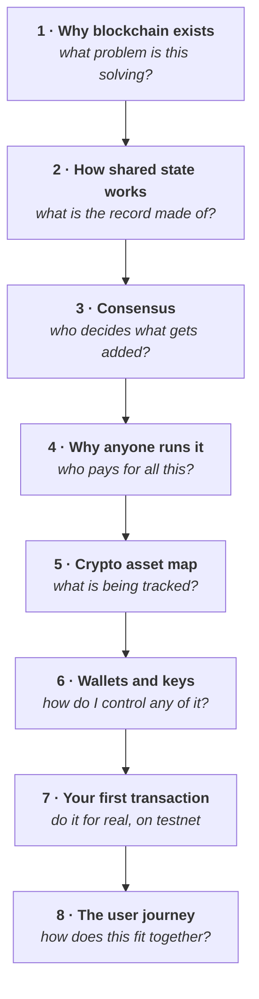

# Week 1 — Web3, blockchain, crypto assets and wallets

<svg xmlns="http://www.w3.org/2000/svg" viewBox="0 0 64 64" width="56" height="56" class="academy-week-mark" role="img" aria-labelledby="t1 d1">
  <title id="t1">Three linked blocks</title><desc id="d1">Three blocks joined in a chain, representing the blockchain.</desc>
  <g fill="none" stroke="#37a4e3" stroke-width="4" stroke-linecap="round" stroke-linejoin="round">
    <rect x="4" y="25" width="13" height="15" rx="3.5" fill="#9aeaf6"/>
    <rect x="25.5" y="25" width="13" height="15" rx="3.5" fill="#9aeaf6"/>
    <rect x="47" y="25" width="13" height="15" rx="3.5" fill="#9aeaf6"/>
    <path d="M17 32.5 H25.5 M38.5 32.5 H47"/>
  </g>
</svg>

<Badge type="info" text="8 parts" /> <Badge type="tip" text="100 points" /> <Badge type="warning" text="Testnet only" />

> **Core question — why does Web3 exist, and how do blockchain assets and
> accounts actually work?**

This is where Week 0's vocabulary turns into a working mental model, and the
week you first touch a wallet. It ends with you having sent a real transaction
on a test network and being able to explain what happened.

| Part | Page | Reading |
|---|---|---|
| 1 | [Why blockchain exists](./day-1-why-blockchain-exists.md) | 12 min |
| 2 | [How shared state works](./day-2-how-shared-state-works.md) | 15 min |
| 3 | [Consensus, and how chains agree](./day-3-consensus.md) | 16 min |
| 4 | [Why anyone runs the network](./day-4-incentives.md) | 13 min |
| 5 | [What crypto assets actually are](./day-5-crypto-asset-map.md) | 15 min |
| 6 | [Wallets, accounts and keys](./day-6-wallets-and-accounts.md) | 16 min |
| 7 | [Your first transaction](./day-7-your-first-transaction.md) | 30 min hands-on |
| 8 | [How it all connects: one user journey](./day-8-the-user-journey.md) | 12 min |

**Anchor Mission:** [Week 1 mission](./anchor-mission.md) · 100 points

## The arc

Each part answers the question the previous one leaves open.

## Before you start

::: warning Part 7 needs a wallet — but not yet
You install one **during** that page, and it will be a fresh wallet holding
testnet assets only. If you have not read
[Week 0 Part 4](../../getting-started/safety.md), read it before Part 6.
:::
