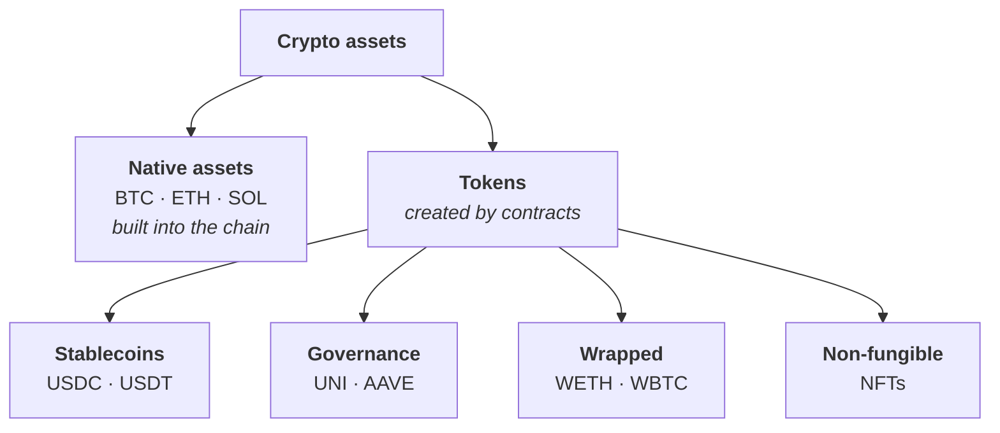

# Week 1 · Part 5 — What crypto assets actually are

You know how state changes and how the network agrees on it. This is what is
being tracked.

Beginners file all of this under "crypto" and assume the differences are
branding. They are not. These are five different kinds of thing, with **five
different things that can go wrong**.

::: important The distinction everything hangs on
**A coin is part of the blockchain itself. A token is a program running on top
of it.**
:::

## Learning objectives

- Distinguish a coin from a token, and explain why the distinction is structural
- Place any asset you meet into one of five categories
- Explain why a stablecoin carries risks a native asset does not
- Explain the difference between custodial and self-custodial holdings

## Core

### Coins and tokens are not the same shape

**Native assets** are built into the protocol. ETH is not stored in a contract —
ETH balances are part of Ethereum's state, at the same level as the chain itself.

**Tokens** are created by smart contracts. A token contract is a program holding
a table of who owns how much. USDC on Ethereum is one contract's ledger.

| | Native asset (ETH) | Token (USDC) |
|---|---|---|
| Exists because | The protocol says so | A contract says so |
| Can be frozen by an issuer | No | **Yes**, if the contract allows it |
| Can be lost to a contract bug | No | **Yes** |
| Pays the transaction fee | **Yes** | No — you need ETH to pay the fee as well |

::: warning Every beginner hits this once
**Holding only USDC on Ethereum means you cannot move it.** Moving it requires
calling a contract, calling a contract requires gas, and the resulting
transaction fee is paid in ETH.
:::

### The five categories

:::: tabs
@tab Native

The chain's own asset. Pays fees, secures the network, understood by the
protocol itself.

| Asset | Chain | Note |
|---|---|---|
| <Icon name="token-branded:bitcoin" /><strong>BTC</strong> | Bitcoin | Deliberately limited. Designed to be money and little else |
| <Icon name="token-branded:ethereum" /><strong>ETH</strong> | Ethereum | Pays transaction fees, and is staked to secure the network |
| <Icon name="token-branded:solana" /><strong>SOL</strong> | Solana | Same roles on Solana |

No issuer. Nobody can freeze your BTC or reverse your ETH transfer — and nobody
can help you if you lose your keys.

@tab Stablecoins

Tokens designed to hold a steady value, almost always one US dollar.

| Asset | Issuer | Model |
|---|---|---|
| <Icon name="token-branded:usdc" /><strong>USDC</strong> | Circle | Cash and short-term US treasuries, with public attestations |
| <Icon name="token-branded:usdt" /><strong>USDT</strong> | Tether | Backed by reserves; the largest by volume |

**Why they matter.** Native assets move in price, which makes them awkward as
money — nobody wants to be paid in something worth 20% less by Friday.
Stablecoins give a stable unit that still moves at blockchain speed. Most
real-world payment usage runs through them.

**And the trade-off.** A dollar-backed stablecoin is a *claim on an issuer*.
Holding USDC means trusting the blockchain, the token contract, **and Circle** —
that reserves exist and redemption is honoured.

That third one is new. It is a centralised trust assumption inside a
decentralised system, and it is not hidden — it is the deal. Regulated issuers
can and do freeze addresses when compelled by law enforcement.

@tab Governance

Tokens tied to a specific application, usually carrying a vote over how it
changes.

| Asset | Protocol | Roughly |
|---|---|---|
| <Icon name="token-branded:uni" /><strong>UNI</strong> | Uniswap | Governance over the Uniswap protocol |
| <Icon name="token-branded:aave" /><strong>AAVE</strong> | Aave | Governance, and a role in the safety module |

What a governance token actually entitles you to varies enormously, and is often
less than the marketing implies. Week 4 covers this properly. For now: holding
one is participation in a decision process, which is a different kind of thing
from holding money.

@tab Wrapped

A token that *represents* another asset, so it can be used where the original
cannot.

| Asset | Represents | Why it exists |
|---|---|---|
| <strong>WETH</strong> | ETH | ETH is native, so it doesn't follow the token standard contracts expect |
| <strong>WBTC</strong> | BTC | Bitcoin can't run Ethereum contracts |

**WETH is mechanically simple: deposit ETH into the contract, receive WETH, and
redeem it through the same contract.** Unlike custodial wrapped assets, there is
no external custodian holding the underlying ETH; the main dependency is the
contract itself.

**WBTC is a different animal.** Real BTC sits on Bitcoin, held by a custodian,
while a token on Ethereum represents it. That token is worth a bitcoin only as
long as the custodian holds the bitcoin and honours redemption.

@tab NFTs

Fungible means interchangeable — any 1 USDC is any other. **Non-fungible means
each unit is individually distinct.**

Uses go well beyond profile pictures: event tickets, in-game items, domain names
like ENS, credentials, ownership records.

::: warning The most common NFT misconception
**The image is usually not on the blockchain.** Storing images on-chain is
prohibitively expensive, so the token typically holds a *link*. If whatever
hosts that file disappears, the token remains and the picture does not.
:::
::::

### Custodial versus self-custodial

Cutting across all five categories: **who holds the keys?**

| | Custodial | Self-custodial |
|---|---|---|
| Who holds the keys | An exchange or company | You |
| What you have | An account balance and a claim | The asset itself |
| Lost password | Recoverable via support | **Nothing can be done** |
| Company fails | You are a creditor | Unaffected |
| Token-level controls | The platform may freeze its account | An issuer may still freeze its token |

Buy ETH on an exchange and leave it there, and you do not have ETH. You have a
claim against a company that has ETH. Usually equivalent. In the cases where
they diverge — and there is a long history of exchange failures where they
diverged badly — the difference is everything. Self-custody removes the
platform's custody control, but it does not remove token-level controls built
into an asset such as a stablecoin.

::: tip "Not your keys, not your coins"
This is not advice to move everything to self-custody. Self-custody transfers
the entire security burden to you, and [Week 0 Part 4](../../getting-started/safety.md)
explains how much burden that is. It is a statement about what you *own* — and
both options are legitimate for different purposes.
:::

## Landscape

- **Meme coins** — value resting entirely on attention and community
- **RWA** — real-world assets like treasuries or property represented on-chain
- **LSTs** — liquid staking tokens, representing staked assets while staying tradable
- **Algorithmic stablecoins** — stability by mechanism rather than reserves. Poor track record; Terra/UST's 2022 collapse is the case study
- **ERC-20 / ERC-721 / ERC-1155** — the standards making tokens interoperable. Week 3
- **Token supply terms** — circulating, total and fully diluted supply frequently differ dramatically

## Worked example

One person's holdings, sorted by what could actually go wrong. **The risks
differ in kind, not just in size.**

| Holding | Category | What has to hold up |
|---|---|---|
| 0.5 ETH in their own wallet | Native, self-custodial | Ethereum works; they keep their keys safe |
| 200 USDC in the same wallet | Stablecoin, self-custodial | The above, **plus** the contract works, **plus** Circle holds reserves |
| 100 UNI in the same wallet | Governance, self-custodial | The above, minus the issuer |
| 0.01 BTC on an exchange | Native, **custodial** | Bitcoin works, **and the exchange stays solvent** |
| 1 NFT in their wallet | Non-fungible | Ethereum works, keys safe, **and someone keeps hosting the image** |

Five holdings, five failure modes. The exchange BTC is the only one where a
bankruptcy costs you the asset. The USDC is the only one where an issuer could
freeze you. The NFT is the only one that can silently become a broken link.

::: important This is the actual skill
Being able to build this table for anything you hold. [Week 2 Part 6](../week-2/day-6-trust-and-risk-map.md)
generalises it into a tool you can point at anything.
:::

::: details Further exploration — optional, not assessed
- [ethereum.org — Stablecoins](https://ethereum.org/stablecoins/) — the models compared, including algorithmic
- [ethereum.org — NFTs](https://ethereum.org/nft/) — uses beyond collectibles
- [ethereum.org — What is ether](https://ethereum.org/eth/) — why the native asset is structurally different
- **Tokenomics** — supply schedules, emissions, incentive design. A large field, deliberately not compulsory
:::

::: details Sources and attribution
- [ethereum.org — Stablecoins](https://ethereum.org/stablecoins/) — Reuse (CC BY 4.0), adapted
- [ethereum.org — ERC-20 token standard](https://ethereum.org/developers/docs/standards/tokens/erc-20/) — Reuse (CC BY 4.0), adapted
- [ethereum.org — NFTs](https://ethereum.org/nft/) — Reuse (CC BY 4.0), adapted
- [ethereum.org — What is ether](https://ethereum.org/eth/) — Reuse (CC BY 4.0), adapted

*Named assets are illustrative examples chosen for recognisability, not
recommendations. Nothing here is financial advice.*
:::
