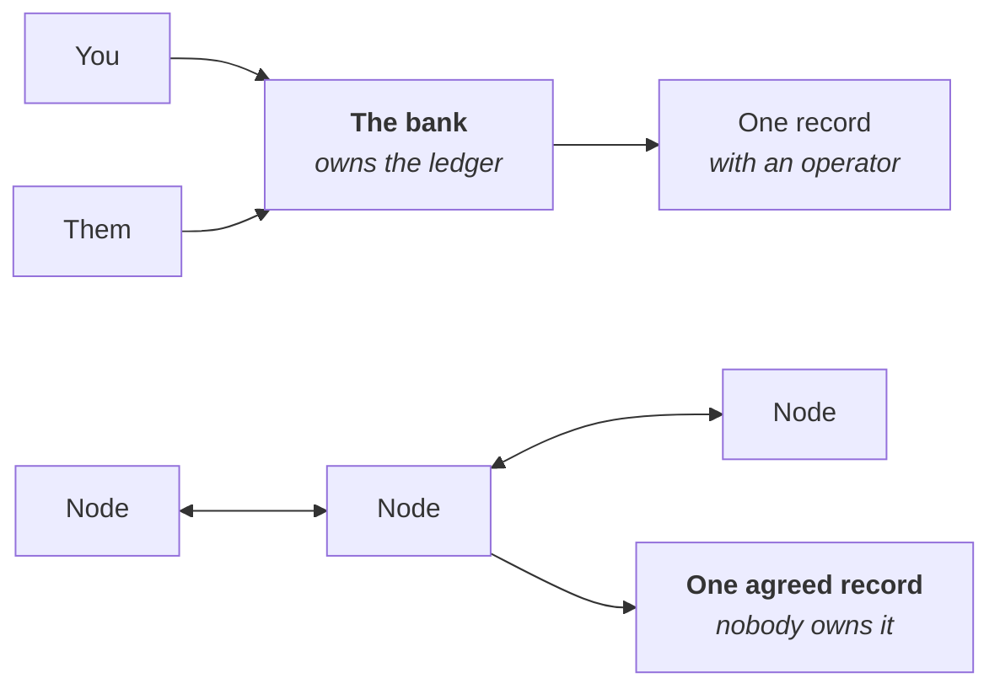

# Week 1 · Part 1 — Why blockchain exists

## Why this matters

Week 0 gave you vocabulary and a tool map. This week turns them into a working
model, and it starts with the question everything else depends on.

Most people meet blockchain through prices, tokens and hype, which is a bad
introduction because it skips the actual problem the technology was built to
solve. If you don't understand that problem, everything afterwards — wallets,
gas, contracts — is arbitrary rules to memorise.

This is the only part of the week with no software to install. It's the one that
makes the rest of the programme make sense.

## Learning objectives

By the end of this page you should be able to:

- Explain what problem blockchains were designed to solve, without using the word "crypto"
- Describe the difference between a system with an operator and one without
- Give one example where removing the operator genuinely helps, and one where it doesn't

### A short history: why “Web3”?

Before asking what problem a blockchain solves, it helps to know why people call
this space **Web3**. The name is a historical shorthand for a changing web, not a
technical label that every application must satisfy.

| Aspect | Web1 | Web2 | Web3 |
|---|---|---|---|
| **Useful shorthand** | Read | Read + write | Read + write + own |
| **Typical identity** | Website or session | Platform account | Platform account and/or wallet |
| **Typical state/data** | Website server | Platform database | Off-chain systems plus selected on-chain state |
| **Digital value** | External payment rails | Platform-mediated payments | Native or tokenised programmable assets |
| **Main trust model** | Site operator | Platform operator | A mix of users, networks, contracts and operators |

These labels describe broad tendencies:

- **Web1** was mainly about publishing and consuming information. “Read” is a
  useful summary, not a claim that every early website was completely static.
- **Web2** made accounts, user-generated content and social interaction
  mainstream. Users can own rights to accounts or content, but platforms often
  still control the account system and database.
- **Web3** describes a blockchain-oriented vision in which wallets, blockchains
  and smart contracts can add portable digital assets and programmable forms of
  ownership or control. That does not make every application decentralised, and
  it does not give users ownership of every piece of application data.

Ethereum co-founder **Gavin Wood articulated a “Web 3.0” decentralised-web vision
in 2014**, motivated in part by reducing how much people must rely on trusted
central intermediaries. “Web3” later became the broader industry term used around
blockchain-based applications, assets and ownership.

The memorable **“read + write + own”** phrase is therefore a way to remember the
direction of the idea, not a formal definition or a promise that Web3 replaces
Web2. A modern application can use a Web2 database and login alongside a wallet
and selected on-chain state.

One last naming detail: the blockchain-oriented Web3 idea and the older
**Semantic Web / “Web 3.0”** idea are not necessarily the same concept. You do not
need Semantic Web theory for this course; just avoid treating the shared name as
proof that the two visions are identical.

That is why people started calling this **Web3**. The next question is why a
blockchain might be useful at all.

## Core

### Every online system you use has an operator

When you send someone money through a bank app, you don't transfer anything. You
ask your bank to update its records. The bank owns the ledger, decides whether the
update happens, and can reverse it.

That arrangement works well. Operators are efficient, and they can fix mistakes.
Most of the time you want one.

The catch is that everyone in the system has to trust the operator — to stay
solvent, stay honest, stay online, and keep serving you. Usually reasonable. Not
always.

### The problem: agreeing without an operator

Say you want a shared record of who owns what, where no single party controls it.
Now you have a genuinely hard problem. If everyone keeps their own copy, whose
copy is right when they disagree?

Copying a file is free, so nothing stops someone spending the same money twice by
telling two different people two different things. With an operator this is easy —
they check their records. Without one, it went unsolved for decades.

### The idea

A blockchain is a shared record that many independent computers maintain
together, with rules that let them agree on what is true without any of them being
in charge.

<figure class="academy-reference-visual">
  
  <figcaption>A blockchain network can have many independent nodes. Each keeps a copy of the same history and checks new blocks against the rules, so the network does not rely on one central operator.</figcaption>
</figure>

Three things make it work:

| Element | What it does |
|---|---|
| **Shared ledger** | Everyone holds the same record, and anyone can read it |
| **Rules everyone checks** | A change is only valid if it follows the rules, and every participant verifies this independently |
| **Agreement mechanism** | A way to settle what gets added next, even when participants don't trust each other |

That third element is **consensus**, and it's [Part 3](./part-3-consensus.md).

### What it costs

::: important This is where most introductions stop, and it's the part worth being honest about
:::

Removing the operator is expensive. Thousands of computers redoing the same work
is slower and costlier than one company running one database. Nobody can reverse a
mistake for you. Nobody can restore your access if you lose your keys.

So the useful question is never "should this be on a blockchain?" — it's:

::: important Is the operator actually a problem here?
:::

| Case | Verdict |
|---|---|
| Your university's exam records | **The operator is fine.** NTU is trusted, accountable, and reversing an error is a feature |
| Sending money abroad through four intermediaries who each take a fee and a day | **The operator is more of a problem** |

You'll meet plenty of projects that got this question wrong. Being able to ask it
is most of what separates someone who understands this space from someone
repeating what they heard.

## Landscape

You'll hear these words in the same breath as blockchain. You don't need to be
able to build any of them — just place them on the map.

- **Bitcoin** — the first working example of this idea, built mainly for payments and deliberately narrow in scope
- **Ethereum** — a shared record that can also run programs, trading more flexibility for more complexity
- **Consensus** — the agreement mechanism that decides which valid history the network follows. Part 3
- **Crypto assets** — values tracked by a blockchain, with different rights and risks depending on the asset. Part 5

## Worked example

Two people agree Ann pays Ben $50.

::: tabs
@tab With an operator

Ann's bank reduces her balance, increases Ben's, and records it.

- If the bank goes down, nothing happens
- If it makes an error, it can fix it
- Both parties trust the bank

@tab Without one

Ann announces to a network that she's sending 50 to Ben, signed with a key only
she holds. Participants check she has 50 and hasn't already spent it. They agree
to add it to the shared record.

It's now permanent, visible to anyone, and reversible by no one — including Ann,
and including whoever wrote the software.
:::

::: warning Notice the trade in both directions
**Harder:** no help if Ann sent it to the wrong address.

**Easier:** Ben needs no permission from anyone to receive it, and no central
ledger operator can simply reverse a valid native-asset transfer.
:::

::: details Further exploration — optional, not assessed
- [Bitcoin whitepaper](https://bitcoin.org/bitcoin.pdf) — the original 2008 proposal. Nine pages. Section 1 alone is worth reading, and states the double-spend problem more plainly than most modern explanations
- [ethereum.org — Web3](https://ethereum.org/web3/) — how the same idea extends beyond payments
:::

::: details Sources and attribution
- [ethereum.org — Web3](https://ethereum.org/web3/) — Reuse (CC BY 4.0), adapted
- [ethereum.org — What is Ethereum](https://ethereum.org/what-is-ethereum/) — Reuse (CC BY 4.0), adapted
- [ethereum.org — Intro to Ethereum](https://ethereum.org/developers/docs/intro-to-ethereum/) — Reuse (CC BY 4.0), adapted
- [Bitcoin whitepaper](https://bitcoin.org/bitcoin.pdf) — Link, referenced only
- [Web3 Internship Handbook](https://github.com/ethpanda-org/Web3-Internship-Handbook) — Reuse (permission granted, LXDAO); distributed-network visual adapted from its blockchain basics materials
- [Gavin Wood — Less-techy: What Web 3.0 Is](https://gavwood.com/web3lt.html) — Link, referenced for the 2014 Web 3.0 origin and decentralised-web framing
:::
