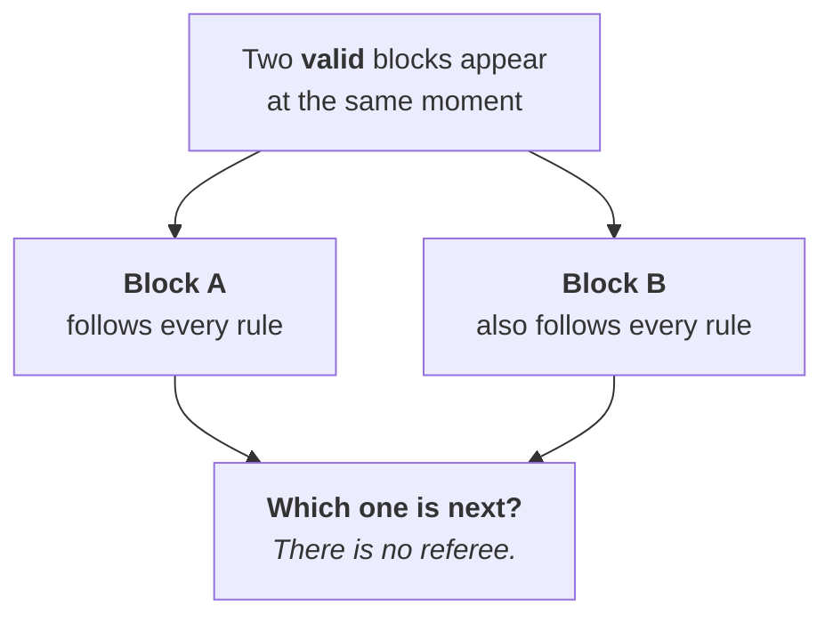

# Week 1 · Part 3 — Consensus, and how chains agree

Part 2 left one question open, and it is the hard one.

Imagine two computers propose the next block at nearly the same time. Each block
may follow all the rules, but the network still needs one shared history. The
first question is whether a block is allowed; the second is which allowed block
the network follows.

::: important First-pass model
Follow the story in this order:

```text
Block proposed
  ↓
Does it follow the rules? → validity check
  ↓
If valid histories compete, which one does the network follow?
  ↓
Consensus helps the network converge on one history
  ↓
Confirmations and finality increase confidence in that history
```

Consensus does not make an invalid block valid. It helps the network choose
between histories that already pass the rules.
:::



Every node can independently check whether a block is *valid*. But when two
valid blocks compete, both legitimate, something has to decide. That mechanism
is **consensus** — the invention that made everything else possible, and the
reason this problem went unsolved for decades.

## Learning objectives

- Explain what problem consensus solves, distinct from validity
- Describe how Proof of Work and Proof of Stake each make attacks expensive
- Compare the two on cost, energy, and how they punish dishonesty
- Explain why a transaction becomes safer the longer it has been buried

## Core

### Validity is not agreement

| Question type | Question | Settled by |
|---|---|---|
| **Validity** | Does this block follow the rules? | Every node checks alone — Part 2 |
| **Consensus** | Of several valid options, which counts? | The agreement mechanism — this page |

An invalid block is rejected by everyone automatically. Two *valid* competing
blocks is a genuine coordination problem.

For Foundation, keep this first-pass model:

- **Validity:** Is this allowed by the rules?
- **Consensus:** Which valid history do we follow?

::: important The shared goal
You cannot stop someone *proposing* dishonest history. So instead you make
**attacks extremely expensive, so honest participation is usually the
economically rational choice.**

Both mechanisms below do that — but they do it in genuinely different ways, and
the difference is worth keeping straight.

| Dimension | Proof of Work | Proof of Stake |
|---|---|---|
| Where security comes from | Block production is **expensive to perform** — real hardware and electricity | Validators put **assets at risk** that can be taken away |
| What an attacker spends | Enormous real-world computing resources, continuously | Enormous capital, locked as stake |
| What failure costs them | Ongoing hashpower costs; PoW has no slashing | Provable dishonesty can have their stake **slashed** |
:::

### The two mechanisms

::: tabs
@tab Proof of Work

Bitcoin's mechanism, and Ethereum's until 2022. The first idea to hold is
simple: **Proof of Work makes block production costly by requiring real
computing work.** A miner proposes a block, and the network checks whether the
work and the block follow the rules.

To propose a block you must find a number that, hashed with the block's
contents, produces an output below a target. There is no shortcut — Part 2's
"you cannot work backwards from a hash" guarantees it. You guess, trillions of
times per second, until you get lucky. This is **mining**.

| Aspect | Details |
|---|---|
| The scarce resource | Electricity and specialised hardware |
| How you attack it | Control most of the network's computing power |
| What it costs | Control enough effective hashpower for long enough to outpace the honest chain |
| What cheating costs | **PoW has no slashing.** An attacker must continuously spend on hashpower, whether the attack succeeds or fails |

The security argument is economic: attacking Bitcoin means sustaining enough
hashpower to outpace the honest chain for long enough to attack the system your
hardware's value depends on.

**The honest criticism:** all that electricity produces no other output. Not a
bug — the expenditure *is* the security — but it is real energy for one purpose.

@tab Proof of Stake

Ethereum's mechanism since 2022. The first idea to hold is also simple:
**Proof of Stake makes validators put valuable assets at risk.** Validators
propose and attest to blocks, and the network uses those messages to decide
which history to follow and, under the protocol's conditions, to finalise it.

Instead of burning electricity, participants **lock up the network's own asset**
as collateral. On Ethereum, 32 ETH makes you a validator. Validators are chosen
to propose and attest to blocks roughly in proportion to what they have staked.

| Aspect | Details |
|---|---|
| The scarce resource | The staked asset itself |
| How you attack it | Control a large share of everything staked |
| What it costs | Acquiring an enormous quantity of the asset |
| What cheating costs | Provable misbehaviour can cause part of your stake to be **slashed or lost** |

The elegance: an attacker must buy huge amounts of the asset, then use it to
attack the network that asset derives its value from. Success devalues the very
thing they spent to obtain it.

**The honest criticism:** it may favour those who already hold a lot. Whether
that centralises control over time is a live debate, not a settled question.
Note also that 32 ETH is a real barrier — which is why staking pools exist, and
why some argue pooling reintroduces concentration.
:::

### Side by side

| Dimension | Proof of Work | Proof of Stake |
|---|---|---|
| Scarce resource | Computing power | Staked capital |
| Energy use | Very high | Roughly 99.9% lower |
| Barrier to entry | Hardware, cheap electricity | Solo validator: 32 ETH + suitable hardware; pools allow economic participation without running a validator |
| Cost of cheating | Ongoing hashpower and electricity costs; no slashing | Slashed stake |
| Finality | Probabilistic — confidence grows | Explicit — ~13 minutes |
| Used by | Bitcoin | Ethereum, most modern chains |

::: tip Neither is simply better
They make different trade-offs — a theme [Week 2](../week-2/) makes central.

And both raise the same obvious question: *if nobody is being paid a salary, why
does anyone do this work at all?* That is [Part 4](./part-4-incentives.md).
:::

### Why "wait for confirmations"

Under Proof of Work, two miners occasionally find a block at nearly the same
moment. Briefly, two valid chains exist. The rule: **follow the chain with the
most accumulated work.**

So a transaction one block deep has one confirmation. Six blocks deep, undoing
it means redoing six blocks faster than the entire network — practically
impossible. This is **probabilistic finality**: never mathematically certain,
but rapidly certain enough for many practical decisions.

Ethereum's Proof of Stake adds explicit finality. After roughly 13 minutes a
block is **finalised**. Ethereum needs a supermajority of validator stake to
finalise blocks, so a large attacker can disrupt finality — but producing two
conflicting finalised histories requires provable dishonest behaviour, which
exposes an enormous amount of stake to slashing.

For Foundation, the idea to hold is simply:

> **Ethereum makes attacks expensive because validators have real value at
> risk.**

The exact thresholds are Further Exploration.

::: tip This is why exchanges make you wait after a deposit
They are not being awkward. They are waiting for the reversal cost to exceed
your deposit.
:::

### What consensus does not do

::: warning A common overclaim
Consensus guarantees participants agree on **what was recorded** and that the
rules were followed. It does **not** make the recorded information *true*.

Record "this diamond is ethically sourced" on-chain and consensus proves that
statement was recorded, when, and by whom. It says nothing about the diamond.
**Blockchains secure the ledger, not reality.**
:::

Week 3's oracles are the partial answer to this, and [Week 2 Part 6](../week-2/part-6-trust-and-risk-map.md)
maps it properly.

## Landscape

- **51% attack** — an attacker gains enough control over how new blocks are chosen to heavily influence the chain. Depending on the design, they may block transactions, reorder them, or try to reverse one of their own recent payments so they spend the same funds twice. The exact threshold and effects depend on the consensus design; this does not reveal private keys or let them simply take coins from someone else's wallet
- **Slashing** — taking away part of a validator's staked assets when the protocol can prove serious rule-breaking. It makes some attacks costly, but only exists in some Proof of Stake designs
- **Validator / miner** — validators participate in Proof of Stake; miners produce blocks in Proof of Work. They secure networks in different ways and carry different costs
- **Staking pool** — pooling assets so people can participate economically without running a validator or holding 32 ETH alone. The pool adds its own operator and smart-contract risks
- **Liquid staking** — a tradable token representing staked assets. It can keep capital usable, but its price and redemption depend on the issuing system
- **Byzantine Fault Tolerance (BFT)** — ways for a set of validators to reach a clear decision quickly, even if some fail or behave badly. Week 2 meets one in Cosmos
- **Nakamoto consensus** — Bitcoin's way of choosing the chain with the most accumulated work. More work makes the history harder to replace, so confidence grows over time rather than becoming final in one clear decision
- **MEV** — profit that can come from seeing pending transactions and choosing their order. For a normal user, this can mean another trader moves first and the user gets a worse price; it is Further Exploration

## Worked example

Someone wants to spend the same 10 ETH twice: pay a merchant, then erase it.

They send 10 ETH to the merchant. It lands in block 500. They now need a history
where that never happened, so they build an alternative chain from block 499.

| Dimension | Proof of Work | Proof of Stake |
|---|---|---|
| What they need | To control enough effective hashpower for long enough to outpace the honest chain | A very large share of all staked ETH |
| Why it fails | The honest chain keeps extending; the attacker must sustain enough hashpower to outpace it | Finalising a competing chain requires provable misbehaviour |
| What it costs them | Control enough effective hashpower for long enough to outpace the honest chain | A very large amount of stake exposed to **slashing** |
| Outcome | The attacker must sustain costly hashpower; success is expensive and not guaranteed | The attack becomes economically costly, with provable dishonesty exposing that stake to slashing |

::: important The defence is the same shape in both cases
The design aims to make attacks **economically unattractive or prohibitively
expensive**. That is what blockchain security actually is: a deterrent built
from costs and incentives, not a claim that attacks cannot happen.
:::

::: warning Which is why scale matters
A small chain with few miners or little staked is genuinely attackable, and
small chains do get 51%-attacked. **"It's a blockchain" is not by itself a
security claim.**
:::

::: details Further exploration — optional, not assessed
- [ethereum.org — Consensus mechanisms](https://ethereum.org/developers/docs/consensus-mechanisms/) — the overview, with more mechanisms
- [ethereum.org — Proof of stake](https://ethereum.org/developers/docs/consensus-mechanisms/pos/) — Ethereum's design in detail
- [Bitcoin whitepaper](https://bitcoin.org/bitcoin.pdf) — sections 4, 5 and 11 are Proof of Work and the attack maths, in about three pages
- **MEV** — how block producers profit from ordering transactions. One of the most consequential topics in the field, and firmly optional here
:::

::: details Sources and attribution
- [ethereum.org — Consensus mechanisms](https://ethereum.org/developers/docs/consensus-mechanisms/) — Reuse (CC BY 4.0), adapted
- [ethereum.org — Proof of stake](https://ethereum.org/developers/docs/consensus-mechanisms/pos/) — Reuse (CC BY 4.0), adapted
- [ethereum.org — Proof of work](https://ethereum.org/developers/docs/consensus-mechanisms/pow/) — Reuse (CC BY 4.0), adapted
- [Bitcoin whitepaper](https://bitcoin.org/bitcoin.pdf) — Link, referenced only
:::
