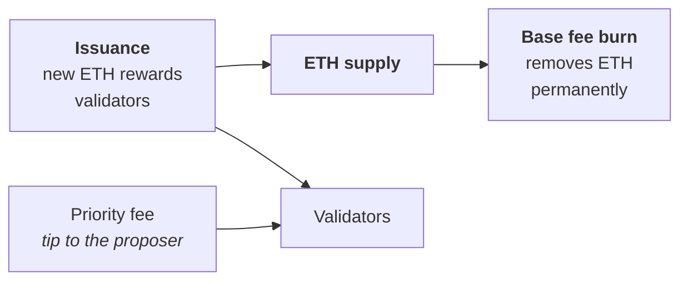

# Week 1 · Part 4 — Why anyone runs the network

[Part 3](./part-3-consensus.md) explained *how* the network agrees. It left a
question that every beginner asks and most explanations skip:

::: important If no company is paying people to run the network, why would anyone keep doing it?
:::

The answer is **economic incentives**, and it is worth one short page because it
makes the rest of Web3 legible. Once you see that miners, validators, block
producers and liquidators are all being paid to do something, a lot of otherwise
mysterious behaviour stops being mysterious.

## Learning objectives

- Explain why a decentralised network has to pay its participants
- Describe how Bitcoin and Ethereum each reward the people securing them
- Explain what the halving and the base fee burn actually do
- Distinguish running a node from earning protocol rewards

## Core

### Somebody has to do the work

A blockchain needs independent participants to verify transactions, propose
blocks and keep the shared history going. That work costs real money —
electricity, hardware, locked-up capital, time.

There is no employer. So the protocol itself pays.

::: important The design goal
**Make honest participation profitable, and make attacking the network
expensive.** Every incentive below exists to serve that one sentence.
:::

### Bitcoin — paying miners

Bitcoin miners spend real money on hardware and electricity. The miner who
successfully produces a block receives:

| | |
|---|---|
| **Block subsidy** | Newly issued BTC, created by the protocol |
| **Transaction fees** | Paid by the people whose transactions are in that block |

<figure class="academy-reference-visual academy-reference-visual--narrow">
  
  <figcaption>Miners spend resources to do the work of securing a Proof of Work chain, so the protocol gives successful block production an economic reward.</figcaption>
</figure>

The subsidy is not constant. Roughly every four years it is cut in half, in an
event called the **halving**. Fewer new BTC are created per block over time, and
total supply approaches a fixed limit of 21 million.

::: warning What the halving does — and what it does not do
The halving **reduces the rate at which new BTC enters circulation.** That
creates a predictable supply schedule.

It does **not** mean the price goes up. Whether BTC becomes more valuable is
determined by market demand, not by the issuance schedule. You will hear
"halving therefore number go up" stated as if it were arithmetic. It is not, and
recognising that is part of understanding this properly.
:::

<figure class="academy-reference-visual academy-reference-visual--narrow">
  
  <figcaption>Bitcoin is designed to be transferable between holders and to have a limited supply, which are part of why people discuss it as digital money. That design does not guarantee a stable price.</figcaption>
</figure>

Over the long run, as the subsidy shrinks, transaction fees are expected to make
up more of what miners earn. Whether that is enough to secure the network in
future is a genuine open debate — and a good example of an unsettled question in
a field that often pretends everything is settled.

### Ethereum — paying validators, and burning fees

Ethereum uses Proof of Stake, so the mechanism differs. Validators lock ETH as
stake and help propose and attest to blocks. Honest validators earn ETH;
provable dishonesty can have stake **slashed**.

Ethereum also does something Bitcoin does not. Part of every transaction fee —
the **base fee** — is **permanently destroyed** rather than paid to anyone.

Two forces pull in opposite directions:

- **issuance** creates ETH to pay for security
- **burning** removes ETH whenever the network is used

When activity is high, the burn can exceed issuance and supply temporarily
shrinks — sometimes described as **net deflationary**. When activity is quiet,
issuance can be higher. Neither state is permanent, and neither is a prediction
about price.

### Running a node is not the same as earning rewards

::: warning A distinction beginners get wrong constantly
**Running a full node does not pay you.** A full node independently verifies the
chain — that is its value, and it is genuinely valuable — but the protocol does
not send you rewards for having one online.

Rewards go to **miners** in Proof of Work and **validators** in Proof of Stake.
Those are specific roles with specific costs, not "anyone with the software
installed".
:::

People run full nodes anyway: to verify rather than trust, to avoid depending on
someone else's RPC provider ([Week 2 Part 4](../week-2/part-4-transactions-and-gas.md)),
and because businesses need reliable access to chain data.

### Side by side

| | Bitcoin | Ethereum |
|---|---|---|
| Security model | Proof of Work | Proof of Stake |
| Who secures it | Miners | Validators |
| Main reward | Newly issued BTC + transaction fees | ETH staking rewards + priority fees |
| Supply model | Fixed maximum of 21 million BTC | No fixed maximum |
| Issuance | Block subsidy halves roughly every four years | New ETH issued to reward validators |
| Fee mechanism | Fees go to miners | Base fee **burned**; priority fee to validators |

::: important The takeaway
**Both networks use their native asset to pay for security, but the economic
designs are genuinely different.** Bitcoin commits to a fixed long-term supply.
Ethereum combines validator issuance with fee burning, so supply responds to how
much the network is used.

Neither design is "better". They are answers to different questions.
:::

## Landscape

- **Block reward** — subsidy plus fees, paid to whoever produced the block
- **Halving** — Bitcoin's roughly four-yearly subsidy reduction
- **Base fee / priority fee** — the burned portion and the tip, introduced by EIP-1559 ([Week 2 Part 4](../week-2/part-4-transactions-and-gas.md))
- **Staking pool** — pooling ETH to validate without holding 32 ETH alone
- **Liquid staking** — a tradable token representing staked ETH
- **Issuance vs burn** — new supply created versus supply destroyed
- **MEV** — additional value block producers can capture by ordering transactions. Real, significant, and Further Exploration

## Worked example

Where does the fee on your Week 1 transaction actually go?

You will send a Sepolia transaction in [Part 7](./part-7-your-first-transaction.md)
and pay a small fee. On Ethereum mainnet, that fee splits:

| Portion | Goes to | Why |
|---|---|---|
| **Base fee** | **Nobody** — destroyed | Prices congestion. Burning it means the block proposer does not directly receive the base fee |
| **Priority fee** | The block proposer | Your tip for being included sooner |

That first row is worth a moment. The base fee is set by demand and then
**burned**, specifically so that whoever picks transactions has less incentive
to manipulate the congestion price for their own benefit. The block proposer
does not directly receive the base fee.

::: tip This is what "incentive design" means in practice
Not slogans about decentralisation — a concrete decision that removes a specific
conflict of interest. When you meet a new protocol, the useful question is the
same one: **who gets paid, for doing what, and what does that encourage them to
do?**
:::

::: details Further exploration — optional, not assessed
- [ethereum.org — Staking](https://ethereum.org/staking/) — what validators actually commit to
- [ethereum.org — Rewards and penalties](https://ethereum.org/developers/docs/consensus-mechanisms/pos/rewards-and-penalties/) — precisely how validators are paid and slashed
- [Bitcoin whitepaper](https://bitcoin.org/bitcoin.pdf) — section 6, "Incentive", is half a page and states the argument in the original terms
- **MEV, tokenomics and monetary policy** — large fields, deliberately not compulsory here
:::

::: details Sources and attribution
- [ethereum.org — Proof of stake rewards and penalties](https://ethereum.org/developers/docs/consensus-mechanisms/pos/rewards-and-penalties/) — Reuse (CC BY 4.0), adapted
- [ethereum.org — Ethereum staking](https://ethereum.org/staking/) — Reuse (CC BY 4.0), adapted
- [ethereum.org — Gas and fees](https://ethereum.org/developers/docs/gas/) — Reuse (CC BY 4.0), adapted
- [ethereum.org — Nodes and clients](https://ethereum.org/developers/docs/nodes-and-clients/) — Reuse (CC BY 4.0), adapted
- [Bitcoin whitepaper](https://bitcoin.org/bitcoin.pdf) — Link, referenced only
- [Web3 Internship Handbook](https://web3intern.xyz/zh/blockchain-basic/) — Reuse (permission granted); node-reward and Bitcoin monetary-properties visuals adapted from its blockchain basics materials

*Named assets are illustrative. Nothing here is financial advice, and nothing
here is a claim about future prices.*
:::
