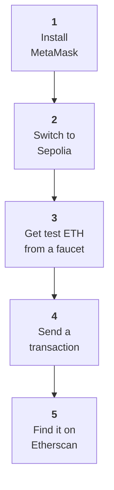

# Week 1 · Part 7 — Your first transaction

::: danger Testnet only
==Everything on this page uses free test assets with no monetary value. **Never
use real funds for an Academy activity.**==
:::

Six parts of theory. Today you use it.



By the end you will have sent a transaction, seen it recorded on the chain, and
found that public record through a block explorer.

::: important This is also your Anchor Mission evidence
Work carefully and keep what you produce — the address, the hash, and the link.
:::

## Learning objectives

- Install and set up a wallet, and secure its recovery phrase
- Obtain testnet ETH and explain why it is free and worthless
- Send a transaction and explain each field you confirmed
- Read your own transaction on a block explorer

## Core

### Gas, briefly

Every on-chain transaction consumes **gas**, which measures the work the
network performs. You pay a **transaction fee** based on how much gas the
transaction uses and the current gas price. **Fees price scarce blockspace and
make spam costly. Part 4 explains how Ethereum splits and burns those fees.**

| Term | Meaning |
|---|---|
| **Gas used** | How much computation the transaction took. A plain transfer has traditionally used 21,000 units under the current fee schedule |
| **Gas price** | What you pay per unit, in **gwei** (one billionth of an ETH) |
| **Transaction fee** | Gas used × gas price. What actually leaves your balance |

::: tip The key idea
**Complexity costs more.** Sending ETH is the cheapest thing you can do. Calling
a contract costs more. Deploying one costs much more — you will feel this in
Week 3.
:::

## Guided walkthrough

Take your time. Nothing here is timed, and the habits matter more than the speed.

::: tip Before you start
You need about 30 minutes, a desktop browser, and nowhere to be. If a step does
not look like the screenshot, stop and ask in the Telegram group rather than
guessing — wallet interfaces change, and the group will know.
:::

:::: steps
1. **Install MetaMask**

   Go to **[metamask.io](https://metamask.io)** — type it or use the bookmark
   you made in Week 0.

   ::: danger Do not reach it through a search advert
   Fake wallet extensions are a routine attack and they look correct. Check the
   URL before you install anything.
   :::

   <figure class="academy-shot">
     
     <figcaption>Check the URL first, every time. This is the habit, not the click.</figcaption>
   </figure>

   Install the browser extension and choose **Create a new wallet**.

   <figure class="academy-shot">
     
     <figcaption>Create a new wallet. Do not import one you already use.</figcaption>
   </figure>

   ::: warning Create a wallet only for the Academy
   This wallet will only ever hold worthless test assets. **Do not reuse a
   wallet that holds real funds** — Week 0's separate-wallets rule starts here.
   :::

   Set a strong password. This encrypts the wallet on *this device only*. It is
   not your recovery phrase.

2. **Write down your recovery phrase**

   You will be shown a **12-word recovery phrase**.

   ::: danger Stop here — this is the irreversible one
   Write the twelve words on paper, in order.

   **Never:** a screenshot · a cloud note · a message to yourself · typed into
   any website or "support" chat

   Anyone who obtains these words controls this wallet permanently, from
   anywhere. **Blockchain@NTU will never ask you for it.** The normal exception
   is when **you deliberately restore or import your wallet into wallet software
   that you installed from a verified official source**. Never enter it because
   someone sent you a link, DMed you, or told you to “verify”, “sync” or “unlock”
   your wallet.

   Practise storing it properly **now**, while the stakes are zero.
   :::

   <figure class="academy-shot">
     
     <figcaption>A mock-up, not a real screen. The point is to show <em>where</em> the phrase appears, never what a real one says.</figcaption>
   </figure>

   Confirm the phrase when prompted. *You should now see a wallet with one
   account and a balance of 0 ETH.*

   <figure class="academy-shot">
     
     <figcaption>Setup is done when you land here. The balance is 0 and the network is still Mainnet.</figcaption>
   </figure>

3. **Switch to Ethereum Sepolia**

   MetaMask opens on Ethereum Mainnet, and test networks are hidden until you
   ask for them. There is no plain network dropdown any more: open the **network
   selector** at the top left, choose **Manage networks**, turn on **Show test
   networks**, then pick **Ethereum Sepolia**.

   <figure class="academy-shot">
     
     <figcaption>Test networks are hidden by default. Enable them once.</figcaption>
   </figure>

   <figure class="academy-shot">
     
     <figcaption>With the toggle on, the test networks appear.</figcaption>
   </figure>

   <figure class="academy-shot">
     
     <figcaption>Now pick Ethereum Sepolia from the list.</figcaption>
   </figure>

   <figure class="academy-shot">
     
     <figcaption>Confirm Sepolia is showing before you go any further.</figcaption>
   </figure>

   ::: tip Verify you are on the right network
   Ethereum Sepolia's **Chain ID is 11155111**. MetaMask already knows Sepolia,
   so you should not need to add a custom RPC by hand — if a guide tells you to,
   check you are not being sent to an imitation network.
   :::

   ::: warning Check this every single time from now on
==**Which network am I on** is the first question of every transaction.==
   Confusing mainnet and testnet is a classic and expensive mistake.
   :::

4. **Copy your wallet address**

   Your address starts `0x` and is 42 characters long. Click it at the top of
   the wallet to copy.

   <figure class="academy-shot">
     
     <figcaption>This is the value you paste into a faucet.</figcaption>
   </figure>

   ::: important Four things beginners mix up
   | Item | What it is | Safe to share? |
   |---|---|---|
   | **Wallet address** | The public identifier for this account, `0x` + 40 chars | **Yes** |
   | **Transaction hash** | The ID of one transaction, `0x` + 64 chars | **Yes** |
   | **Contract address** | A program's address on the chain | **Yes** |
   | **Private key / recovery phrase** | What controls your wallet | **Never** |

   ==The first three are public by design. The fourth is the only secret.==
   :::

5. **Claim test ETH from a faucet**

   A **faucet** gives you testnet ETH for learning. It has no real monetary
   value — that is the whole design.

   Try these in order:

   | Priority | Faucet | Note |
   |---|---|---|
   | **First** | [Google Cloud Web3 faucet](https://cloud.google.com/application/web3/faucet/ethereum/sepolia) | Needs a Google account |
   | **Backup** | [Coinbase Developer Platform faucet](https://portal.cdp.coinbase.com/products/faucet) | Needs a free CDP account |
   | **Directory** | [ethereum.org testnet and faucet list](https://ethereum.org/developers/docs/networks/) | The official list, if both above fail |

   <figure class="academy-shot">
     
     <figcaption>Paste the address you copied in step 4.</figcaption>
   </figure>

   <figure class="academy-shot">
     
     <figcaption>The faucet confirms first. The wallet catches up a moment later.</figcaption>
   </figure>

   <figure class="academy-shot">
     
     <figcaption>Funds usually arrive within a minute.</figcaption>
   </figure>

   ::: warning If the faucet does not work
   This is common and it is **not your fault**. Faucets run dry, change their
   rules, and add requirements without notice.

   1. Check you pasted the correct wallet address.
   2. Check your wallet is on **Sepolia**, not mainnet.
   3. Try the next faucet in the table.
   4. If all of them fail, say so in the Telegram group — someone will know
      which one is working today.
   :::

   ::: danger Never pay for testnet ETH
   ==It is worthless by definition, so anyone selling it is running a scam.== There
   is **no way to convert or bridge Sepolia ETH into real mainnet ETH**. Anyone
   claiming they can turn your test ETH into real ETH is scamming you. Never
   connect a wallet holding real assets to a faucet.
   :::

6. **Send a test transaction**

   You will send a small amount between two accounts you control. It is a real
   transaction in every respect, and it needs no second person.

   In MetaMask, add a **second account** from the account menu and copy its
   address. Then choose **Send**, paste that address as the recipient, and enter
   a small amount such as **0.001**.

   <figure class="academy-shot">
     
     <figcaption>One wallet, two accounts. The second one is the recipient.</figcaption>
   </figure>

   <figure class="academy-shot">
     
     <figcaption>Sending between two accounts you control lets you see both sides of the transfer.</figcaption>
   </figure>

   On the confirmation screen, **read every line before confirming**:

   | Check | Should say |
   |---|---|
   | Network | Sepolia |
   | To | Your second account |
   | Amount | 0.001 SepoliaETH |
   | Estimated fee | A small amount of SepoliaETH |

   <figure class="academy-shot">
     
     <figcaption>The four fields to read before you ever press Confirm.</figcaption>
   </figure>

   ::: important The habit this whole page exists to build
   **Before confirming anything, check the network, the recipient, the amount,
   and what you are being asked to authorise.**

   Practise it here, on testnet, where getting it wrong is free.
   :::

   Choose **Confirm**. *The status usually confirms within seconds on Sepolia,
   but it can take longer.*

   <figure class="academy-shot">
     
     <figcaption>Copy the transaction hash — you need it for the Anchor Mission.</figcaption>
   </figure>

7. **Find the transaction on the explorer**

   Go to **[sepolia.etherscan.io](https://sepolia.etherscan.io)** and paste your
   transaction hash into the search box.

   <figure class="academy-shot">
     
     <figcaption>No account. No login. No permission needed.</figcaption>
   </figure>

   <figure class="academy-shot">
     
     <figcaption>Every field here is something you now understand.</figcaption>
   </figure>

   The explorer shows the transaction's public record from the chain. No account
   is required.
::::

::: tip One small exploration task
Click your own address on Etherscan and look at its full transaction history.

**This is what "public ledger" means in practice.** Anyone in the world can do
the same with your address, without asking you.
:::

## Optional stretch — use a real DApp on testnet

::: details Optional, not assessed, not part of the Anchor Mission
Once the basic transaction works, you can see what a wallet is actually *for*.

[Uniswap on Sepolia](https://app.uniswap.org/swap?chain=sepolia)

1. Connect your Academy test wallet.
2. **Confirm the network is Sepolia** before anything else.
3. Explore the swap interface without committing to anything.
4. If suitable test tokens are available, try a very small testnet swap.
5. Open the resulting transaction on Etherscan.

Watch what your wallet asks you for. You will likely meet an **approval** before
the swap itself — the exact pattern
[Part 6](./part-6-wallets-and-accounts.md) warned about, now in front of you on a
network where mistakes cost nothing.

The point:

> **A wallet is not only for sending tokens. It is how you interact with
> decentralised applications.**
:::

### Reading the explorer

Every field is something you now understand.

| Field | What it tells you |
|---|---|
| **Status** | Success or failed. Failed transactions still cost gas |
| **Block** | Which block included it, and how many have followed |
| **From / To** | The addresses involved |
| **Value** | How much moved |
| **Transaction Fee** | What you actually paid |
| **Gas Used** | 21,000 for a plain transfer, under the current fee schedule |
| **Nonce** | Your account's counter |

*You should be able to point at each field and say what it means.* If any is
unclear, that is the signal to reread [Part 2](./part-2-how-shared-state-works.md).

::: important Notice what just happened
You looked up a financial transaction on a public website, with no login, no
permission, and no relationship with anyone. Anyone in the world can do the same
with your hash.

That is what "public ledger" means in practice — and it is worth deciding how
you feel about it, because it applies to everything you do on-chain.
:::

## Landscape

- **Pending / dropped / replaced** — a transaction can wait, be discarded, or be superseded by one with a higher fee. Until it is included, it has not changed the chain's state
- **Speed up / cancel** — resubmitting with a higher fee and the same nonce. This can replace a pending request, but cannot undo a confirmed transaction
- **Nonce ordering** — transactions from one address execute in strict nonce order, so a stuck low nonce blocks everything behind it until it is included or replaced
- **Wei / gwei / ether** — units. 1 ether = 10⁹ gwei = 10¹⁸ wei; recognising the units helps you read wallet and explorer fee fields
- **Failed transactions still cost gas** — the work was done even though the outcome reverted

## Worked example

A completed transaction, field by field.

```text
Status:              Success
Block:               11,679,871  (20 block confirmations)
From:                0x8fB2…FD6ec   ← your address
To:                  0x3f31…DC8dC   ← your second account
Value:               0.001 ETH
Transaction Fee:     0.000057162195783 ETH
Gas Price:           2.722009323 Gwei
Gas Limit & Usage:   31,500 | 21,000 (66.67%)
Nonce:               0
Input Data:          0x
```

Read it back in plain English:

> Address `0x8fB2…FD6ec` sent 0.001 test ETH to another account it controls. It
> was included in block 11,679,871, and 20 blocks have followed — so it now has
> many confirmations. It used exactly 21,000 gas, the traditional cost of a plain
> ETH transfer under the current fee schedule. Nonce 0 means this was the first
> transaction this address ever sent — receiving the faucet's transfer did not
> increment it, because only sending does.

Three details worth pausing on:

**The limit is not the price.** Gas Limit & Usage reads `31,500 | 21,000` — the
wallet reserved headroom, the transaction used 21,000, and ==**you are not
charged for the unused portion**==.

**The fee is gas used × gas price.** 21,000 × 2.722 Gwei ≈ 0.000057 ETH. Both
numbers are on the page, so you can check the arithmetic yourself.

**Input Data is `0x` — empty.** That is what makes this a plain transfer. When
you interact with a contract in Week 3, this field carries the instruction you
sent, and that difference is the whole distinction between moving value and
running code.

Now connect it to the theory:

| What you see | Which part explains it |
|---|---|
| **You signed it** with your private key, so the network accepted it as authorised | [Part 6](./part-6-wallets-and-accounts.md) |
| **Every node independently verified** the signature, balance and nonce | [Part 2](./part-2-how-shared-state-works.md) |
| **Consensus** put it in one agreed position in one agreed history | [Part 3](./part-3-consensus.md) |
| **The ETH** is a native asset, which is why it could pay its own fee | [Part 5](./part-5-crypto-asset-map.md) |

::: important That is Week 1 in a single transaction
The [Anchor Mission](./anchor-mission.md) asks you to explain exactly this, in
your own words, about your own hash.
:::

::: details Further exploration — optional, not assessed
- [ethereum.org — Gas and fees](https://ethereum.org/developers/docs/gas/) — how fees are actually calculated
- Look up a **failed** transaction on Etherscan and work out why. Understanding failure teaches more than success
- Find a large, busy address and scroll its history. A useful sense of what *public* really means
:::


::: details Sources and attribution
- [ethereum.org — Networks](https://ethereum.org/developers/docs/networks/) — Reuse (CC BY 4.0), adapted
- [ethereum.org — Gas and fees](https://ethereum.org/developers/docs/gas/) — Reuse (CC BY 4.0), adapted
- [ethereum.org — Block explorers](https://ethereum.org/developers/docs/data-and-analytics/block-explorers/) — Reuse (CC BY 4.0), adapted
- [MetaMask — Support](https://support.metamask.io/) — Link, referenced only
- [Google Cloud Web3 — Ethereum Sepolia faucet](https://cloud.google.com/application/web3/faucet/ethereum/sepolia) — Link, referenced only
- [Coinbase Developer Platform Faucet](https://portal.cdp.coinbase.com/products/faucet) — Link, referenced only
- [Uniswap](https://app.uniswap.org/) — Link, referenced only
:::
