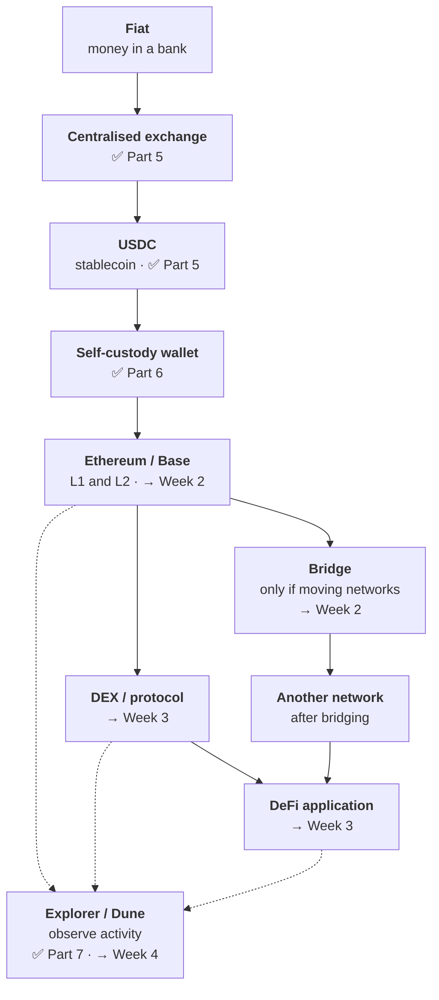

# Week 1 · Part 8 — How it all connects: one user journey

You now have seven pieces. This is where they become one picture.

::: important This page is a preview, not a lesson
Roughly half the steps below are taught in Weeks 2 and 3. Each is marked and
linked to where it is covered.

You are **not** expected to understand them yet. You are expected to finish the
week able to say *"I know what that step is for, and I know which week explains
it."*
:::

::: warning You will not do this journey
It involves real money and real risk, and nothing in this programme requires
either. It is here to show how the pieces fit — nothing more.
:::

## Learning objectives

- Trace one possible path from a bank account to an on-chain position and name each step
- Identify which steps you already understand and which are still ahead
- Explain, at each handover, what changes about who you are trusting
- Point to the week that covers each step you have not met yet

## Core

### The journey

This is one deliberately complex example, not the sequence every Web3 user
follows. A bridge appears only when value needs to move between networks, and an
explorer or dashboard is for observing activity rather than receiving assets.

✅ means you have covered it. → means it is ahead of you.

### Step by step

Watch the **"what you are trusting"** line at each handover. Read the rows as
branches in the example, not as a mandatory queue.

| Step | What happens | What you are trusting |
|---|---|---|
| **Fiat → exchange** | Money moves from a bank into an exchange account. A normal regulated relationship: KYC, an account, a company holding your funds | The exchange, **entirely**. You have a claim, not an asset |
| **Exchange → USDC** | Fiat converted to a stablecoin. Dollar value that moves at blockchain speed | The exchange, **plus Circle** — the issuer holding reserves. A new assumption, quietly added |
| **Exchange → wallet** | Withdrawn to an address you control. Custody moves from a company to a person | **You control custody.** The exchange no longer controls the wallet, but token-level controls may still exist — for example, a stablecoin issuer may be able to freeze its token |
| **Wallet → chain** | Assets sit on Ethereum, or on **Base**, a Layer 2 built on top for lower fees. The route does not require a bridge | The network, and the L2's operators → [Week 2 Part 5](../week-2/part-5-l1-l2-and-bridges.md) |
| **Bridge, only when needed** | Moving value between networks. Chains cannot natively see each other | Source chain + destination chain + **the bridge mechanism** → [Week 2 Part 5](../week-2/part-5-l1-l2-and-bridges.md) |
| **DEX** | Swapping assets through contracts, from your own wallet, no account | Your wallet + the DEX contracts + each token's contract → Week 3 |
| **DeFi protocol** | Depositing into a lending market or pool — finance by programs, not institutions | All the above + this protocol's contracts + its **oracle** + its economic design → Week 3 |
| **Explorer / Dune** | A block explorer or dashboard lets you observe and analyse on-chain activity; it is not the destination of the assets | The explorer's record; Dune's indexing and definitions if you use its dashboard → [Part 7](./part-7-your-first-transaction.md), Week 4 |

::: warning Bridges deserve early attention
Bridges have historically been a major source of large crypto exploits — worth
understanding even before you know how they work.
:::

### The thing to actually take from this

Read the trust column downward and notice the shape.

| Stage | Trusting |
|---|---|
| Exchange | The exchange |
| USDC | Exchange + issuer |
| Self-custody | **Yourself** + issuer |
| Bridge | Two chains + bridge mechanism |
| DEX | Wallet + several sets of contracts |
| DeFi protocol | All of the above + oracle + economic design |

**Trust assumptions change as you move through the stack.** They can increase,
decrease or shift depending on the path. In this example, each extra component
adds another assumption.

Moving to self-custody did not remove trust — it moved it onto you, and onto the
software you interact with. Each additional protocol adds assumptions rather than
removing them.

::: important The single most useful sentence in Week 1
**Web3 does not eliminate trust. It changes and redistributes trust
assumptions.**

[Week 2 Part 6](../week-2/part-6-trust-and-risk-map.md) turns this into a tool
you can apply to anything.
:::

## Landscape

- **On-ramp / off-ramp** — converting between fiat and crypto in either direction. The service handling the conversion adds its own fees, limits and custody risk
- **Layer 2** — a network built on a base chain for cheaper, faster transactions (Week 2). It adds another system and therefore another set of trust assumptions
- **Wrapped asset** — a token representing an asset from elsewhere ([Part 5](./part-5-crypto-asset-map.md)). Its value depends on the mechanism that links it to the underlying asset
- **Slippage** — the gap between the price you expected on a swap and the one you got. Thin liquidity or a large trade can make the gap wider
- **Liquidity pool** — pooled assets a DEX trades against (Week 3). More liquidity usually makes larger trades easier to execute without moving the price as much
- **Oracle** — a service supplying external data to contracts (Week 3). If the data is wrong or manipulated, the contract can make a wrong decision
- **Yield** — return from lending or providing liquidity. It is compensation for a risk; the useful question is which risk pays it

## Worked example

The same journey as a decision rather than a diagram.

A student in Singapore wants to send S$500 to a family member abroad and has
heard stablecoins are faster.

| They do | They gain | They take on |
|---|---|---|
| Buy USDC on a licensed exchange | A dollar value that moves in minutes, not days | Exchange custody; issuer reserves |
| Withdraw to their own wallet | They control custody; token-level issuer controls may remain | Full responsibility for keys |
| Send to the recipient's address | Settlement in seconds, at a fee measured in cents | Wrong address means it is gone. No reversal |
| Recipient converts to local currency | Done | Their local exchange, their local rules |

Faster and cheaper than four correspondent banks. Also: no error correction
anywhere in the chain, several new counterparties, and two jurisdictions'
regulations — [Week 0 Part 5](../../getting-started/regulatory-awareness.md).

::: important Whether that trade is worth making depends entirely on the situation
Noticing that it **is a trade** — rather than a straightforward upgrade — is
what this week was for.
:::

::: details Further exploration — optional, not assessed
- [ethereum.org — Layer 2](https://ethereum.org/layer-2/) — a preview of Week 2
- [ethereum.org — Decentralized finance](https://ethereum.org/defi/) — a preview of Week 3
- [ethereum.org — Bridges](https://ethereum.org/developers/docs/bridges/) — including a frank treatment of the risks
:::

::: details Sources and attribution
- [ethereum.org — Stablecoins](https://ethereum.org/stablecoins/) — Reuse (CC BY 4.0), adapted
- [ethereum.org — Decentralized finance (DeFi)](https://ethereum.org/defi/) — Reuse (CC BY 4.0), adapted
- [ethereum.org — Bridges](https://ethereum.org/developers/docs/bridges/) — Reuse (CC BY 4.0), adapted
- [ethereum.org — Layer 2](https://ethereum.org/layer-2/) — Reuse (CC BY 4.0), adapted

*Named products are illustrative, not recommendations. Nothing here is financial advice.*
:::
