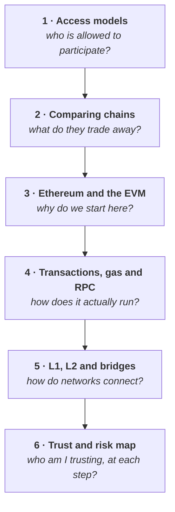

# Week 2 — Blockchain architectures, Ethereum and interoperability

<svg xmlns="http://www.w3.org/2000/svg" viewBox="0 0 64 64" width="56" height="56" class="academy-week-mark" role="img" aria-labelledby="t2 d2">
  <title id="t2">Three stacked layers</title><desc id="d2">Three platforms stacked in decreasing width, representing layered blockchain architecture.</desc>
  <g fill="none" stroke="#37a4e3" stroke-width="4" stroke-linecap="round" stroke-linejoin="round">
    <rect x="6" y="43" width="52" height="11" rx="3.5" fill="#9aeaf6"/>
    <rect x="14" y="28" width="36" height="11" rx="3.5" fill="none"/>
    <rect x="22" y="13" width="20" height="11" rx="3.5" fill="none"/>
  </g>
</svg>

<Badge type="info" text="6 parts" /> <Badge type="tip" text="100 points" /> <Badge type="warning" text="No wallet work" />

> **Core question — why are there many different blockchains, and how do they
> connect?**

Week 1 taught you what a blockchain is, using Ethereum as the example. That
leaves an obvious question: if this works, why are there thousands of them, and
why do they keep making different choices?

**Because there is no single best design — only trade-offs.** This week teaches
you to see them, which is the skill that lets you evaluate any network you meet
from here on.

| Part | Page | Reading |
|---|---|---|
| 1 | [Public, private and consortium chains](./part-1-access-models.md) | 20 min |
| 2 | [Comparing blockchains and their trade-offs](./part-2-comparing-blockchains.md) | 25 min |
| 3 | [Why we start with Ethereum and the EVM](./part-3-why-ethereum-and-evm.md) | 20 min |
| 4 | [Transactions, state, gas and RPC](./part-4-transactions-and-gas.md) | 25 min |
| 5 | [L1, L2, sidechains and bridges](./part-5-l1-l2-and-bridges.md) | 30 min |
| 6 | [The trust and risk map](./part-6-trust-and-risk-map.md) | 15 min |

**Anchor Mission:** [Week 2 mission](./anchor-mission.md) · 100 points

## The arc

::: important Part 6 is the shortest page and the one the rest of the Foundation leans on hardest
Give it proper attention.
:::

## What this week is not

This week is **analytical, not technical**. No wallet work and no code — that
returns in Week 3.

Depth is deliberately capped. Bridge verification mechanisms, modular
architecture, data availability layers and ZK internals are **Further
Exploration**, not Core. You are building a map, not mastering a subfield.
