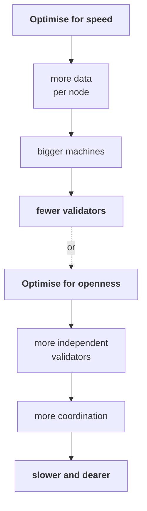

# Week 2 · Part 2 — Comparing blockchains and their trade-offs

Part 1 sorted blockchains by who is allowed in. Today sorts the public ones by
what they optimise for.

There are thousands of chains and you will never evaluate them one at a time.
What you can do is learn the handful of dimensions they all vary along.

::: important The conclusion, stated up front
**Different blockchains make different design choices. None of them is strictly
best.** A chain advertising a number without naming its cost is marketing, not
engineering.
:::

## Learning objectives

- Name the dimensions along which blockchain designs differ
- Explain the trade-off between decentralisation and throughput
- Compare two chains on three dimensions and say what each gave up
- Recognise when a performance claim has quietly omitted its cost

## Core

### The central tension

Most of what follows reduces to one pressure.

You will hear this framed as the **blockchain trilemma** — decentralisation,
security, scalability, pick two.

::: tip Treat the trilemma as a rule of thumb, not a law
Enormous engineering effort goes into softening it, and [Part 5](./day-5-l1-l2-and-bridges.md)
covers the most successful attempt so far. But the pressure is real, and a chain
claiming to have escaped it entirely has usually just moved the cost somewhere
you were not looking.
:::

### The seven dimensions

| Dimension | The question |
|---|---|
| **Decentralisation** | How many independent participants, how spread out? |
| **Finality** | How long until a transaction is genuinely settled? |
| **Throughput** | How many transactions per second? |
| **Validator requirements** | What does it cost to be one? |
| **Execution model** | What can the chain compute, and how? |
| **Ecosystem** | What already exists — tools, users, applications? |
| **Design trade-off** | What was deliberately given up, and for what? |

That last row is the one beginners skip and the one that tells you the most.

### Five representative chains

Chosen because they made genuinely different choices — not because they are the
five best.

::: warning Figures are approximate and directional
Real throughput depends on transaction type and network conditions, and
advertised maximums are almost never sustained. Use these to compare *shapes*,
not to quote numbers.
:::

::: tabs
@tab <Icon name="token-branded:bitcoin" /> Bitcoin

**Maximum conservatism.**

| | |
|---|---|
| Consensus | Proof of Work |
| Finality | Probabilistic; ~1 hour for high confidence |
| Throughput | Very low — a handful per second |
| Validator requirements | Mining hardware and cheap electricity |
| Execution | Deliberately limited scripting. Not general-purpose |
| **Trade-off** | Gave up nearly everything for security, simplicity and predictability |

Bitcoin's limitations are not failures to fix. They are the design. Less
functionality means less to attack and less to argue about. It has done one job
without interruption since 2009.

@tab <Icon name="token-branded:ethereum" /> Ethereum

**Programmability first.**

| | |
|---|---|
| Consensus | Proof of Stake |
| Finality | Explicit, ~13 minutes |
| Throughput | Low at the base layer — roughly 15–30 per second |
| Validator requirements | 32 ETH, or a pool. Consumer hardware |
| Execution | The EVM. General-purpose smart contracts |
| **Trade-off** | Accepted low base-layer throughput to keep validation cheap enough for ordinary hardware — then scaled via Layer 2 |

Ethereum's answer to "it's slow" is not to raise base-layer capacity. It is to
keep the base layer verifiable by anyone and push volume to Layer 2.

@tab <Icon name="token-branded:solana" /> Solana

**Performance first.**

| | |
|---|---|
| Consensus | Proof of Stake, with a verifiable clock ordering transactions |
| Finality | Fast — seconds |
| Throughput | High — thousands per second |
| Validator requirements | **Substantial** — high-spec hardware and bandwidth |
| Execution | Parallel: non-conflicting transactions run simultaneously |
| **Trade-off** | Accepted higher validator costs, and historically some stability incidents, for speed and very low fees |

Solana genuinely delivers the performance. The honest accounting is that it
costs real money to run a validator, which concentrates who can — and the
network has had outages that Ethereum and Bitcoin have not.

@tab <Icon name="token-branded:cosmos" /> Cosmos

**Many chains, not one.**

| | |
|---|---|
| Consensus | CometBFT — Byzantine Fault Tolerant Proof of Stake |
| Finality | **Instant** — one block, no waiting |
| Throughput | High per chain |
| Validator requirements | Set by each chain, typically a fixed modest set |
| Execution | Each chain builds its own; connected via IBC |
| **Trade-off** | Gave up shared security — each chain secures itself — for sovereignty and instant finality |

Cosmos rejects the premise that everyone should share one chain. The cost is
that a new chain starts with its own small validator set and must bootstrap its
own security.

@tab <Icon name="token-branded:avalanche" /> Avalanche

**Subnets and configurability.**

| | |
|---|---|
| Consensus | Avalanche consensus — repeated randomised sampling |
| Finality | Fast — around a second |
| Throughput | High |
| Validator requirements | A stake requirement; consumer-grade hardware |
| Execution | Multiple chains; EVM-compatible option; custom subnets |
| **Trade-off** | Optimised for configurable, application-specific networks over one shared environment |
:::

### Side by side

| | <Icon name="token-branded:bitcoin" /> Bitcoin | <Icon name="token-branded:ethereum" /> Ethereum | <Icon name="token-branded:solana" /> Solana | <Icon name="token-branded:cosmos" /> Cosmos | <Icon name="token-branded:avalanche" /> Avalanche |
|---|---|---|---|---|---|
| Decentralisation | Very high | Very high | Moderate | Varies | High |
| Finality | ~1 hour | ~13 min | Seconds | Instant | ~1 second |
| Throughput | Very low | Low (base) | High | High | High |
| Validator cost | Hardware + power | 32 ETH | High-spec hardware | Varies | Stake + modest |
| Execution | Limited | EVM | Parallel | Per chain | Configurable |

::: tip Read the columns downward, not the rows across
Nobody chose "moderate decentralisation" as a goal. Solana chose speed, and
that is what it cost.
:::

## Landscape

- **Blockchain trilemma** — a framing, not a proof
- **BFT consensus** — the family behind instant finality
- **Parallel execution** — running non-conflicting transactions simultaneously
- **IBC** — the Cosmos standard for chain-to-chain messaging
- **Subnet / appchain** — a network dedicated to one application. Part 5
- **EVM-compatible** — runs Ethereum contracts largely unmodified
- **Shared vs sovereign security** — inheriting security, or providing your own
- **Client diversity** — how many independent software implementations exist. A real and underrated decentralisation measure

## Worked example

> **"Which chain should a payments app for small merchants in Southeast Asia
> use?"**

Do not start from a favourite. Start from what the application needs.

| Requirement | Consequence |
|---|---|
| Confirmation while the customer waits | Rules out minute-scale finality |
| Fees well under a cent | Rules out congested base layers |
| Stablecoin support | Needs a real ecosystem, not just a chain |
| Merchants cannot lose funds to outages | Uptime is a hard requirement |

The candidates, honestly:

| Candidate | Verdict |
|---|---|
| Bitcoin | **No.** Hour-scale finality, no native stablecoin support |
| Ethereum L1 | **No.** Fees and finality both wrong for point-of-sale |
| Solana | **Plausible.** Fast, cheap, strong stablecoin usage. Weigh the outage history |
| An Ethereum L2 | **Plausible.** Cheap and fast, with Ethereum behind it |
| A Cosmos appchain | **Plausible** if you need full control. You'd bootstrap your own validators |

::: important There is no single right answer — that is the exercise
What you should be able to say is: *"We chose X. It gives us speed and low fees.
What we gave up is Y, and here is why that is acceptable for this use case."*

Someone who says "we chose X because it is the best chain" has not understood
this material.
:::

::: details Further exploration — optional, not assessed
- [Solana docs](https://solana.com/docs) · [CometBFT docs](https://docs.cometbft.com/) · [Avalanche docs](https://build.avax.network/docs) — primary sources for three of the five
- [Bitcoin whitepaper](https://bitcoin.org/bitcoin.pdf) — nine pages, and the origin of the constraints Bitcoin still honours
- **Modular blockchains and data availability layers** — the current frontier of this argument
:::

::: details Sources and attribution
- [ethereum.org — Consensus mechanisms](https://ethereum.org/developers/docs/consensus-mechanisms/) — Reuse (CC BY 4.0), adapted
- [Bitcoin whitepaper](https://bitcoin.org/bitcoin.pdf) — Link, referenced only
- [Solana documentation](https://solana.com/docs) — Link, referenced only
- [CometBFT documentation](https://docs.cometbft.com/) — Link, referenced only
- [Avalanche documentation](https://build.avax.network/docs) — Link, referenced only

*Named networks are illustrative examples, not recommendations. Performance
figures are approximate and change; verify against primary sources.*
:::
