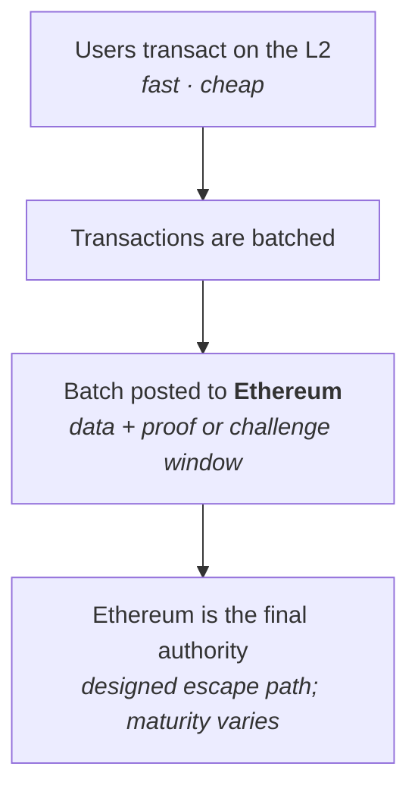
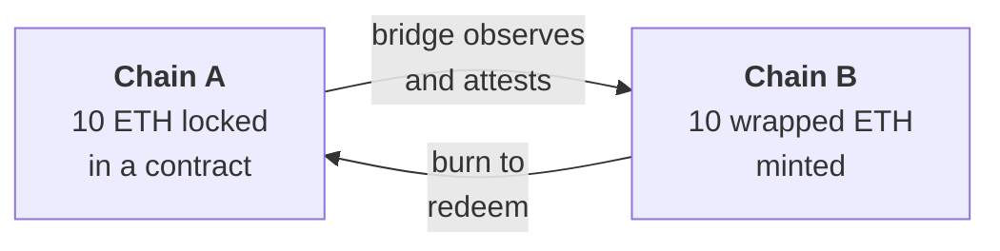
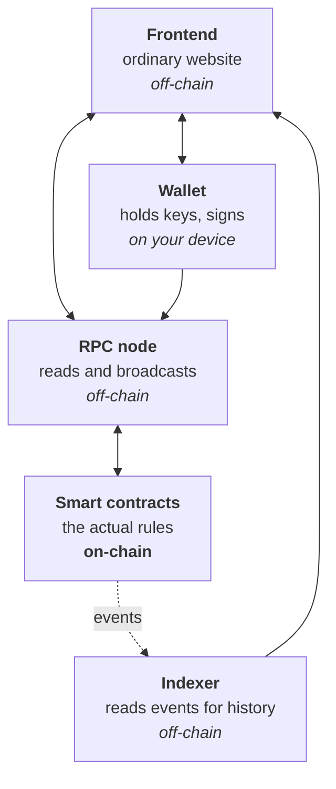

# Week 2 · Part 5 — L1, L2, sidechains and bridges

[Part 2](./day-2-comparing-blockchains.md) left Ethereum with an unresolved
problem: roughly 15–30 transactions per second, and a deliberate refusal to fix
that by raising base-layer capacity.

This is how it gets fixed instead. And once there are many networks, a second
problem appears immediately: **they cannot see each other.**

## Learning objectives

- Explain what a Layer 2 is and what it inherits from its Layer 1
- Distinguish a Layer 2 from a sidechain by their security assumptions
- Explain why bridges are necessary and where their risk sits
- Describe the parts of a DApp and which of them are actually on-chain

## Core

### The vocabulary

| Term | What it is |
|---|---|
| **Layer 1 (L1)** | A base blockchain that secures itself. Ethereum, Bitcoin, Solana |
| **Layer 2 (L2)** | A network processing transactions separately but **deriving its security from an L1** |
| **Sidechain** | A separate chain connected to another, with **its own security** |
| **Appchain** | A chain dedicated to one application |
| **Bridge** | Infrastructure moving assets or messages between chains |

::: important The distinction that actually matters
**L2 versus sidechain — and it is about where security comes from.** Not speed,
not fees, not branding.
:::

### How a Layer 2 works

The core idea: **do the work elsewhere, but post enough to Ethereum that
Ethereum remains the referee.**

Thousands of L2 transactions compress into one L1 posting, so the L1 cost is
shared across all of them. **That is where the cost reduction comes from** — not
from cutting corners on verification, but from amortising it.

::: important What a mature rollup is designed to do
**A mature rollup is designed so you do not have to trust one operator forever.**
Enough data goes to Ethereum that, in principle, your balance can be
reconstructed and withdrawn even if the operators turn against you.

**But "designed to" is doing real work in that sentence.** Real networks differ
in maturity, upgrade controls, data availability and withdrawal mechanisms. Some
networks marketed as L2s do not yet provide that guarantee in practice.
:::

Two families:

| | **Optimistic rollups** | **ZK rollups** |
|---|---|---|
| Assumption | Batches are valid unless challenged | Validity is proven mathematically |
| Challenge window | ~7 days | None needed |
| Withdrawal to L1 | Slow (the window) | Fast |
| Examples | Arbitrum, Optimism, Base | zkSync, Starknet, Linea, Scroll |

::: tip How ZK proofs work is Further Exploration
For Foundation, know that one approach **waits and watches**, the other
**proves** — and that this determines how long withdrawals take.
:::

### Sidechains are a different thing

A sidechain looks similar from the user's seat — cheaper, faster,
EVM-compatible — and is structurally quite different.

| | **Layer 2** | **Sidechain** |
|---|---|---|
| Security from | Ethereum | Its own validators |
| If operators turn malicious | Designed to allow exit via L1; maturity varies | **Your funds depend on them** |
| Data posted to L1 | Yes | No |

::: warning Do not ask only "Is this an L2?"
Ask: **what do I still have to trust?**

That question stays accurate as the ecosystem changes, and it separates networks
that genuinely inherit Ethereum's security from ones that only say they do.
[L2BEAT](https://l2beat.com/) answers it network by network, including which
self-described L2s do not yet fully qualify.
:::

Not a criticism — sidechains are a legitimate design and often perform better.
The point is that the label alone does not tell you what you are trusting.

### Bridges

Blockchains are isolated by design. Ethereum has no way to observe Bitcoin;
Solana cannot read Ethereum's state. Each only knows its own.

::: tabs
@tab Asset bridges

They move value. The usual mechanism is lock-and-mint:

Nothing physically crosses. The original is immobilised on one side and a
representation created on the other — Week 1 Part 5's wrapped assets, with the
mechanism now visible.

@tab Message bridges

They move *information* rather than value: "this happened on chain A" delivered
to chain B, so a contract there can act on it.

More general, and the foundation of cross-chain applications.
:::

### Bridge risk

::: danger Bridges have lost more value to exploits than any other category of infrastructure
Hundreds of millions of dollars, repeatedly. The structural reason is not bad
luck.
:::

| Why | |
|---|---|
| **1** | A bridge holds a large pool of locked assets — an unusually concentrated target |
| **2** | Something must attest that the lock really happened. **That attestation is the weak point.** Forge it and unlimited wrapped assets can be minted with nothing backing them |
| **3** | You inherit three risk surfaces at once — source chain, destination chain, and the bridge between |

Who performs that attestation varies enormously — a small multisig, a validator
set, a light client, a cryptographic proof — and the differences are the
difference between "reasonably safe" and "one compromised key away from
catastrophe".

::: important Evaluating those mechanisms is deliberately Further Exploration
For Foundation, hold this:

**A wrapped asset is only as good as the mechanism holding the original. A
bridge adds a trust assumption that neither chain had on its own.**
:::

### DApp architecture

Pulling the week together: what is actually on-chain in a typical application?

**Most of a DApp is ordinary web software.** Only the contracts are on-chain, and
they are usually a small fraction of the code.

::: warning A consequence people learn the hard way
The frontend can be compromised while the contracts remain perfectly sound. A
hijacked website serving malicious transaction requests is a well-established
attack, and the contracts are entirely innocent.

This is why Week 0 insisted on **bookmarks over search results** — and why
hardware wallets showing you the actual transaction on their own screen are
valuable.
:::

## Landscape

- **Rollup** — the general term for L2s posting compressed data to an L1
- **Fraud proof / validity proof** — the challenge mechanism, or the cryptographic proof
- **Sequencer** — the party ordering L2 transactions. Usually centralised today, which is an openly acknowledged limitation
- **Data availability** — the guarantee that the data needed to exit is genuinely published
- **Canonical vs third-party bridge** — the official bridge for a network, or an independent one
- **IBC** — Cosmos's native chain-to-chain messaging standard
- **Cross-chain protocols** — LayerZero, Wormhole, Across and others. Week 4
- **Chain abstraction / intents** — hiding chain choice from users entirely

## Worked example

> **"Base fees are cents and Ethereum's are dollars. Why would anyone use
> Ethereum?"**

| | Ethereum L1 | Base (L2) |
|---|---|---|
| Fee for a swap | Dollars | Cents |
| Confirmation | ~13 min to finality | Seconds |
| Who orders transactions | Thousands of validators | **A sequencer, currently operated by Coinbase** |
| If that operator fails | N/A | Exit via Ethereum is the designed escape route — check the network's actual maturity |
| Security ultimately from | Itself | **Ethereum** |

Base is cheap **because it batches work and posts the result to Ethereum.** Not
cheaper by being less secure in the long run — cheaper by sharing Ethereum's
security across many transactions.

What you accept is a centralised sequencer today, which can in principle censor
or reorder, and a withdrawal path that is not instant.

::: important Both choices are correct, for different jobs
For a $20 swap, the L2 is obviously right. For settling $50 million between
institutions, paying Ethereum's fee to avoid depending on any single operator is
also obviously right.

That sentence is Week 2 in miniature — and [Part 6](./day-6-trust-and-risk-map.md)
turns it into a tool you can point at anything.
:::

::: details Further exploration — optional, not assessed
- [L2BEAT](https://l2beat.com/) — pick one network and read its risk summary. The clearest public writing on trust assumptions anywhere
- [ethereum.org — Layer 2](https://ethereum.org/layer-2/) — the rollup-centric strategy explained
- [ethereum.org — Bridges](https://ethereum.org/developers/docs/bridges/) — including a frank account of the risks
- **ZK proofs, data availability, modular architecture, bridge verification** — the genuine frontier, firmly optional here
:::

::: details Sources and attribution
- [ethereum.org — Layer 2](https://ethereum.org/layer-2/) — Reuse (CC BY 4.0), adapted
- [ethereum.org — Scaling](https://ethereum.org/developers/docs/scaling/) — Reuse (CC BY 4.0), adapted
- [ethereum.org — Bridges](https://ethereum.org/developers/docs/bridges/) — Reuse (CC BY 4.0), adapted
- [ethereum.org — Dapps](https://ethereum.org/dapps/) — Reuse (CC BY 4.0), adapted
- [L2BEAT](https://l2beat.com/) — Link, referenced only

*Named networks are illustrative examples, not recommendations.*
:::
