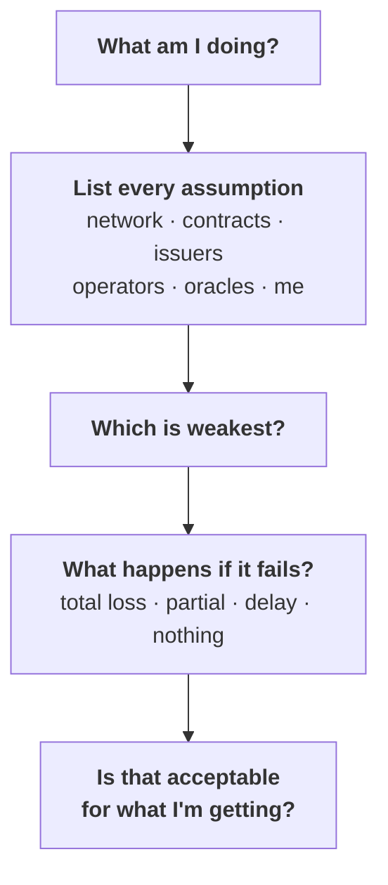

# Week 2 · Part 6 — The trust and risk map

This is the shortest page in Week 2 and the one the rest of the Foundation leans
on hardest.

Week 1 Part 5 sorted assets by what could go wrong with each. Week 1 Part 8
traced how the list of things you trust changes at every step. Parts 3 to 5 this
week showed the machinery underneath. **Today turns all of that into one
question you can ask about anything, forever.**

## Learning objectives

- List the trust assumptions behind any common Web3 action
- Explain why self-custody redistributes trust rather than removing it
- Identify which assumption in a stack is the weakest
- Apply the map to something the handbook has never mentioned

## Core

### The claim this page corrects

The popular version of Web3 is *"trustless — you don't have to trust anyone."*

That is not right, and believing it is actively dangerous, because it stops you
asking the useful question.

::: important The accurate version
**Web3 does not eliminate trust. It changes and redistributes trust
assumptions.**

You are always trusting *something*. What changes is **what**, **how many
things**, and crucially **whether you can inspect them**.
:::

Traditional finance asks you to trust institutions you cannot audit. Web3 asks
you to trust code, networks and issuers — some inspectable, some very much not.
A real improvement in some respects and a real downgrade in others. **The skill
is telling which is which.**

### The map

Each row lists everything that must hold for you to still have what you think
you have tomorrow.

<figure class="academy-shot">
<svg viewBox="0 0 640 316" width="100%" role="img" aria-labelledby="trustmap-title trustmap-desc" style="max-width:640px;margin:0 auto;display:block;overflow:visible">
  <title id="trustmap-title">The trust and risk map</title>
  <desc id="trustmap-desc">Seven common Web3 actions, each shown with the trust assumptions it carries. Holding BTC carries two; using a lending protocol carries four. The list never gets shorter as you move down.</desc>

  <text font-family="system-ui, -apple-system, sans-serif" font-size="10" font-weight="700" letter-spacing="0.06em" fill="currentColor" fill-opacity="0.6" x="150" y="22" text-anchor="end">WHAT YOU DO</text>
  <text font-family="system-ui, -apple-system, sans-serif" font-size="10" font-weight="700" letter-spacing="0.06em" fill="currentColor" fill-opacity="0.6" x="162" y="22">WHAT YOU ARE TRUSTING</text>

  <g>
    <text font-family="system-ui, -apple-system, sans-serif" font-size="11" font-weight="600" fill="currentColor" x="150" y="61" text-anchor="end">Hold BTC</text>
    <g transform="translate(162,44)"><rect width="108" height="26" rx="6" fill="#3b82f6" fill-opacity=".16" stroke="#3b82f6"/><text font-family="system-ui, -apple-system, sans-serif" font-size="9.5" font-weight="500" fill="currentColor" x="54" y="17" text-anchor="middle">Network</text></g>
    <g transform="translate(276,44)"><rect width="108" height="26" rx="6" fill="#10b981" fill-opacity=".16" stroke="#10b981"/><text font-family="system-ui, -apple-system, sans-serif" font-size="9.5" font-weight="500" fill="currentColor" x="54" y="17" text-anchor="middle">Your keys</text></g>
  </g>
  <g>
    <text font-family="system-ui, -apple-system, sans-serif" font-size="11" font-weight="600" fill="currentColor" x="150" y="99" text-anchor="end">Hold USDC</text>
    <g transform="translate(162,82)"><rect width="108" height="26" rx="6" fill="#3b82f6" fill-opacity=".16" stroke="#3b82f6"/><text font-family="system-ui, -apple-system, sans-serif" font-size="9.5" font-weight="500" fill="currentColor" x="54" y="17" text-anchor="middle">Network</text></g>
    <g transform="translate(276,82)"><rect width="108" height="26" rx="6" fill="#8b5cf6" fill-opacity=".16" stroke="#8b5cf6"/><text font-family="system-ui, -apple-system, sans-serif" font-size="9.5" font-weight="500" fill="currentColor" x="54" y="17" text-anchor="middle">Token contract</text></g>
    <g transform="translate(390,82)"><rect width="108" height="26" rx="6" fill="#f59e0b" fill-opacity=".16" stroke="#f59e0b"/><text font-family="system-ui, -apple-system, sans-serif" font-size="9.5" font-weight="500" fill="currentColor" x="54" y="17" text-anchor="middle">Issuer</text></g>
  </g>
  <g>
    <text font-family="system-ui, -apple-system, sans-serif" font-size="11" font-weight="600" fill="currentColor" x="150" y="137" text-anchor="end">Use a CEX</text>
    <g transform="translate(162,120)"><rect width="108" height="26" rx="6" fill="#f59e0b" fill-opacity=".16" stroke="#f59e0b"/><text font-family="system-ui, -apple-system, sans-serif" font-size="9.5" font-weight="500" fill="currentColor" x="54" y="17" text-anchor="middle">Exchange custody</text></g>
  </g>
  <g>
    <text font-family="system-ui, -apple-system, sans-serif" font-size="11" font-weight="600" fill="currentColor" x="150" y="175" text-anchor="end">Use a DEX</text>
    <g transform="translate(162,158)"><rect width="108" height="26" rx="6" fill="#10b981" fill-opacity=".16" stroke="#10b981"/><text font-family="system-ui, -apple-system, sans-serif" font-size="9.5" font-weight="500" fill="currentColor" x="54" y="17" text-anchor="middle">Wallet + keys</text></g>
    <g transform="translate(276,158)"><rect width="108" height="26" rx="6" fill="#8b5cf6" fill-opacity=".16" stroke="#8b5cf6"/><text font-family="system-ui, -apple-system, sans-serif" font-size="9.5" font-weight="500" fill="currentColor" x="54" y="17" text-anchor="middle">DEX contracts</text></g>
    <g transform="translate(390,158)"><rect width="108" height="26" rx="6" fill="#8b5cf6" fill-opacity=".16" stroke="#8b5cf6"/><text font-family="system-ui, -apple-system, sans-serif" font-size="9.5" font-weight="500" fill="currentColor" x="54" y="17" text-anchor="middle">Token contracts</text></g>
  </g>
  <g>
    <text font-family="system-ui, -apple-system, sans-serif" font-size="11" font-weight="600" fill="currentColor" x="150" y="213" text-anchor="end">Lending protocol</text>
    <g transform="translate(162,196)"><rect width="108" height="26" rx="6" fill="#10b981" fill-opacity=".16" stroke="#10b981"/><text font-family="system-ui, -apple-system, sans-serif" font-size="9.5" font-weight="500" fill="currentColor" x="54" y="17" text-anchor="middle">Wallet + keys</text></g>
    <g transform="translate(276,196)"><rect width="108" height="26" rx="6" fill="#8b5cf6" fill-opacity=".16" stroke="#8b5cf6"/><text font-family="system-ui, -apple-system, sans-serif" font-size="9.5" font-weight="500" fill="currentColor" x="54" y="17" text-anchor="middle">Contracts</text></g>
    <g transform="translate(390,196)"><rect width="108" height="26" rx="6" fill="#ef4444" fill-opacity=".16" stroke="#ef4444"/><text font-family="system-ui, -apple-system, sans-serif" font-size="9.5" font-weight="500" fill="currentColor" x="54" y="17" text-anchor="middle">Oracle</text></g>
    <g transform="translate(504,196)"><rect width="108" height="26" rx="6" fill="#ef4444" fill-opacity=".16" stroke="#ef4444"/><text font-family="system-ui, -apple-system, sans-serif" font-size="9.5" font-weight="500" fill="currentColor" x="54" y="17" text-anchor="middle">Collateral model</text></g>
  </g>
  <g>
    <text font-family="system-ui, -apple-system, sans-serif" font-size="11" font-weight="600" fill="currentColor" x="150" y="251" text-anchor="end">Use a bridge</text>
    <g transform="translate(162,234)"><rect width="108" height="26" rx="6" fill="#3b82f6" fill-opacity=".16" stroke="#3b82f6"/><text font-family="system-ui, -apple-system, sans-serif" font-size="9.5" font-weight="500" fill="currentColor" x="54" y="17" text-anchor="middle">Source chain</text></g>
    <g transform="translate(276,234)"><rect width="108" height="26" rx="6" fill="#ef4444" fill-opacity=".16" stroke="#ef4444"/><text font-family="system-ui, -apple-system, sans-serif" font-size="9.5" font-weight="500" fill="currentColor" x="54" y="17" text-anchor="middle">Bridge mechanism</text></g>
    <g transform="translate(390,234)"><rect width="108" height="26" rx="6" fill="#3b82f6" fill-opacity=".16" stroke="#3b82f6"/><text font-family="system-ui, -apple-system, sans-serif" font-size="9.5" font-weight="500" fill="currentColor" x="54" y="17" text-anchor="middle">Target chain</text></g>
  </g>
  <g>
    <text font-family="system-ui, -apple-system, sans-serif" font-size="11" font-weight="600" fill="currentColor" x="150" y="289" text-anchor="end">Use an L2</text>
    <g transform="translate(162,272)"><rect width="108" height="26" rx="6" fill="#3b82f6" fill-opacity=".16" stroke="#3b82f6"/><text font-family="system-ui, -apple-system, sans-serif" font-size="9.5" font-weight="500" fill="currentColor" x="54" y="17" text-anchor="middle">Ethereum</text></g>
    <g transform="translate(276,272)"><rect width="108" height="26" rx="6" fill="#8b5cf6" fill-opacity=".16" stroke="#8b5cf6"/><text font-family="system-ui, -apple-system, sans-serif" font-size="9.5" font-weight="500" fill="currentColor" x="54" y="17" text-anchor="middle">Proof system</text></g>
    <g transform="translate(390,272)"><rect width="108" height="26" rx="6" fill="#f59e0b" fill-opacity=".16" stroke="#f59e0b"/><text font-family="system-ui, -apple-system, sans-serif" font-size="9.5" font-weight="500" fill="currentColor" x="54" y="17" text-anchor="middle">Sequencer</text></g>
  </g>
</svg>
<figcaption>Blue = networks · violet = code · amber = companies · green = you · red = external inputs. Read it top to bottom: <strong>the list never shortens.</strong></figcaption>
</figure>

### Reading the map

| Row | What to notice |
|---|---|
| **Hold BTC** | The shortest row. No issuer, no contract, no company — which is precisely why the entire remaining risk is *you* |
| **Hold USDC** | Adds two. The contract could have a flaw. The issuer could fail to hold reserves, or freeze your address |
| **Use a CEX** | Collapses to one thing. You are not really trusting the blockchain at all — you are trusting a company's balance sheet |
| **Use a DEX** | Replaces the company with code. No custody, no permission — and now several sets of contracts must be correct, including a token's you did not write |
| **Lending protocol** | Adds an **oracle**, and this is the row worth dwelling on |
| **Use a bridge** | The longest, and the reason bridges are the most exploited category in the industry |

::: warning Why the oracle row matters most
The protocol needs a price to decide whether to liquidate. [Part 3](./day-3-why-ethereum-and-evm.md)
explained that contracts cannot see outside the chain, so a price must be *put*
on-chain by someone.

Corrupt that feed and the contract behaves perfectly while producing a
catastrophic outcome. **The code can be flawless and the input still wrong.**
:::

### The useful question

For anything you encounter, from now on:

::: important What has to be true, and who has to behave, for me to still have this tomorrow?
Then find the **weakest** item in the answer. Not the scariest-sounding one —
the weakest. They are frequently different, and the gap is where people get hurt.
:::

::: tip The final box is the whole point
This is not a method for **avoiding** risk. It is a method for **taking risk
deliberately** instead of accidentally.
:::

::: warning What this is not
A **conceptual tool**, not a risk-management course. It does not tell you how
much to allocate, how to hedge, or what is safe.

And it is not an argument against using anything. Every row describes things
people use every day for good reasons. The point is to be able to **name what
you accepted**.
:::

## Landscape

- **Counterparty risk** — the chance the other party fails to perform. Extreme in the CEX row
- **Smart contract risk** — bugs or exploitable logic. Audits reduce it; audited protocols still get exploited
- **Oracle risk** — bad or manipulated external data
- **Custodial risk** — someone else holding your assets
- **Systemic risk** — one failure cascading, because protocols build on one another
- **Composability** — protocols plugging into each other freely. Web3's greatest strength and the mechanism by which failures spread
- **Governance risk** — the rules being changed by whoever controls governance
- **Key management risk** — you, losing your keys. **The most common loss of all**

## Worked example

Someone deposits USDC into a lending protocol on an L2, having bridged from
Ethereum. An entirely ordinary thing to do. Here is the full stack.

| Layer | Trusting | If it fails |
|---|---|---|
| Ethereum | The L1 | Total — but this has never failed |
| The bridge | Its attestation mechanism | **Total loss** |
| The L2 | Its proof system, its sequencer today | Delay, or censorship |
| USDC contract | The code | Total loss of that token |
| Circle | Reserves, redemption, no freeze | Depegging, or a frozen address |
| Lending contracts | The code | Total loss of the deposit |
| The oracle | Honest, timely prices | **Wrongful liquidation** |
| Liquidation model | Sound economic design | Bad debt, partial loss |
| Their own keys | Themselves | Total loss of everything |

**Nine assumptions. For one deposit.**

Now the two questions that matter:

| Question | Answer |
|---|---|
| Which is **weakest**? | Almost certainly the bridge, on the historical record — with the oracle close behind, because oracle failures produce losses while every contract behaves exactly as written |
| Which is most likely to **actually get them**? | **Their own keys.** By a wide margin |

::: important The most sophisticated row is not the one that gets most people
More value is lost to lost keys, phishing and careless approvals than to every
protocol exploit combined.

Which brings the week back to [Week 0 Part 4](../../getting-started/safety.md).
**The basics are the basics because they are what actually happens.**
:::

::: details Further exploration — optional, not assessed
- [L2BEAT](https://l2beat.com/) — this exact analysis, done professionally, for every L2. Read one and compare it to your own attempt
- [ethereum.org — Oracles](https://ethereum.org/developers/docs/oracles/) — the oracle problem, which Week 3 returns to
- Pick any protocol you have heard of and build its map before Week 3. Fifteen minutes, and the single most transferable skill in this handbook
:::

::: details Sources and attribution
- [ethereum.org — Security](https://ethereum.org/security/) — Reuse (CC BY 4.0), adapted
- [ethereum.org — Bridges](https://ethereum.org/developers/docs/bridges/) — Reuse (CC BY 4.0), adapted
- [ethereum.org — Oracles](https://ethereum.org/developers/docs/oracles/) — Reuse (CC BY 4.0), adapted
- [L2BEAT](https://l2beat.com/) — Link, referenced only
:::
