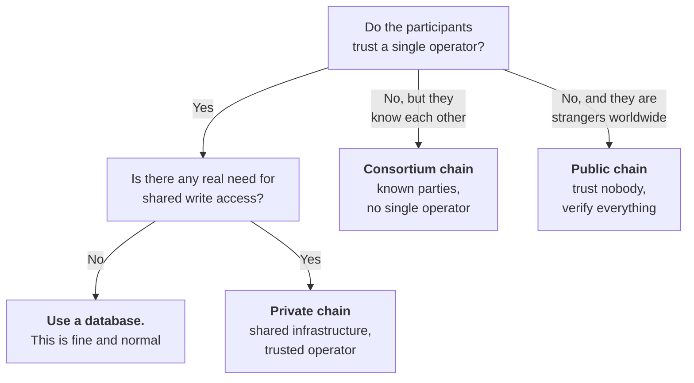

# Week 2 · Part 1 — Public, private and consortium chains

Week 1 described one kind of blockchain: anyone can read it, anyone can
participate, nobody is in charge. That is the kind this programme mostly deals
with, and it is not the only kind.

Banks, shipping consortia, hospital networks and government agencies also run
blockchains — with membership lists, access controls and named participants. To
someone who has only met public chains this looks like missing the point
entirely.

::: important It is neither a contradiction nor a mistake
It is a different point on the same set of trade-offs. Being able to place any
system on that spectrum is what today gives you.
:::

## Learning objectives

- Distinguish public, private and consortium blockchains by who can participate
- Explain permissionless vs permissioned, and why it is a separate axis
- Name what a permissioned system gains and what it gives up
- Judge, for a given use case, which model actually fits

## Core

### Two questions, not one

People collapse these into a single spectrum, and it causes real confusion.

| Question | Axis |
|---|---|
| **Who can read it?** | Public ↔ Private |
| **Who can participate in maintaining it?** | Permissionless ↔ Permissioned |

Ethereum is public and permissionless. A bank's internal chain is private and
permissioned. A consortium chain might publish some data publicly while
restricting who validates.

### The three models

<figure class="academy-reference-visual">
  
  <figcaption>Public, consortium and private chains make different choices about who can participate and who can see the record.</figcaption>
</figure>

:::: tabs
@tab Public

Anyone can read, transact, and run a node. No gatekeeper.

**Examples:** Bitcoin, Ethereum, Solana

| Aspect | Details |
|---|---|
| **Gains** | Censorship resistance, no operator to trust, anyone can verify anything, global from day one |
| **Costs** | Slower, more expensive, everything visible, and nobody can fix a mistake |
| **Use when** | Participants do not trust one another and no acceptable operator exists |

@tab Private

One organisation controls who participates and what is visible. Often a single
company across its own departments or subsidiaries.

| Aspect | Details |
|---|---|
| **Gains** | Fast, cheap, private, compliant with data rules, errors can be corrected |
| **Costs** | You are trusting the operator — the thing public chains exist to avoid |
| **Use when** | You want shared infrastructure and tamper-evident records inside a trust boundary that already exists |

::: warning The fair question to ask any private chain — out loud
*If one organisation controls it, what does the blockchain give you that a
well-run database with good audit logs would not?*

Sometimes there is a genuinely good answer: shared write access across mutually
suspicious internal parties, cryptographic auditability, easier reconciliation.
Sometimes there is not, and the honest answer is that a database would have been
fine.
:::

@tab Consortium

Several organisations jointly operate the network. No single one is in charge,
but participation is by membership.

**Examples:** trade finance networks, interbank settlement, supply chain consortia

| Aspect | Details |
|---|---|
| **Gains** | No single operator, known and accountable participants, good performance, privacy where needed |
| **Costs** | Governance is genuinely hard — members must agree on rules, upgrades and admissions — and it is only as decentralised as its membership |
| **Use when** | Several organisations need a shared record, do not fully trust one another, but know and can hold one another accountable |

This is the model most enterprise blockchain work actually uses, and where much
of the industry's non-crypto employment sits.
::::

### The trade-off, in one table

Every design decision on this page is one of five dials.

| Dimension | Public / permissionless | Consortium | Private |
|---|---|---|---|
| **Openness** | Anyone | Members only | One organisation |
| **Control** | Nobody | Shared among members | One organisation |
| **Privacy** | Everything visible | Selective | Full |
| **Decentralisation** | High | Moderate | Low |
| **Efficiency** | Low | High | Highest |

::: important Read across any row
**Openness and decentralisation trade directly against efficiency and privacy.**
There is no configuration that maximises all five. Anyone claiming otherwise is
selling something.
:::

This is Week 1 Part 1's insight — removing the operator has a cost —
generalised into a spectrum rather than a binary.

### Choosing

::: tip Being willing to say "this should be a database" is a mark of competence
The most common mistake in this industry is starting at the bottom right when
the honest answer was the top left.
:::

## Landscape

- **Hyperledger Fabric** — a widely used permissioned framework, with private channels between subsets of members. It can limit who sees or writes particular records
- **Enterprise Ethereum** — EVM-compatible deployments run under permissioned conditions. Familiar Ethereum tools can be used, but access is controlled by an organisation or consortium
- **Sidechain** — a separate chain connected to a main one, often with its own smaller validator set ([Part 5](./part-5-l1-l2-and-bridges.md)). Its connection to the main chain does not automatically give it the same security
- **Validator set** — the group permitted to produce or confirm blocks. On a public chain participation is open under the rules; on a permissioned chain membership is controlled
- **Node operator agreement** — the contractual layer a consortium chain needs to define who runs nodes and what happens when someone fails. Public networks use protocol rules instead
- **Hybrid designs** — private execution with periodic commitments anchored to a public chain. This can keep business data private while making a checkpoint publicly verifiable

## Worked example

Five ports and forty shipping companies want a shared record of container
custody. Today each keeps its own system, and reconciling disputes takes weeks.

| Option | Verdict |
|---|---|
| **Public chain** | **No.** Container movements are commercially sensitive — competitors would read each other's volumes in real time. Fees and latency also poorly match millions of routine updates |
| **Private chain, run by the largest port** | **No.** Everyone else is now trusting a competitor to operate the record. The forty-first participant will ask why, and they will be right to |
| **Consortium chain** | **Yes.** Ports and carriers jointly validate. Members are known, accountable and contractually bound. Sensitive detail stays restricted; custody handovers are shared. No single participant can rewrite history alone |

::: warning And the honest check
**Could this be a shared database run by an industry body?** Genuinely, yes — and
several such systems exist.

The argument for the consortium chain is that no member has to accept another's
system as authoritative, and disputes are settled against a record none of them
can unilaterally alter. That is a real argument. It is also a **modest** one —
and it is the kind that survives contact with reality, unlike "blockchain will
revolutionise shipping."
:::

::: details Further exploration — optional, not assessed
- [ethereum.org — Enterprise Ethereum](https://ethereum.org/enterprise/) — EVM technology in permissioned settings
- [Hyperledger Fabric documentation](https://hyperledger-fabric.readthedocs.io/) — the leading permissioned framework
- Find a real enterprise blockchain announcement and ask the database question of it. A genuinely useful habit
:::

::: details Sources and attribution
- [ethereum.org — Enterprise Ethereum](https://ethereum.org/enterprise/) — Reuse (CC BY 4.0), adapted
- [ethereum.org — Networks](https://ethereum.org/developers/docs/networks/) — Reuse (CC BY 4.0), adapted
- [ethereum.org — Nodes and clients](https://ethereum.org/developers/docs/nodes-and-clients/) — Reuse (CC BY 4.0), adapted
- [Web3 Internship Handbook](https://web3intern.xyz/zh/blockchain-basic/) — Reuse (permission granted); public, consortium and private chain visual adapted with permission
:::
