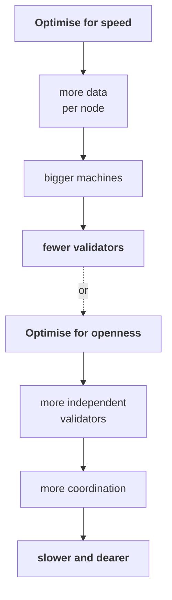

# Week 2 · Part 2 — Comparing blockchains and their trade-offs

Part 1 sorted blockchains by who is allowed in. Today sorts the public ones by
what they optimise for.

There are thousands of chains and you will never evaluate them one at a time.
What you can do is learn the handful of dimensions they all vary along.

::: important The conclusion, stated up front
**Different blockchains make different design choices. None of them is strictly
best.** A chain advertising a number without naming its cost is marketing, not
engineering.
:::

## Learning objectives

- Name the dimensions along which blockchain designs differ
- Explain the trade-off between decentralisation and throughput
- Compare two chains on three dimensions and say what each gave up
- Recognise when a performance claim has quietly omitted its cost

## Core

### Start with four questions

Before comparing detailed specifications, use four simple questions:

1. How fast and affordable is it for the thing we want to do?
2. Who can realistically help secure or validate it?
3. What can developers build on it?
4. What did the design give up to get those benefits?

These questions provide a first lens. The seven dimensions below make the lens
more complete without turning it into a memorisation exercise.

### Three useful starting shapes

Start with three familiar shapes:

- **Bitcoin:** conservative and narrow, prioritising security and predictability.
- **Ethereum:** programmable, with a broad ecosystem and a strong focus on
  decentralisation; it scales through both its base layer and Layer 2s.
- **Solana:** high performance, with higher hardware requirements and different
  trade-offs.

These are not complete verdicts. They are handles for seeing why the additional
Cosmos and Avalanche examples make different choices too.

### How closely to read them

Read **Bitcoin, Ethereum and Solana** as the main contrasting shapes. **Cosmos
and Avalanche** broaden the design space by showing other ways to organise
chains and security. You are not expected to memorise chain specifications;
use the comparisons to practise asking better questions.

### The central tension

Most of what follows reduces to one pressure.

You will hear this framed as the **blockchain trilemma** — decentralisation,
security, scalability, pick two.

::: tip Treat the trilemma as a rule of thumb, not a law
Enormous engineering effort goes into softening it, and [Part 5](./part-5-l1-l2-and-bridges.md)
covers the most successful attempt so far. But the pressure is real, and a chain
claiming to have escaped it entirely has usually just moved the cost somewhere
you were not looking.
:::

### The seven dimensions

You are not expected to memorise the specifications. Use the dimensions to ask
better questions and explain what a chain gains and gives up.

| Dimension | The question |
|---|---|
| **Decentralisation** | How many independent participants, how spread out? |
| **Finality** | How long until a transaction is genuinely settled? |
| **Throughput** | How many transactions per second? |
| **Security participation** | What does it take to help secure the network? |
| **Execution model** | What can the chain compute, and how? |
| **Ecosystem** | What already exists — tools, users, applications? |
| **Design trade-off** | What was deliberately given up, and for what? |

That last row is the one beginners skip and the one that tells you the most.

### Five representative chains

Chosen because they made genuinely different choices — not because they are the
five best.

::: warning Figures are approximate and directional
Real throughput depends on transaction type and network conditions, and
advertised maximums are almost never sustained. Use these to compare *shapes*,
not to quote numbers.
:::

::: tabs
@tab <Icon name="token-branded:bitcoin" /><strong>Bitcoin</strong>

**Maximum conservatism.**

| Aspect | Details |
|---|---|
| Consensus | Proof of Work |
| Finality | Probabilistic; roughly an hour is commonly used for high confidence |
| Throughput | Very low — a handful per second |
| Security participation | Mining: specialised hardware + electricity |
| Execution | Deliberately limited scripting. Not general-purpose |
| **Trade-off** | Gave up nearly everything for security, simplicity and predictability |

Bitcoin's limitations are not failures to fix. They are the design. Less
functionality means less to attack and less to argue about. It has kept a
deliberately narrow and conservative design since 2009.

@tab <Icon name="token-branded:ethereum" /><strong>Ethereum</strong>

**Programmability first.**

| Aspect | Details |
|---|---|
| Consensus | Proof of Stake |
| Finality | Explicit, ~13 minutes |
| Throughput | Lower at the base layer than high-throughput chains; capacity is increasing |
| Security participation | Solo validator: 32 ETH + suitable hardware. Pools let smaller holders participate economically without running their own validator |
| Execution | The EVM. General-purpose smart contracts |
| **Trade-off** | Accepted low base-layer throughput to keep validation cheap enough for ordinary hardware — then scaled via Layer 2 |

Ethereum historically kept L1 capacity conservative so that validating the chain
remained accessible, while scaling heavily through Layer 2s. Today it is scaling
both: gradually increasing L1 capacity while continuing to expand L2 capacity.

@tab <Icon name="token-branded:solana" /><strong>Solana</strong>

**Performance first.**

| Aspect | Details |
|---|---|
| Consensus | Proof of Stake, with a verifiable clock ordering transactions |
| Finality | Fast — seconds |
| Throughput | High — thousands per second |
| Security participation | **Substantial** — comparatively high-spec hardware, bandwidth and stake/economic resources |
| Execution | Parallel: non-conflicting transactions run simultaneously |
| **Trade-off** | Accepted higher validator costs, and historically some stability incidents, for speed and very low fees |

Solana genuinely delivers the performance. The honest accounting is that it
costs real money to run a validator, which concentrates who can — and the
network has had outages that Ethereum and Bitcoin have not.

@tab <Icon name="token-branded:cosmos" /><strong>Cosmos</strong>

**Many chains, not one.**

| Aspect | Details |
|---|---|
| Consensus | CometBFT — Byzantine Fault Tolerant Proof of Stake |
| Finality | **Deterministic** once a block is committed |
| Throughput | High per chain |
| Security participation | Depends on the chain's validator set or shared-security model |
| Execution | Each chain builds its own; connected via IBC |
| **Trade-off** | Many chains choose sovereignty and their own validator set; some use shared-security models instead |

Cosmos rejects the premise that everyone should share one chain. Many Cosmos
chains run their own validator sets, trading shared security for sovereignty.
Some can also use shared-security models such as Interchain Security.

@tab <Icon name="token-branded:avalanche" /><strong>Avalanche</strong>

**Avalanche L1s (formerly Subnets) and configurability.**

An **Avalanche L1** is a sovereign, application-specific network with its own
validator configuration. These networks were formerly commonly called
Subnets.

| Aspect | Details |
|---|---|
| Consensus | Avalanche consensus — repeated randomised sampling |
| Finality | Fast — around a second |
| Throughput | High |
| Security participation | Depends on the particular Avalanche L1's validator configuration |
| Execution | Multiple chains; EVM-compatible option; configurable Avalanche L1s |
| **Trade-off** | Optimised for configurable, application-specific networks over one shared environment |
:::

### Side by side

| Dimension | <Icon name="token-branded:bitcoin" /><strong>Bitcoin</strong> | <Icon name="token-branded:ethereum" /><strong>Ethereum</strong> | <Icon name="token-branded:solana" /><strong>Solana</strong> | <Icon name="token-branded:cosmos" /><strong>Cosmos</strong> | <Icon name="token-branded:avalanche" /><strong>Avalanche</strong> |
|---|---|---|---|---|---|
| Operator participation | Open under protocol rules | Broad participation is the goal; hardware, stake and client/operator spread still matter | Higher-spec hardware and stake can narrow participation | Depends on each chain and security model | Depends on each Avalanche L1 configuration |
| Finality | Probabilistic; confidence grows | Explicit; roughly minutes | Seconds | Deterministic after commit | Fast; depends on configuration |
| Throughput | Very low | Low (base) | High | High | High |
| Security participation | Mining hardware + power | Solo: 32 ETH + hardware; pools are economic participation | Higher-spec hardware + stake | Per-chain or shared-security model | Per-L1 validator configuration |
| Execution | Limited | EVM | Parallel | Per chain | Configurable |

::: tip Read the columns downward, not the rows across
These are rough qualitative descriptions of particular dimensions, not one
objective decentralisation score. The point is not that anyone set out to
choose "moderate decentralisation". Solana's emphasis on speed makes the
validator trade-off especially visible.
:::

## Landscape

- **Blockchain trilemma** — a reminder that decentralisation, security and scalability pull in different directions. A chain that improves one may accept a trade-off in another; it is a question, not a proof
- **BFT consensus** — ways for a set of validators to reach a clear decision quickly, even if some fail or behave badly. It is a family of approaches, not one single protocol
- **Parallel execution** — running independent transactions at the same time. It can process more transactions, but the chain must first know that the transactions do not conflict
- **IBC** — a Cosmos messaging standard that lets connected chains send verified messages. It does not make them one ledger, and each connection still has assumptions to check
- **Avalanche L1 / appchain** — a network dedicated to one application. Avalanche L1s were formerly commonly called Subnets; the separate network can be configured for that application's needs. Part 5
- **EVM-compatible** — a network that can run Ethereum-style contracts. Close compatibility lets tools and code be reused, but differences can still matter
- **Shared vs sovereign security** — whether a chain borrows security from another network or runs its own security. Borrowing reduces the chain's own burden; sovereignty gives control but leaves the chain responsible for its security budget
- **Client diversity** — having more than one independent software implementation of a network. It can reduce the chance that one software bug affects everyone

## Worked example

> **"Which chain should a payments app for small merchants in Southeast Asia
> use?"**

Do not start from a favourite. Start from what the application needs.

| Requirement | Consequence |
|---|---|
| Fast user-facing confirmation while the customer waits | Needs fast inclusion; the app may accept that stronger protocol finality takes longer, depending on the value and use case |
| Fees well under a cent | Rules out congested base layers |
| Stablecoin support | Needs a real ecosystem, not just a chain |
| Merchants cannot lose funds to outages | Uptime is a hard requirement |

The candidates, honestly:

| Candidate | Verdict |
|---|---|
| Bitcoin | **No.** Roughly an hour is commonly used for high confidence, and Bitcoin has no native stablecoin support |
| Ethereum L1 | **No for this target.** Fees are usually too high, and the application would need to decide whether its stronger finality delay is acceptable |
| Solana | **Plausible.** Fast, cheap, strong stablecoin usage. Weigh the outage history |
| An Ethereum L2 | **Plausible.** Cheap and fast, with Ethereum behind it |
| A Cosmos appchain | **Plausible** if you need full control. You'd bootstrap your own validators |

::: important There is no single right answer — that is the exercise
What you should be able to say is: *"We chose X. It gives us speed and low fees.
What we gave up is Y, and here is why that is acceptable for this use case."*

Someone who says "we chose X because it is the best chain" has not understood
this material.
:::

::: details Further exploration — optional, not assessed
- [Solana docs](https://solana.com/docs) · [CometBFT docs](https://docs.cometbft.com/) · [Avalanche docs](https://build.avax.network/docs) — primary sources for three of the five
- [Bitcoin whitepaper](https://bitcoin.org/bitcoin.pdf) — nine pages, and the origin of the constraints Bitcoin still honours
- **Modular blockchains and data availability layers** — the current frontier of this argument
:::

::: details Sources and attribution
- [ethereum.org — Consensus mechanisms](https://ethereum.org/developers/docs/consensus-mechanisms/) — Reuse (CC BY 4.0), adapted
- [Bitcoin whitepaper](https://bitcoin.org/bitcoin.pdf) — Link, referenced only
- [Solana documentation](https://solana.com/docs) — Link, referenced only
- [CometBFT documentation](https://docs.cometbft.com/) — Link, referenced only
- [Avalanche documentation](https://build.avax.network/docs) — Link, referenced only

*Named networks are illustrative examples, not recommendations. Performance
figures are approximate and change; verify against primary sources.*
:::
