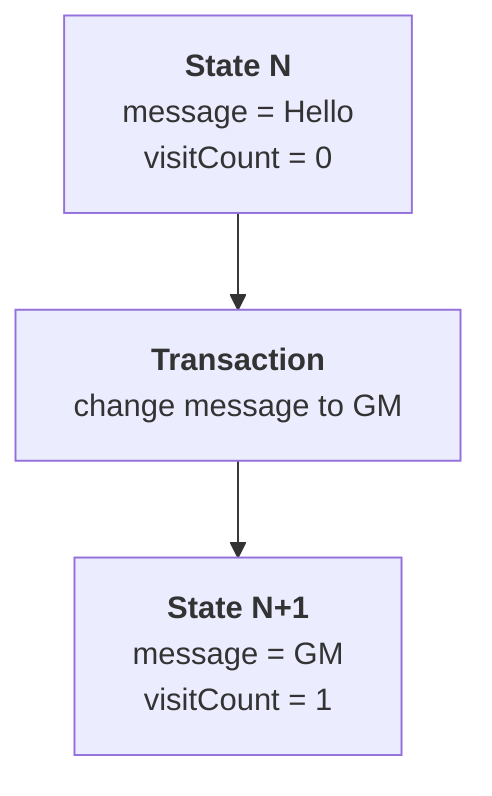
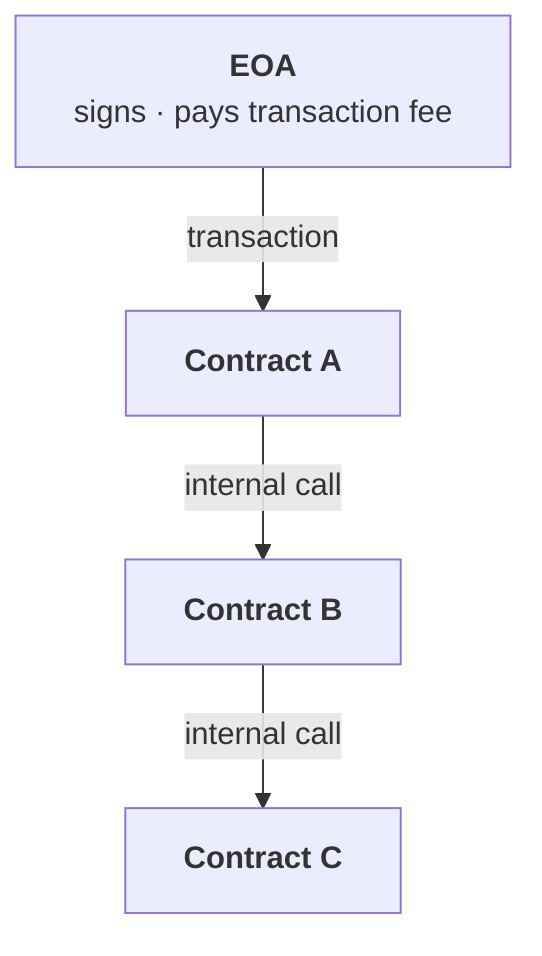

# Week 2 · Part 3 — Why we start with Ethereum and the EVM

[Part 2](./part-2-comparing-blockchains.md) showed five chains making five
different choices and deliberately did not crown a winner. So it is fair to ask
why the rest of this programme is built on Ethereum.

::: important The answer is not that Ethereum is best
It is that the EVM is the most useful **first** environment to learn. What you
learn transfers to dozens of other networks, the documentation is unusually
good, and the tooling is free.
:::

## Learning objectives

- Give three concrete reasons for learning the EVM first
- Explain what "Ethereum is a state machine" actually means
- Distinguish an EOA from a contract account
- Explain why a contract needs an external trigger

## Core

### From Bitcoin to Ethereum to the EVM

Bitcoin showed that a blockchain could maintain digital money without one
trusted ledger operator. Ethereum broadened that idea into **programmable shared
state**: the network can also run rules and applications, not just record
payments. The **EVM** is the execution environment that runs those shared rules
on Ethereum nodes.

### Why the EVM first

| Reason | Why it matters |
|---|---|
| **What you learn transfers** | Base, Arbitrum, Optimism, Polygon, Avalanche's C-Chain, BNB Chain and many others run the EVM or a close variant. Few skills in this industry have that reach |
| **The standards are everywhere** | ERC-20 for tokens, ERC-721 for NFTs and their relatives began here and were adopted almost universally |
| **The ecosystem is the largest** | More applications, documentation, answered questions and audited open-source code. When you are stuck at 11pm, the odds someone hit your exact error and wrote it down are far higher here |
| **The free tooling is excellent** | Remix runs a full development environment in a browser tab with nothing installed. Week 3 uses it |

None of this makes Ethereum technically superior. It makes it the best place to
build a foundation you can carry elsewhere — a different and more useful claim.

### Ethereum is a shared record and shared computer

Suppose a small contract currently stores:

```text
message = "Hello"
visitCount = 0
```

You send `setMessage("GM")`. After the transaction runs, it might store:

```text
message = "GM"
visitCount = 1
```

Ethereum can be pictured as two things working together:

| Part of the picture | What it does |
|---|---|
| **Shared record** | Remembers ETH balances, contract data, and token ownership |
| **Shared computer** | Follows program rules that determine how the record may change |

A transaction asks the shared computer to make a change to the shared record.
Every node follows the same rules and should reach the same result.

Engineers describe this before → instruction → after pattern as a **state
machine**. In the formal shorthand, it looks like this:



Apply the same transaction to the same starting state and the result should be
the same. That requirement matters because thousands of computers are executing
the same transaction. They cannot each produce a different answer.

The rule that makes this possible is **determinism**: the same input produces the
same output on every machine.

It also explains why smart contracts cannot freely use ordinary outside data:

::: warning The same input must be available to every node
If one node read a different web page, random value or outside clock, it could
calculate a different result and the network would no longer agree.

When a contract needs outside data, that data is put on-chain by a transaction so
every node can see the same value. A service that supplies this data is called an
**oracle** (Week 3).
:::

### The EVM

The program code needs a place to run. Each Ethereum node has an execution
environment for that job: the **Ethereum Virtual Machine**, or **EVM**. You do
not need its internals yet. Three properties matter:

| Property | Consequence |
|---|---|
| **Deterministic** | Same input, same output, on every node |
| **Sandboxed** | Contract code cannot reach the host machine, the internet, or anything outside chain state |
| **Metered** | Every operation costs gas. Run out and execution stops and reverts |

That third one answers a genuinely hard problem: how do you let strangers run
arbitrary programs on your computer without them running forever? **You charge
per step and stop when the money runs out.**

### EVM-compatible does not mean “built on Ethereum”

Here is one more distinction that prevents a common mistake. **EVM-compatible**
describes the execution environment: a network can run Ethereum-style contract
code and use familiar tools. It does not tell you who secures the network.

- **Monad** is its own Layer 1, with its own validators, consensus and final
  history, while remaining EVM-compatible.
- **Base** is an Ethereum Layer 2 that relies on Ethereum for important
  settlement or security, and it is also EVM-compatible.
- **Polygon PoS** is a connected, independently secured sidechain-style network
  that is also EVM-compatible.

Think of EVM compatibility like two computers supporting the same operating
system: compatible software can run on both, but the computers are still
separate machines with their own owners and security. The analogy stops there —
blockchains have their own execution, validator and settlement designs.

So: **EVM-compatible ≠ Ethereum L2 ≠ Ethereum sidechain.**

### Two kinds of account

Ethereum has addresses that can authorise actions with a key, and addresses that
contain program code. Engineers call the first kind an **EOA** and the second a
**contract account**.

Traditional mental model: an EOA is controlled by a private key, while a
contract account is controlled by code. Since EIP-7702, an EOA can also delegate
execution to code while remaining key-controlled, so “EOA = no code” is no
longer a strict rule. This page keeps the traditional model to make the basic
distinction clear.

| Account type | **EOA** (Externally Owned Account) | **Contract account** |
|---|---|---|
| Controlled by | A private key | Its own code |
| Can independently sign an ordinary transaction | **Yes** | **No** |
| Created by | Generating a key | Being deployed by a transaction |

Both have a `0x` address. On an explorer they look similar. They are
fundamentally different things.

### The rule that surprises everyone

::: important A contract needs a trigger
**Smart contracts do not wake up and run by themselves. Something has to trigger
their execution.**

A contract has no private key of its own, so its code does not sign or submit an
ordinary transaction by itself. In the common Foundation model, a
wallet-controlled account starts the call. The contract can then call other
contracts inside that transaction, but it cannot start the chain of execution on
a schedule or by watching the outside world.
:::

Contracts *can* call other contracts, but only as part of execution that has
already been triggered.



One signature, one fee, one atomic outcome: either the whole chain succeeds or
all of it reverts.

::: tip So when an application appears to act automatically…
A loan liquidated the moment collateral falls, a scheduled payment — **something
off-chain is watching and sending a transaction.** Usually a bot, paid a fee for
doing so.

The automation is real; it is just not the contract acting alone. Knowing this
prevents a whole family of misunderstandings about what DeFi actually is.
:::

## Landscape

- **EVM-compatible / EVM-equivalent** — a network that can run Ethereum-style contracts with some differences, or almost none. The closer the match, the more existing tools and code can be reused
- **Bytecode** — the lower-level instructions produced when Solidity is compiled. This is what the EVM runs, and people can see deployed bytecode even when the original source is not verified
- **Opcode** — one small instruction inside bytecode. Each has a gas cost; looking at opcodes can show what the machine is doing. See [evm.codes](https://www.evm.codes/)
- **Solidity** — the dominant contract language. Week 3 uses it to show how a small contract behaves
- **Vyper** — an alternative contract language, deliberately more restricted. A smaller language can make some behaviour easier to inspect, but it has a different ecosystem
- **World state** — everything Ethereum remembers about its accounts and data. A successful transaction changes this shared record
- **Account abstraction** — letting accounts be programmable, softening the simple EOA/contract split. Smart-account systems can make the user-facing flow look different, but contract code still executes when something triggers it; this is Landscape-level nuance
- **Precompiles** — built-in shortcuts for common cryptographic work. Contracts can use them instead of implementing the same expensive operation in ordinary bytecode

## Worked example

Two addresses on an explorer. Tell them apart.

::: tabs
@tab Address A — an EOA

```text
Address:        0x3f7a…c214
Balance:        0.048 ETH
Transactions:   3 (sent)
Contract:       No
Code:           —
```

It has **sent** transactions, so it holds a private key and someone signed with
it. No code. This is what your wallet from Week 1 looks like.

@tab Address B — a contract

```text
Address:        0xA0b8…eB48
Balance:        0 ETH
Transactions:   0 (sent)
Contract:       Yes ✓
Code:           0x60806040523480156100...
Token Tracker:  USD Coin (USDC)
```

Note **0 transactions sent** — as expected, since a contract does not
independently sign ordinary transactions. But it has code, storage, and it is the ledger for billions of dollars
of USDC.

USDC-related actions happen as part of execution that an account or another
contract has already triggered.
:::

::: important Now connect it to Week 1 Part 5
This is the concrete reason a token differs structurally from a coin.

- **ETH** is tracked by the protocol itself. Its balance is a field on your account
- **USDC** is tracked by contract B's storage. Your USDC balance is a row in one program's table

If contract B has a bug, USDC balances can be affected. Your native ETH balance
is tracked by Ethereum itself, not by the USDC contract. A bug in that token
contract can therefore change what it records about USDC, but it cannot rewrite
Ethereum's native ETH ledger in the same way.

That is not a difference in branding. It is a difference in what has to be true
for you to still own the thing tomorrow — exactly what
[Part 6](./part-6-trust-and-risk-map.md) turns into a reusable tool.
:::

::: details Further exploration — optional, not assessed
- [ethereum.org — Ethereum Virtual Machine](https://ethereum.org/developers/docs/evm/) — a fuller treatment
- [evm.codes](https://www.evm.codes/) — every opcode with its gas cost, interactively
- Open a contract you have heard of on Etherscan and look at its **Contract** tab. You will not understand the code yet; notice that you *can read it at all*
:::

::: details Sources and attribution
- [ethereum.org — Intro to Ethereum](https://ethereum.org/developers/docs/intro-to-ethereum/) — Reuse (CC BY 4.0), adapted
- [ethereum.org — Ethereum Virtual Machine (EVM)](https://ethereum.org/developers/docs/evm/) — Reuse (CC BY 4.0), adapted
- [ethereum.org — Ethereum accounts](https://ethereum.org/developers/docs/accounts/) — Reuse (CC BY 4.0), adapted
- [ethereum.org — Smart contracts](https://ethereum.org/developers/docs/smart-contracts/) — Reuse (CC BY 4.0), adapted
- [Monad documentation](https://docs.monad.xyz/) — Link, referenced for the EVM-compatible Layer 1 example
:::
