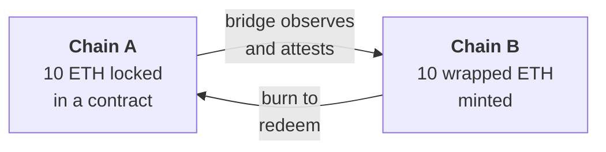
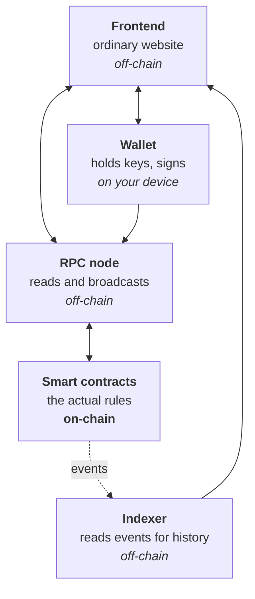

# Week 2 · Part 5 — L1, L2, sidechains and bridges

[Part 2](./part-2-comparing-blockchains.md) left Ethereum with an unresolved
scaling challenge. Ethereum historically kept L1 capacity conservative so that
validation remained accessible, while scaling heavily through Layer 2s. Today it
is scaling both: gradually increasing L1 capacity while continuing to expand L2
capacity.

This is how the scaling trade-off is managed. And once there are many networks,
a second problem appears: **they cannot see each other.**

## Learning objectives

- Explain what a Layer 2 is and what it inherits from its Layer 1
- Distinguish a Layer 2 from a sidechain by their security assumptions
- Explain why bridges are necessary and where their risk sits
- Describe the parts of a DApp and which of them are actually on-chain

## Core

### Why L2 exists

Ethereum can and does improve its L1 capacity over time. But if every L1 node
has to process dramatically more work, the hardware and bandwidth needed to
verify the chain can rise too. If independent verification becomes expensive,
fewer people may be able to participate. One scaling approach is therefore to
move much of the everyday activity elsewhere while keeping Ethereum as an
important settlement and security base.

Picture Ethereum L1 as a very secure but crowded main road. An L2 is like an
elevated expressway handling much of the everyday traffic separately. The
analogy stops here: an L2 is not simply another independent road network. It
sends enough data, results or proofs back so Ethereum can help check or settle
the L2's state according to that design.

**L2 does much of the busy work; L1 keeps the important receipts and acts as the
referee.** This is a model, not a claim that every L2 transaction is later
re-executed one by one on Ethereum.

This is why Ethereum scales in two directions at once: L1 improvements and L2
expansion.

### First-pass model

Start with the job before the labels. If Ethereum's base layer is busy, another
network can do some of the processing elsewhere and still use Ethereum as the
place that checks or settles the result.

For Foundation, keep this first-pass model:

- **L1:** the base settlement and security layer.
- **L2:** processes many transactions elsewhere and reports or proves enough
  back to an L1.
- **Sidechain:** another chain with its own security.
- **Bridge:** a mechanism for convincing one chain that something happened on
  another chain.

### The vocabulary

Learn the category before the subtype. These are the names you need first:

| Type | Plain-English idea | Examples | Question to remember |
|---|---|---|---|
| **Layer 1 (L1)** | A base blockchain that secures itself | Ethereum, Bitcoin, Solana | Who secures this network? |
| **Layer 2 (L2)** | A network that handles activity separately while relying on an L1 for important settlement or security | Base, Arbitrum, Optimism, Starknet, zkSync | What does it inherit from the L1, and what extra operators or controls do I still trust? |
| **Sidechain** | A separate connected blockchain with its own validator and security system | Polygon PoS | Who secures this chain itself? |
| **Appchain / application-specific chain** | A blockchain mainly built for one application, community or ecosystem | Avalanche L1s, many Cosmos chains | Why does this need its own chain rather than only a smart contract on a shared chain? |
| **Bridge** | Infrastructure that helps assets or messages cross between networks | Across, Wormhole | What convinces the destination network that something really happened on the source network? |

::: important The distinction that actually matters
**L2 versus sidechain — and it is about where security comes from.** Not speed,
not fees, not branding.
:::

This table gives the category names. Only now do we ask what many Ethereum L2s
use inside their architecture.

These labels answer different questions, so they can be combined rather than
treated as mutually exclusive categories:

- **Settlement / security relationship:** L1, L2 or sidechain
- **Execution environment:** EVM-compatible, or another execution environment
- **Purpose:** general-purpose or application-specific (an appchain)
- **Participation:** public, private or permissioned
- **Communication:** bridge, IBC or another cross-chain messaging mechanism

For example, **Base** can be described as an Ethereum L2 + EVM-compatible +
general-purpose; **Monad** as an L1 + EVM-compatible + general-purpose; and an
application-specific Avalanche L1 as an L1 + appchain. A chain can have several
labels because each label describes a different dimension.

### Why not just build another L1?

A new L1, such as Solana or Monad, can optimise its own architecture and keep
control of its validators, consensus and final history. But it must attract and
fund its own security, infrastructure, liquidity and ecosystem. An Ethereum L2,
such as Base or Arbitrum, handles activity separately and tries to reuse
Ethereum as an important settlement and security base, while accepting extra
L2-specific assumptions such as sequencers, upgrade controls and withdrawal
mechanisms.

In shorthand:

```text
Build a new L1  → own the whole system and the whole security problem
Build an L2     → reuse more of Ethereum and accept extra L2 machinery
```

Neither is universally better. They optimise for different things.

### Appchains are about purpose

**Appchain** describes what a chain is mainly built for, not necessarily where
its security comes from. An appchain could be its own L1, use a shared-security
model, or be an application-specific L2.

Deploying a smart contract on a general-purpose chain is like renting a shop in
someone else's city: you can build an application, but you still follow that
chain's infrastructure rules. An appchain is closer to building an industrial
campus for one company or ecosystem — more control over fees, performance,
access or infrastructure, but more responsibility as well. The analogy stops
there; the chain still needs a real security and operating model.

### How a Layer 2 works

The core idea: **do the work elsewhere, but post enough to Ethereum that
Ethereum remains the referee.**

<figure class="academy-reference-visual">
  
  <figcaption>Rollups process transactions separately and post data or proofs back to Ethereum.</figcaption>
</figure>

**Many L2 transactions can be batched into L1 postings, so the L1 cost is shared
across them.** That is where the cost reduction comes from — not from cutting
corners on verification, but from amortising it.

::: important What a mature rollup is designed to do
**A mature rollup is designed so you do not have to trust one operator forever.**
Enough data goes to Ethereum that, in principle, your balance can be
reconstructed and withdrawn even if the operators turn against you.

**But "designed to" is doing real work in that sentence.** Real networks differ
in maturity, upgrade controls, data availability and withdrawal mechanisms. Some
networks marketed as L2s do not yet provide that guarantee in practice.
:::

Many Ethereum L2s use a design called a **rollup**. In plain English, many
transactions happen away from Ethereum's base layer, then enough data, results
or proofs are brought back so Ethereum can help check or settle what happened.

There are two broad approaches. An optimistic-style rollup accepts a result
unless someone successfully challenges a bad one. A validity/ZK-style rollup
provides a cryptographic proof that the result follows the rules.

| Dimension | **Optimistic rollups** | **ZK rollups** |
|---|---|---|
| Assumption | Batches are valid unless challenged | Validity is proven mathematically |
| Challenge window | ~7 days | None needed |
| Withdrawal to L1 | Slow (the window) | Fast |
| Examples | Arbitrum, Optimism, Base | zkSync, Starknet, Linea, Scroll |

::: tip How ZK proofs work is Further Exploration
For Foundation, know that one approach **waits and watches**, the other
**proves** — and that this affects how long withdrawals take.
:::

### Sidechains are a different thing

A sidechain looks similar from the user's seat — cheaper, faster,
EVM-compatible — and is structurally quite different.

| Dimension | **Layer 2** | **Sidechain** |
|---|---|---|
| Security from | Ethereum | Its own validators |
| If operators turn malicious | Designed to allow exit via L1; maturity varies | **Your funds depend on them** |
| Data posted to L1 | Yes | No |

::: warning Do not ask only "Is this an L2?"
Ask: **what do I still have to trust?**

That question stays accurate as the ecosystem changes, and it separates networks
that genuinely inherit Ethereum's security from ones that only say they do.
[L2BEAT](https://l2beat.com/) answers it network by network, including which
self-described L2s do not yet fully qualify.
:::

Not a criticism — sidechains are a legitimate design and often perform better.
The point is that the label alone does not tell you what you are trusting.

**Polygon PoS** is a useful sidechain example: it is connected to Ethereum, but
its own validator and security system remains a separate assumption.

A sidechain may be attractive because it can choose its own validator rules and
optimise fees, performance or access while staying connected to Ethereum users,
assets and tooling. Its design says: **“I want to stay connected to the Ethereum
ecosystem, but I want to run my own security system.”** That is different from
being an L2 that aims to reuse Ethereum's security.

### Bridges

Blockchains are isolated by design. Ethereum has no way to observe Bitcoin;
Solana cannot read Ethereum's state. Each only knows its own.

Think of two blockchains as two banks keeping separate ledgers. Bank B cannot
simply assume that a balance change recorded inside Bank A's system really
happened; it needs evidence it is willing to trust. The analogy stops there — a
bridge is not a bank, but a mechanism that carries or verifies evidence between
separate on-chain systems.

Names such as **Across** and **Wormhole** are examples of systems used to move
assets or messages across networks. They do not all work the same way, so the
important question is what convinces the destination network that the event on
the source network really happened.

::: tabs
@tab Asset bridges

They move value. The usual mechanism is lock-and-mint:



Nothing physically crosses. The original is immobilised on one side and a
representation created on the other — Week 1 Part 5's wrapped assets, with the
mechanism now visible.

@tab Message bridges

They move *information* rather than value: "this happened on chain A" delivered
to chain B, so a contract there can act on it.

More general, and the foundation of cross-chain applications.
:::

### Bridge risk

::: danger Bridges have historically been a major source of large crypto exploits
Hundreds of millions of dollars have been lost in repeated incidents. The
structural reason is not bad luck.
:::

| Point | Why it matters |
|---|---|
| **1** | A bridge holds a large pool of locked assets — an unusually concentrated target |
| **2** | Something must attest that the lock really happened. **That attestation is the weak point.** Forge it and unlimited wrapped assets can be minted with nothing backing them |
| **3** | You inherit three risk surfaces at once — source chain, destination chain, and the bridge between |

Who performs that attestation varies enormously — a small multisig, a validator
set, a light client, a cryptographic proof — and the differences are the
difference between "reasonably safe" and "one compromised key away from
catastrophe".

::: important Evaluating those mechanisms is deliberately Further Exploration
For Foundation, hold this:

**A wrapped asset is only as good as the mechanism holding the original. A
bridge adds a trust assumption that neither chain had on its own.**
:::

### DApp architecture

Now place everything from this week inside one application. This is a synthesis
of the picture you have just built, not another network type: what is actually
on-chain in a typical DApp, and where do the wallet, RPC, L1/L2 and bridge fit?



**Most of a DApp is ordinary web software.** The smart contracts and blockchain
state are on-chain. Much of the frontend, RPC, indexing and user-interface
infrastructure remains off-chain.

::: warning A consequence people learn the hard way
The frontend can be compromised while the contracts remain sound. A hijacked
website serving malicious transaction requests is a well-established attack; the
contracts may simply be executing as written while the frontend misleads the
user.

This is why Week 0 insisted on **bookmarks over search results** — and why
hardware wallets showing you the actual transaction on their own screen are
valuable.
:::

## Landscape

- **Rollup** — an L2 that processes transactions away from the base chain and sends data or proofs back to it. Ethereum can check or settle the result while many users share the L1 cost
- **Fraud proof / validity proof** — two ways an L2 can show Ethereum why a result should be accepted. One lets a bad result be challenged; the other provides a mathematical proof that the result follows the rules
- **Sequencer** — the service that decides the order of many L2 transactions before a batch is posted to L1. A centralised sequencer can delay or censor transactions, but that does not automatically mean it can steal user funds
- **Data availability** — keeping the transaction details needed to check what happened or recover a position accessible. If the data disappears, checking the L2 history becomes much harder
- **Canonical vs third-party bridge** — a bridge promoted by the network, or one run independently. Neither label removes the need to check its contracts and verification process
- **IBC** — Cosmos's native messaging standard for connected chains. It lets them send verified messages without turning them into one shared ledger
- **Cross-chain protocols** — services such as LayerZero, Wormhole and Across that carry messages or assets between chains. They add another system that must be checked; see Week 4
- **Chain abstraction / intents** — a user describes the result they want, such as a swap, without choosing every chain step. The application or another service chooses the route, which is simpler but adds a new dependency

## Worked example

> **"Base fees are cents and Ethereum's are dollars. Why would anyone use
> Ethereum?"**

| Aspect | Ethereum L1 | Base (L2) |
|---|---|---|
| Fee for a swap | Typically higher | Typically lower |
| Confirmation | Explicit finality: roughly minutes | Seconds |
| Who orders transactions | Thousands of validators | **A sequencer, currently operated by Coinbase** |
| If that operator fails | N/A | Exit via Ethereum is the designed escape route — check the network's actual maturity |
| Security ultimately from | Itself | **Ethereum** |

Base is cheap **because it batches work and posts the result to Ethereum.**
Rollups aim to share Ethereum's settlement and security while accepting
additional L2-specific assumptions, such as sequencers, upgrade controls and
withdrawal maturity.

What you accept is a centralised sequencer today, which can in principle censor
or reorder, and a withdrawal path that is not instant.

::: important Both choices are correct, for different jobs
For a small everyday transaction, an L2 will often be the practical choice
because fees matter. For very high-value settlement, some users may prefer
paying more for direct L1 settlement — but the right choice depends on the
application's requirements.

That sentence is Week 2 in miniature — and [Part 6](./part-6-trust-and-risk-map.md)
turns it into a tool you can point at anything.
:::

::: details Further exploration — optional, not assessed
- [L2BEAT](https://l2beat.com/) — pick one network and read its risk summary. The clearest public writing on trust assumptions anywhere
- [ethereum.org — Layer 2](https://ethereum.org/layer-2/) — the rollup-centric strategy explained
- [ethereum.org — Bridges](https://ethereum.org/developers/docs/bridges/) — including a frank account of the risks
- **ZK proofs, data availability, modular architecture, bridge verification** — the genuine frontier, firmly optional here
:::

::: details Sources and attribution
- [ethereum.org — Layer 2](https://ethereum.org/layer-2/) — Reuse (CC BY 4.0), adapted
- [ethereum.org — Scaling](https://ethereum.org/developers/docs/scaling/) — Reuse (CC BY 4.0), adapted
- [ethereum.org — Bridges](https://ethereum.org/developers/docs/bridges/) — Reuse (CC BY 4.0), adapted
- [ethereum.org — Dapps](https://ethereum.org/dapps/) — Reuse (CC BY 4.0), adapted
- [ethereum.org — Layer 2 rollup visual](https://ethereum.org/layer-2/learn/) — Reuse (CC BY 4.0), local copy at `/learning/ethereum-org/layer-2-rollup.png`
- [L2BEAT](https://l2beat.com/) — Link, referenced only
- [Base documentation](https://docs.base.org/) · [Arbitrum documentation](https://docs.arbitrum.io/) · [Optimism documentation](https://docs.optimism.io/) — Link, referenced for current L2 examples
- [Starknet documentation](https://docs.starknet.io/) · [ZKsync documentation](https://docs.zksync.io/) — Link, referenced for current validity/ZK-style L2 examples
- [Polygon PoS documentation](https://docs.polygon.technology/pos/) — Link, referenced for the sidechain example
- [Cosmos IBC documentation](https://docs.cosmos.network/ibc/latest/ibc/overview) — Link, referenced for the IBC/appchain context
- [Across documentation](https://docs.across.to/) · [Wormhole documentation](https://wormhole.com/docs/) — Link, referenced for bridge examples

*Named networks are illustrative examples, not recommendations.*
:::
