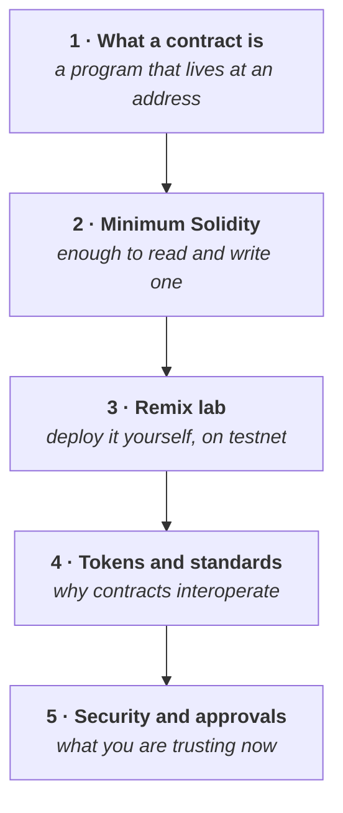

# Week 3 — Smart contracts, tokens and DApps

<svg xmlns="http://www.w3.org/2000/svg" viewBox="0 0 64 64" width="56" height="56" class="academy-week-mark" role="img" aria-labelledby="t3 d3">
  <title id="t3">A contract page with a gear</title><desc id="d3">A document with a gear on its face, representing smart contracts.</desc>
  <g fill="none" stroke="#37a4e3" stroke-width="4" stroke-linecap="round" stroke-linejoin="round">
    <rect x="12" y="5" width="40" height="54" rx="5" fill="#9aeaf6"/>
    <path d="M32.0 16.9 L36.2 21.9 L42.7 21.3 L42.1 27.8 L47.1 32.0 L42.1 36.2 L42.7 42.7 L36.2 42.1 L32.0 47.1 L27.8 42.1 L21.3 42.7 L21.9 36.2 L16.9 32.0 L21.9 27.8 L21.3 21.3 L27.8 21.9 Z" fill="#9aeaf6"/>
    <circle cx="32" cy="32" r="3.9" fill="none"/>
  </g>
</svg>

<Badge type="info" text="5 parts" /> <Badge type="tip" text="100 points" /> <Badge type="warning" text="Testnet only" />

> **Core question — how do blockchains become programmable, and what can a
> program on a blockchain actually do?**

Week 2 ended with Ethereum as a shared state machine and contracts as accounts
made of code. This is the week you write one, deploy it, and call it.

| Part | Page | Reading |
|---|---|---|
| 1 | [What a smart contract actually is](./part-1-what-is-a-smart-contract.md) | 20 min |
| 2 | [The minimum Solidity you need](./part-2-solidity-minimum.md) | 25 min |
| 3 | [Remix lab: deploy your first contract](./part-3-remix-lab.md) | 60 min hands-on |
| 4 | [Tokens, standards and real applications](./part-4-tokens-and-standards.md) | 20 min |
| 5 | [Security, approvals and permissions](./part-5-security-and-approvals.md) | 25 min |

**Anchor Mission:** [Week 3 mission](./anchor-mission.md) · 100 points

## The arc

::: warning Part 3 is the heaviest page in the Foundation
Budget up to an hour with nowhere to be. You will deploy a real contract to a test
network. Nothing costs money, but the first deployment is the point at which the
whole programme stops being abstract — give it proper time.
:::

## What this week is not

You are not becoming a smart contract developer in five days. You are becoming
someone who can **read a contract, deploy a simple one, and reason about what it
can and cannot do.**

AI assistance is explicitly allowed: the goal is to understand what you deploy,
not to type every line yourself.

Deliberately **out of scope** and left to Further Exploration or Semester 2:

| Not covered | Where it belongs |
|---|---|
| AMM maths | Further Exploration |
| Liquidation mechanics | Further Exploration |
| Advanced DeFi strategy | Semester 2 |
| Oracle architecture | Further Exploration |
| Gas optimisation, assembly, proxies | Developer track |
| Formal verification, audit methodology | Semester 2 |

::: tip Everything required is testnet only
You will deploy to the same test network you used in
[Week 1 Part 7](../week-1/part-7-your-first-transaction.md). No real funds, ever.
:::
