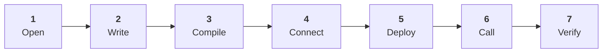

# Week 3 · Part 3 — Remix lab: deploy your first contract

::: danger Testnet only
==Everything here uses free test assets with no monetary value. **Never deploy an
Academy exercise to mainnet**, and never connect a wallet holding real funds.==
:::

Today you put a program on a blockchain. It will have its own address, anyone
can call it, and it remains publicly queryable while the testnet and its history
are maintained.

::: tip Use AI as a tutor, not an autopilot
During the walkthrough, it is fine to paste a compiler error into an AI
assistant, ask what one line does, compare the expected state before and after a
transaction, or ask for help when Remix's wording differs. Keep the provided
`Guestbook` as the canonical path: AI supports the loop of understanding,
testing and inspecting; it does not replace understanding.
:::



::: important This is your Anchor Mission evidence
Keep the contract address, the deployment transaction hash, and your write
transaction hash. You will need all three.
:::

## Learning objectives

- Compile and deploy a Solidity contract to a test network
- Call a read function and a write function, and explain the difference in cost
- Find your contract on a block explorer and read its transactions
- Explain what an event looks like from the outside

## Before you start

::: warning You need three things
1. **Your Academy wallet** from [Week 1 Part 7](../week-1/part-7-your-first-transaction.md), on the test network
2. **Test ETH** in it — deploying costs more gas than a transfer, so top up from a faucet if your balance is low
3. **A desktop browser.** Remix does not work well on mobile
:::

Nothing is installed. Remix runs entirely in a browser tab.

## Guided walkthrough

:::: steps
1. **Open Remix**

   Go to **[remix.ethereum.org](https://remix.ethereum.org/)** — use your Week 0
   bookmark.

   ::: warning Check the URL
   Fake IDE and wallet sites are a routine attack. You will connect a wallet to
   this page, so the URL matters.
   :::

   The interface has three columns: a file tree on the left, the editor in the
   middle, and plugin icons down the far left edge. *You should see a default
   workspace with some sample contracts already in it.*

   <figure class="academy-shot">
     
     <figcaption>Three areas to know: files, editor, plugins. This is an illustrative reference view; Remix's current interface may differ.</figcaption>
   </figure>

2. **Create the contract file**

   In the file explorer, open the `contracts` folder and create a new file called
   **`Guestbook.sol`**.

   Paste in the contract from [Part 2](./part-2-solidity-minimum.md):

   ```solidity title="Guestbook.sol — paste into Remix"
   // SPDX-License-Identifier: MIT
   pragma solidity ^0.8.20;

   contract Guestbook {
       string public message;
       address public lastVisitor;
       uint256 public visitCount;

       event MessageChanged(address indexed visitor, string newMessage);

       constructor() {
           message = "Hello from Blockchain@NTU";
       }

       function setMessage(string calldata newMessage) external {
           message = newMessage;
           lastVisitor = msg.sender;
           visitCount = visitCount + 1;
           emit MessageChanged(msg.sender, newMessage);
       }

       function getMessage() external view returns (string memory) {
           return message;
       }
   }
   ```

   ::: tip Personalise it
   Change the message in the constructor to something of your own. It is your
   contract, it will be public forever, and a submission that says
   `"Hello from Blockchain@NTU"` tells your reviewer nothing.
   :::

3. **Compile**

   Open the **Solidity Compiler** tab in the left icon column. Check the
   compiler version matches your `pragma` — 0.8.20 or a later compatible 0.8.x
   release — then press
   **Compile Guestbook.sol**.

   *You should get a green tick on the compiler icon.* Warnings do not normally
   block compilation, but read them before deploying; **errors are not** and must
   be fixed before you can deploy.

   <figure class="academy-shot">
     
     <figcaption>Green tick means it compiled. It does not mean the contract is correct.</figcaption>
   </figure>

4. **Connect your wallet**

   Open the **Deploy & Run Transactions** tab. In the **Environment** dropdown,
   choose **Browser Extension**, then **MetaMask**.

   ::: warning The option only appears in a browser that has your wallet
   Remix offers this because it can see a wallet extension in the browser you are
   using. Open Remix in the **same browser where MetaMask is installed**, or the
   option will not be listed at all.
   :::

   Your wallet will ask permission to connect. Approve it.

   ::: danger Check the network before you go further
   Remix will show the connected network and your account address. **Confirm it
   says the test network, not Ethereum Mainnet.**

   ==This is the single most important check on this page.== Deploying to mainnet
   costs real money.
   :::

   ::: warning Remix resets to its own simulator when the page reloads
   If the page refreshes, Environment silently reverts to **Remix VM** — a
   simulated chain inside your browser. Anything deployed there is not on any
   real network and will never appear on a block explorer.

   Two tells, either of which means you are on the simulator:

   - the account balance is a round number like 100 ETH rather than your real testnet balance
   - **no MetaMask confirmation appears** when you deploy or write

   Check the Environment field before every deploy and every write.
   :::

   <figure class="academy-shot">
     
     <figcaption>Network first, always. Then account.</figcaption>
   </figure>

5. **Deploy**

   With `Guestbook` selected in the contract dropdown, press **Deploy**.

   Your wallet opens a confirmation. **This is a transaction like any other** —
   read it the way [Week 1 Part 7](../week-1/part-7-your-first-transaction.md)
   taught you. Notice the fee is noticeably higher than a plain transfer: you are
   storing a program on-chain, and [Week 2 Part 4](../week-2/part-4-transactions-and-gas.md)
   said complexity costs more. Here is that, in practice.

   Confirm.

   <figure class="academy-shot">
     
     <figcaption>Compare this fee to your Week 1 transfer. That difference is the lesson.</figcaption>
   </figure>

   *After the transaction confirms, the Remix terminal shows a green tick, and
   your contract appears under **Deployed Contracts** at the bottom left.*

   **Copy the contract address.** You need it for the mission.

   <figure class="academy-shot">
     
     <figcaption>This address is a public deployment recorded on the testnet while its history is maintained.</figcaption>
   </figure>

6. **Call a read function**

   Expand your deployed contract. You will see buttons for each function.

   The read button is blue in the current Remix interface. Press **`message`**.

   *The answer appears immediately, underneath the button. No wallet pop-up and
   no transaction fee.* That is `view` doing exactly what [Part 2](./part-2-solidity-minimum.md)
   said it would.

7. **Call a write function**

   The **orange** button is the write function in the current Remix interface. In
   the field next to **`setMessage`**, type a new message and press it.

   Your wallet opens again.

   ::: warning For this Sepolia lab only: untick "Added protection"
   If MetaMask shows **Added protection**, untick it so this transaction is sent
   directly to your `Guestbook` and matches the explorer and Anchor Mission flow
   below. With protection enabled, MetaMask may route the top-level transaction
   through an additional contract, so the explorer view may differ.

   This is a controlled testnet exercise using a contract you deployed yourself.
   Do not treat disabling wallet protections as a general habit.
   :::

   *Once it confirms, press `message` again — the value has changed. Press
   `visitCount` — it has gone up.*

   **Copy this transaction hash.** You need it for the mission.

   <figure class="academy-shot">
     
     <figcaption>Read calls do not send a transaction. State-changing calls require a signed transaction and gas.</figcaption>
   </figure>

   ::: important You just felt the read/write distinction
   ==One button answered instantly and cost nothing. The other opened your wallet,
   cost gas, and took a block to take effect. That is not a Remix quirk. It is
   the difference between asking a node a
   question and asking the entire network to change its shared state.==
   :::

8. **Find it on the explorer**

   Paste your **contract address** into
   [sepolia.etherscan.io](https://sepolia.etherscan.io).

   You will see the contract, its creation transaction, and every call anyone has
   made to it — including yours.

   Open your `setMessage` transaction and find the **Logs** tab. The Logs tab may
   show the `MessageChanged` event by name, or lower-level log data if Etherscan
   does not decode it for you. Either view is the event record from outside the
   contract.

   <figure class="academy-shot">
     
     <figcaption>This is what an event looks like from outside. Applications read exactly this.</figcaption>
   </figure>
::::

## If something goes wrong

:::: collapse accordion
- :+ "Gas estimation failed" or the deploy button does nothing

  Usually one of three things:

  1. **Not enough test ETH.** Deploying costs more than a transfer. Top up from a faucet.
  2. **Wrong network.** Check the Environment dropdown and your wallet agree.
  3. **Not compiled.** Go back to the Compiler tab and check for a green tick.

- :- The wallet does not open when I press Deploy

  Remix lost the connection. Re-select **Browser Extension** in the
  Environment dropdown, and check the wallet extension is unlocked.

- :- Compilation errors I do not understand

  Read the **first** error only — later ones are usually knock-on effects. The
  most common causes are a missing semicolon, a mismatched `pragma` version, or a
  stray character from pasting.

  If you are stuck for more than ten minutes, paste the error into the Telegram
  group. Someone will have seen it.

- :- Optional — verify your source on Etherscan

  Not required for the mission, and genuinely worth doing.

  Etherscan's **Verify and Publish** flow checks that your submitted source matches
  the deployed bytecode. Once verified, Etherscan can show human-readable source
  and a convenient **Read/Write** interface for the functions it can identify.

  This is what [Part 1](./part-1-what-is-a-smart-contract.md) meant by verified
  source, and what [Week 0 Part 3](../../getting-started/tools.md) meant about
  explorers showing you code.
::::

## Worked example

What actually happened, in the vocabulary of the last two weeks:

| Step | What happened | Where it was covered |
|---|---|---|
| Compile | Solidity became EVM bytecode plus an ABI | [Part 2](./part-2-solidity-minimum.md) |
| Deploy | A transaction with no recipient, carrying code as data | [Week 2 Part 4](../week-2/part-4-transactions-and-gas.md) |
| Address assigned | The network derived an address for the new contract account | [Week 2 Part 3](../week-2/part-3-why-ethereum-and-evm.md) |
| Read `message` | One node answered from its own state copy. Free | [Week 2 Part 4](../week-2/part-4-transactions-and-gas.md) |
| Write `setMessage` | Signed, broadcast, verified by every node, included in a block | [Week 1 Part 2](../week-1/part-2-how-shared-state-works.md) |
| Event emitted | An announcement written to the log for outside applications | [Part 2](./part-2-solidity-minimum.md) |

::: important Notice what nobody did
No one approved your deployment. No one reviewed your code. There was no
registration, no account, no permission.

You published a program to a public network because you had a key and some test
ETH. **That is the whole thing** — and it is exactly why
[Part 5](./part-5-security-and-approvals.md) exists.
:::

::: details Further exploration — optional, not assessed
- [Remix documentation](https://remix-ide.readthedocs.io/) — the debugger and static analyser are worth an hour if you enjoyed this
- [Solidity by Example](https://solidity-by-example.org/) — deploy two or three more, each a little harder
- Add a `require` to `setMessage` so only the deployer can call it, and redeploy. That one line is the most common permission pattern in the industry
:::

::: details Sources and attribution
- [Remix IDE](https://remix.ethereum.org/) — Link, referenced only
- [Remix documentation](https://remix-ide.readthedocs.io/) — Link, referenced only
- [ethereum.org — Deploy a smart contract](https://ethereum.org/developers/docs/smart-contracts/deploying/) — Reuse (CC BY 4.0), adapted
- [Sepolia Etherscan](https://sepolia.etherscan.io/) — Link, referenced only
- [Web3 Internship Handbook](https://web3intern.xyz/zh/smart-contract-development/) — Reuse (permission granted); Remix workspace visual adapted with permission
:::
