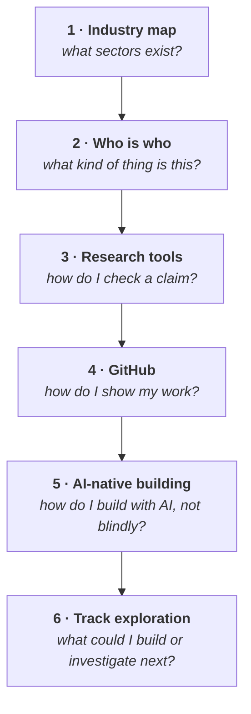

# Week 4 — Web3 industry, research and contribution

<svg xmlns="http://www.w3.org/2000/svg" viewBox="0 0 64 64" width="56" height="56" class="academy-week-mark" role="img" aria-labelledby="t4 d4">
  <title id="t4">A compass rose</title><desc id="d4">A four-pointed compass, representing choosing a direction.</desc>
  <g fill="none" stroke="#37a4e3" stroke-width="4" stroke-linecap="round" stroke-linejoin="round">
    <path d="M32 4 L39 25 L60 32 L39 39 L32 60 L25 39 L4 32 L25 25 Z" fill="#9aeaf6"/>
    <circle cx="32" cy="32" r="4" fill="none"/>
  </g>
</svg>

<Badge type="info" text="6 parts" /> <Badge type="tip" text="100 points" /> <Badge type="warning" text="No wallet work" />

::: important Foundation Pilot · Sep–Oct 2026
The current Foundation Pilot ends after Week 4. The Week 4 Track Exploration
Card is the final pilot output; the Builder and Researcher Deep Dive is the next
stage of the full Academy and is in development for **Cohort 1 · January 2027**.
:::

> **Core question — what does the Web3 world actually look like, and how do I
> investigate something I do not understand?**

Weeks 1–3 built the machine: state, consensus, incentives, assets, wallets,
contracts. This week is about the **industry built around it**, and about the one
skill that outlasts every specific fact in this handbook — knowing how to find
out.

| Part | Page | Reading |
|---|---|---|
| 1 | [The Web3 industry map](./part-1-industry-map.md) | 25 min |
| 2 | [Who is who, and what kind of thing is it](./part-2-who-is-who.md) | 25 min |
| 3 | [Which tool answers which question](./part-3-research-tool-map.md) | 25 min |
| 4 | [GitHub in practice](./part-4-github-in-practice.md) | 30 min |
| 5 | [AI-native building](./part-5-ai-native-building.md) | 20 min |
| 6 | [Track exploration card](./part-6-direction-card.md) | 25 min |

**Anchor Mission:** [Week 4 mission](./anchor-mission.md) · 100 points

## The arc

## What this week is for

Week 4 has two jobs, and they meet in the Anchor Mission.

**Recognition.** By the end you should be able to hear an unfamiliar protocol
named and place it — what sector, what kind of entity, what problem it claims to
solve — without knowing anything specific about it.

**Track exploration.** Part 6 and the mission help you make a provisional
Builder or Researcher choice, record the domains that interest you and identify
your gaps. For Foundation Pilot learners, the Track Exploration Card is the
final required Foundation output. In the full programme, it informs the W5–W6
Deep Dive; final Proof of Work scope is frozen only after Week 6.

::: important The most transferable page in the handbook
[Part 3](./part-3-research-tool-map.md) teaches which source answers which kind of
question. Every fact in this handbook will age. That skill will not.
:::
