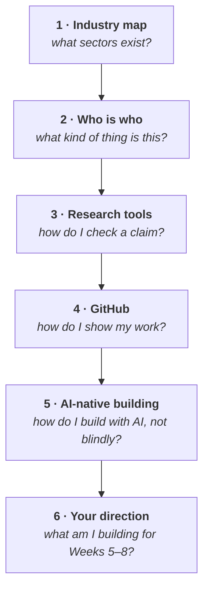

# Week 4 — Web3 industry, research and contribution

<svg xmlns="http://www.w3.org/2000/svg" viewBox="0 0 64 64" width="56" height="56" class="academy-week-mark" role="img" aria-labelledby="t4 d4">
  <title id="t4">A compass rose</title><desc id="d4">A four-pointed compass, representing choosing a direction.</desc>
  <g fill="none" stroke="#37a4e3" stroke-width="4" stroke-linecap="round" stroke-linejoin="round">
    <path d="M32 4 L39 25 L60 32 L39 39 L32 60 L25 39 L4 32 L25 25 Z" fill="#9aeaf6"/>
    <circle cx="32" cy="32" r="4" fill="none"/>
  </g>
</svg>

<Badge type="info" text="6 parts" /> <Badge type="tip" text="100 points" /> <Badge type="warning" text="No wallet work" />

> **Core question — what does the Web3 world actually look like, and how do I
> investigate something I do not understand?**

Weeks 1–3 built the machine: state, consensus, incentives, assets, wallets,
contracts. This week is about the **industry built around it**, and about the one
skill that outlasts every specific fact in this handbook — knowing how to find
out.

| Part | Page | Reading |
|---|---|---|
| 1 | [The Web3 industry map](./day-1-industry-map.md) | 16 min |
| 2 | [Who is who, and what kind of thing is it](./day-2-who-is-who.md) | 16 min |
| 3 | [Which tool answers which question](./day-3-research-tool-map.md) | 15 min |
| 4 | [GitHub in practice](./day-4-github-in-practice.md) | 14 min |
| 5 | [AI-native building](./day-5-ai-native-building.md) | 13 min |
| 6 | [Choosing your direction](./day-6-direction-card.md) | 20 min |

**Anchor Mission:** [Week 4 mission](./anchor-mission.md) · 100 points

## The arc

## What this week is for

Week 4 has two jobs, and they meet in the Anchor Mission.

**Recognition.** By the end you should be able to hear an unfamiliar protocol
named and place it — what sector, what kind of entity, what problem it claims to
solve — without knowing anything specific about it.

**Direction.** Weeks 5–8 are a build sprint in one of four directions. Part 6
and the mission are where you choose yours and scope something real.

::: important The most transferable page in the handbook
[Part 3](./day-3-research-tool-map.md) teaches which source answers which kind of
question. Every fact in this handbook will age. That skill will not.
:::

::: details Scope note — where the v1.2 §23 and §24 material lives
The Foundation v1.2 notes ask for two short additions with no obvious home:
**governance as coordination** (§23) and **identity and ownership intuition**
(§24).

Both are folded into [Part 2](./day-2-who-is-who.md) rather than given their own
pages, because v1.2 asks for "only a short mental model" and "only a short
explanation" in each case. Part 2 already distinguishes networks, tokens,
protocols, companies and DAOs, so governance and on-chain identity sit naturally
alongside it.

Detailed DAO mechanism design and DID/SBT remain out of compulsory Foundation.
:::
