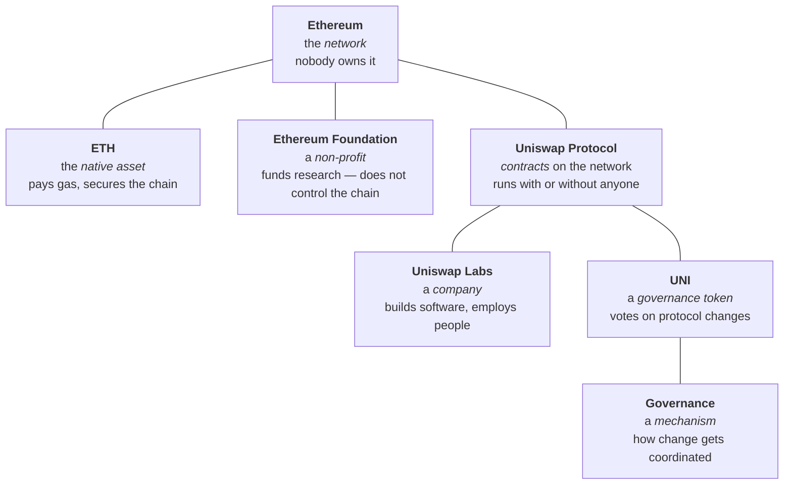

# Week 4 · Part 2 — Who is who, and what kind of thing is it

[Part 1](./day-1-industry-map.md) sorted the industry by sector. This sorts it by
**kind of thing** — and that distinction causes more confused conversations than
almost anything else in Web3.

::: important The sentence this page exists for
**network ≠ token ≠ protocol ≠ company ≠ foundation ≠ DAO**

People use these interchangeably. They are not interchangeable, they have
different owners and different failure modes, and mixing them up produces
statements that cannot be true.
:::

## Learning objectives

- Distinguish a network, a token, a protocol, a company, a foundation and a DAO
- Place a named organisation into its category and sector
- Explain what governance coordinates, and what it does not
- Explain why a wallet address is a form of identity, and why pseudonymity is not anonymity

## Core

### One example, taken fully apart

Everything below is "Ethereum" or "Uniswap" in casual speech. None of it is the
same thing.

| Thing | Category | Who controls it | If it disappeared |
|---|---|---|---|
| Ethereum | **Network** | Nobody | Everything stops |
| ETH | **Native asset** | Nobody | No way to pay gas |
| Ethereum Foundation | **Non-profit** | A board | Ethereum keeps running |
| Uniswap Protocol | **Protocol** — contracts | Nobody, once deployed | Those pools stop |
| Uniswap Labs | **Company** | Its owners | **The protocol keeps running** |
| UNI | **Token** | Its holders | Governance loses its mechanism |
| Governance | **Mechanism** | Token holders, procedurally | Changes stop being coordinated |

::: important The row that surprises people
**Uniswap Labs could shut down tomorrow and the Uniswap Protocol would keep
working.** The contracts are deployed. Nobody can switch them off.

That is not a slogan — it is the concrete, checkable difference between a company
and a protocol, and it is the clearest thing "decentralised" actually buys.

The company runs the *website*. Losing it makes the protocol harder to use, not
non-existent.
:::

### Who is who

Recognition level. The goal is to place a name, not memorise a directory.

::: tabs
@tab Networks

| | What it is |
|---|---|
| <Icon name="simple-icons:ethereum" /> **Ethereum** | The largest smart-contract network |
| <Icon name="simple-icons:solana" /> **Solana** | High-throughput L1 |
| **Base** | Ethereum L2, built by Coinbase |
| **Arbitrum** | Ethereum L2, optimistic rollup |

@tab Companies

| | Category |
|---|---|
| **Coinbase, Binance, OKX** | Centralised exchanges — custodial |
| **Circle** | Issuer of USDC |
| **Tether** | Issuer of USDT |
| **Uniswap Labs, Aave Labs** | Development companies behind protocols |
| **Alchemy, Infura** | Infrastructure providers |

::: tip Notice the pattern
Every row here is **a company with employees, investors and a jurisdiction.**
They can be sued, regulated, acquired or wound up. That is a different kind of
thing from a deployed contract.
:::

@tab Protocols

| | What it does |
|---|---|
| **Uniswap** | Decentralised exchange |
| **Aave** | Lending market |
| **Chainlink** | Oracle network |
| **LayerZero, Wormhole, Across** | Cross-chain messaging and bridging |

@tab Tools and research

| | What it is |
|---|---|
| **Dune** | On-chain data, SQL dashboards — company |
| **DefiLlama** | TVL and protocol comparison |
| **L2BEAT** | L2 risk and maturity analysis |
| **Messari** | Structured research — company |
| **OpenZeppelin** | Security and standard contract libraries — company |
| **Etherscan** | Explorer — company |
:::

### Governance — what it coordinates

::: important Four lines that cover it
> **Blockchains coordinate state.**
> **Smart contracts coordinate rules.**
> **Tokens can coordinate ownership and incentives.**
> **Governance coordinates change.**
:::

That is enough for Foundation. Governance is the answer to *"the contracts are
immutable — so how does anything ever change?"*

Usually: a proposal is discussed on a forum, an off-chain vote is taken on
Snapshot, and if it passes, an on-chain transaction executes it.

::: warning What a governance token is not
Holding one is **not ownership of a company**, not a share, and not a claim on
revenue unless the protocol specifically grants one.

And governance has real problems, named honestly in
[Part 1](./day-1-industry-map.md): turnout is often very low, and token-weighted
voting concentrates influence in the largest holders.

Detailed DAO mechanism design belongs in Semester 2.
:::

### Identity and ownership on-chain

One more short idea, and it applies to you personally now that you have an
address.

Your wallet address is a **persistent public identity**. Assets, activity,
contract interactions and credentials all accumulate against it, permanently and
visibly — [Week 1 Part 7](../week-1/day-7-your-first-transaction.md) had you look
at exactly this.

::: danger Pseudonymity is not anonymity
An address is not your name. But it is a **stable identifier with a complete,
permanent, public history** — and that history can often be linked back to a
person.

Withdraw from a KYC'd exchange to your address, and that exchange can connect
the two. Reuse one address across a forum post, an ENS name and a donation, and
anyone can connect them.

**Deanonymisation is usually done by correlation, not by breaking cryptography.**
:::

The genuine trade-off:

| Possibility | Risk |
|---|---|
| Portable reputation you own, not a platform | Your entire financial history is public |
| Credentials that follow you between applications | Permanent, and cannot be deleted |
| No platform can delete your identity | Correlation can undo pseudonymity |

::: tip Practical implication
Using separate wallets for separate purposes is a **privacy** measure as well as
a security one. [Week 0 Part 4](../../getting-started/safety.md) recommended it for
safety; this is the second reason.
:::

DID and SBT — formal decentralised identity standards — are Further Exploration,
not compulsory Foundation.

## Landscape

- **Foundation** — non-profit funding ecosystem work. Does not control a network
- **Labs / Core contributor** — the company that builds a protocol's software
- **Protocol vs interface** — the contracts, versus the website in front of them. Often different owners
- **Multisig / Safe** — how treasuries actually hold funds
- **Snapshot** — off-chain voting, used by most DAOs
- **Delegation** — assigning your voting power to someone who participates
- **ENS** — human-readable names mapped to addresses, and a public identity in itself
- **DID / SBT** — formal identity standards. Further Exploration

## Worked example

> **"Coinbase launched Base, so Base is centralised and Coinbase controls your
> funds."**

Take it apart by category.

| Claim | Assessment |
|---|---|
| Coinbase is a company | **True** |
| Coinbase built Base | **True** — Base is an Ethereum L2 |
| Coinbase operates the sequencer | **True today**, and openly acknowledged |
| Therefore Coinbase controls your funds | **Does not follow** |

Base is a **network**; Coinbase is a **company**; the sequencer is a **role**.
Conflating them produces a claim that sounds damning and is imprecise.

The accurate version, using [Week 2 Part 5](../week-2/day-5-l1-l2-and-bridges.md):

> "Base's sequencer is currently operated by Coinbase, which means it could in
> principle censor or reorder transactions. Whether users can exit to Ethereum
> without Coinbase's cooperation depends on the network's actual maturity —
> which [L2BEAT](https://l2beat.com/) assesses. Custody of your assets is not the
> same question as who orders transactions."

::: important Same underlying facts, completely different claim
The first version is a vibe. The second is checkable, and it points at where to
check.

**Being precise about categories is what turns an opinion into an analysis** —
and it is what [Part 3](./day-3-research-tool-map.md) and the Week 4 mission ask
you to do.
:::

::: details Further exploration — optional, not assessed
- [ethereum.org — Ethereum Foundation](https://ethereum.org/foundation/) — what a foundation does, and does not do
- [ethereum.org — Governance](https://ethereum.org/governance/) — how Ethereum itself changes, which is unlike most protocol governance
- [ethereum.org — Decentralized identity](https://ethereum.org/decentralized-identity/) — DIDs and verifiable credentials
- Pick a protocol you use and find its forum. Reading one real governance debate teaches more than any summary
:::

::: details Sources and attribution
- [ethereum.org — Ethereum Foundation](https://ethereum.org/foundation/) — Reuse (CC BY 4.0), adapted
- [ethereum.org — DAOs](https://ethereum.org/dao/) — Reuse (CC BY 4.0), adapted
- [ethereum.org — Governance](https://ethereum.org/governance/) — Reuse (CC BY 4.0), adapted
- [ethereum.org — Decentralized identity](https://ethereum.org/decentralized-identity/) — Reuse (CC BY 4.0), adapted

*Named organisations are illustrative examples, not recommendations.*
:::
