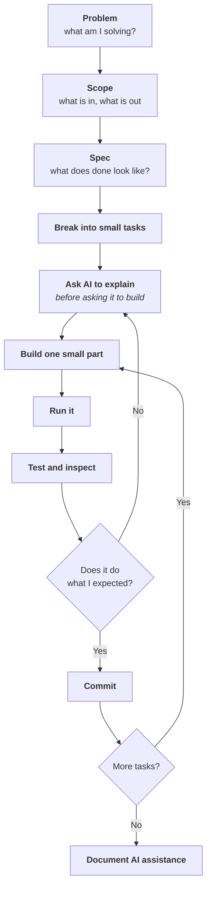

# Week 4 · Part 5 — AI-native building

You will use AI to build your Proof of Work. AI-assisted building is increasingly
common, and it is explicitly allowed in the Academy. The responsibility for
checking the result remains yours.

::: important The Academy's principle
> **AI-native building, not blind AI generation.**

The difference is not how much AI you use. It is whether **you can explain what
it produced and why you agree with it.**
:::

## Learning objectives

- Apply a working loop for building with AI rather than prompting and hoping
- Identify where AI output must be verified before it is trusted
- Explain what to check in generated code that touches keys, funds or contracts
- Document AI assistance honestly

## Core

### The loop

The failure mode is asking for the whole thing at once, getting something
plausible, and having no idea whether it works.



Two steps carry most of the value.

**"Ask AI to explain before asking it to build."** If you cannot describe what
you want in enough detail to check the answer, you are not ready to accept code.
Asking for an explanation first surfaces your own gaps.

**"Run it."** Generated code that has never executed is a guess. AI is fluent,
which makes wrong answers *read* exactly like right ones.

### What AI is genuinely good and bad at

| Good at | Unreliable at |
|---|---|
| Explaining unfamiliar code | Current facts without a live, trustworthy source |
| Boilerplate and scaffolding | Current addresses, APIs, prices, versions |
| Translating between languages | Whether a library is still maintained |
| Suggesting what to test | Security-critical logic |
| Rubber-ducking a design | Knowing what it does not know |

::: danger The specific failure mode that matters here
**AI will confidently produce a plausible contract address, API endpoint,
package name or configuration value that does not exist or is wrong.**

It reads exactly like the correct answer. In this field, a wrong address can send
funds to the wrong place and may be irreversible.

**Verify every address, endpoint and version against a primary source.** Current
facts need a live, trustworthy source; do not rely on a model's assumed cutoff.
[Part 3](./day-3-research-tool-map.md) is that skill.
:::

::: warning This handbook is an example
The first draft of Week 1 contained a SHA-256 hash that looked completely
convincing and was **fabricated**. It sat on the page that specifically teaches
*"anyone can independently verify a hash."*

It was caught by a reviewer, and confirmed in one second by running `shasum`.

That is the whole lesson: **plausible is not verified**, and the check was
trivial once someone thought to run it.
:::

### Where you must inspect and test

The [reviewer guide](https://github.com/Blockchain-NTU-SG/academy-handbook/blob/main/reviewers/review-guide.md)
draws this line, and it is a good one.

For most code, the standard is *"can you explain what it does?"*

For **security-critical logic, do not use generated code blindly**:

| Category | Why |
|---|---|
| Wallet interactions | Can move funds |
| Signatures and approvals | Can grant standing permission — [Week 3 Part 5](../week-3/day-5-security-and-approvals.md) |
| Transactions | Irreversible |
| Contract state changes | Irreversible |
| Network and address configuration | A wrong network or address can send funds to the wrong place and may be irreversible |
| Anything touching secrets | Committed keys are compromised keys |

::: important A simple rule
**If code can move funds, grant permissions, use secrets, or choose a network or
contract address, do not use it blindly.**

1. Understand what that small section is supposed to do.
2. Verify addresses and configuration against primary sources.
3. Test it on testnet.
4. Ask a reviewer or mentor when you cannot explain it.

Use established libraries instead of asking a beginner to audit cryptography.

Everything else, explain-and-move-on is fine.
:::

### Documenting AI assistance

Not a confession. A normal part of a README, and it takes three lines.

::: tip A sufficient AI disclosure
```markdown
## AI assistance

Used Claude to scaffold the data-fetching module and to explain the
Etherscan API response format. I wrote the filtering logic myself and
tested all contract interactions on Sepolia. All contract addresses were
verified against the official docs.
```
:::

That tells a reviewer what was generated, what was written, what was verified,
and what was tested. It takes a minute and it makes the rest of your work more
credible, not less.

::: warning What does not work
"Built with AI" tells a reviewer nothing.

Neither does hiding it — reviewers ask you to explain your own submission, and
[not being able to](../week-3/anchor-mission.md) is the actual failure, whether
or not AI was involved.
:::

## Landscape

- **Hallucination** — confidently generating something false. The core risk here
- **Training cutoff** — anything newer than the model's data may be wrong or invented
- **Prompt injection** — instructions hidden in content the model reads. Relevant if your project ingests external data
- **Code assistants** — Copilot, Cursor, Claude Code and similar
- **Agentic workflows** — AI running multi-step tasks. Powerful, and it compounds unverified errors
- **AI × Web3** — the sector from [Part 1](./day-1-industry-map.md). A lot of narrative; ask what the chain is load-bearing for

## Worked example

Same task, two approaches.

::: tabs
@tab Blind generation

> "Write me a Python script that tracks Uniswap trades and alerts me on large
> swaps."

You get 80 lines that look professional. Then:

- it references a package version that no longer exists
- the Uniswap contract address is **plausible and wrong**
- the event signature is from an older version of the protocol
- it has never been run

You do not know which of these is the problem, because you cannot read the code
well enough to tell. So you paste the error back, get a rewrite, and repeat.

**You end up with something you cannot debug and cannot explain.**

@tab AI-native

**Scope.** "Alert me when a swap over $100k happens in one Uniswap pool. Console
output only. Sepolia first."

**Spec.** Connect to an RPC. Watch one pool. Decode `Swap` events. Compare
against a threshold. Print.

**Explain first.** *"Explain the Uniswap V3 Swap event and what its fields
mean."* Read it. Cross-check the event definition against
[Uniswap's official documentation](https://docs.uniswap.org/).
[Part 3](./day-3-research-tool-map.md) explains why primary-source checking
matters.

**Build one piece.** Just the RPC connection. **Run it.** It works.

**Next piece.** Fetch one event. **Run it.** It fails — wrong address. You catch
it because you only changed one thing.

**Verify the address** against [Uniswap's official documentation](https://docs.uniswap.org/). Fix. Run.
Works. **Commit.**

Continue: decode, threshold, output. Each one built, run, committed.

**Document.** Three lines saying what AI produced and what you verified.
:::

::: important The difference is not AI usage — it is loop size
Both used AI heavily. The second person shipped something they can explain,
extend and debug.

The first has 80 lines they are afraid to touch.
:::

::: tip Where this actually pays off
Weeks 5–8, when something breaks in week 7 and you have to fix it. Small
verified steps leave you able to. A large unverified block leaves you starting
over.
:::

::: details Further exploration — optional, not assessed
- Take code AI wrote for you and ask a *different* model to review it. Disagreements are where the interesting problems are
- Practise writing the spec before prompting. Most bad output is a bad spec, not a bad model
- Read [ethereum.org — Smart contract security](https://ethereum.org/developers/docs/smart-contracts/security/) before accepting any AI-generated contract code
:::

::: details Sources and attribution
- [ethereum.org — Smart contract security](https://ethereum.org/developers/docs/smart-contracts/security/) — Reuse (CC BY 4.0), adapted
- [GitHub Docs — About READMEs](https://docs.github.com/en/repositories/managing-your-repositorys-settings-and-features/customizing-your-repository/about-readmes) — Reuse (CC BY 4.0), adapted
:::
