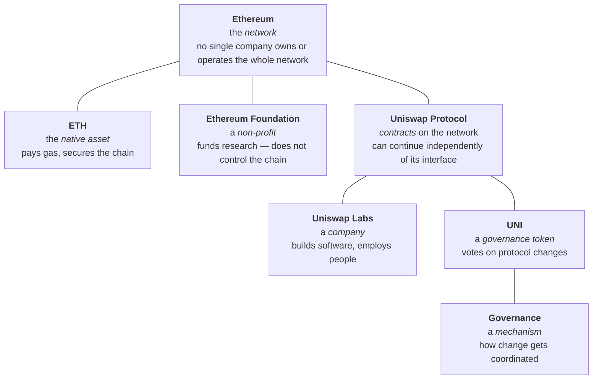

# Week 4 · Part 2 — Who is who, and what kind of thing is it

[Part 1](./part-1-industry-map.md) sorted the industry by sector. This sorts it by
**kind of thing** — and that distinction causes more confused conversations than
almost anything else in Web3.

::: important The sentence this page exists for
**network ≠ token ≠ protocol ≠ company ≠ foundation ≠ DAO**

People use these interchangeably. They are not interchangeable, they have
different owners and different failure modes, and mixing them up produces
statements that cannot be true.
:::

## Learning objectives

- Distinguish a network, a token, a protocol, a company, a foundation and a DAO
- Place a named organisation into its category and sector
- Explain what governance coordinates, and what it does not
- Explain why a wallet address is a form of identity, and why pseudonymity is not anonymity

## Core

### One example, taken fully apart

Everything below is "Ethereum" or "Uniswap" in casual speech. None of it is the
same thing.

| Thing | Category | Who controls it | If it disappeared |
|---|---|---|---|
| Ethereum | **Network** | No single operator | If the network stopped, applications using it would stop |
| ETH | **Native asset** | Nobody | No way to pay gas |
| Ethereum Foundation | **Non-profit** | A board | Ethereum keeps running |
| Uniswap Protocol | **Protocol** — contracts | Depends on deployed permissions and upgrade controls | Relevant pools or features may stop |
| Uniswap Labs | **Company** | Its owners | **The protocol keeps running** |
| UNI | **Token** | Its holders | Governance loses its mechanism |
| Governance | **Mechanism** | Token holders, procedurally | Changes stop being coordinated |

::: important The row that surprises people
**The core deployed Uniswap contracts can continue to exist and be called even if
the company behind the main interface disappears**, although interfaces,
governance and other dependencies still matter.

That is not a slogan — it is the concrete, checkable difference between a company
and a protocol, and it is the clearest thing "decentralised" actually buys.

The company runs the *website*. Losing it can make the protocol harder to use,
but that is a different dependency from the contracts themselves.
:::

### Who is who

Recognition level. The goal is to place a name, not memorise a directory.

:::: tabs
@tab Networks

| Network | What it is |
|---|---|
| <Icon name="token-branded:ethereum" /><strong>Ethereum</strong> | The largest smart-contract network |
| <Icon name="token-branded:solana" /><strong>Solana</strong> | High-throughput L1 |
| <Icon name="token-branded:base" /><strong>Base</strong> | Ethereum L2, built by Coinbase |
| <Icon name="token-branded:arbitrum" /><strong>Arbitrum</strong> | Ethereum L2, optimistic rollup |

@tab Companies

| Organisation type | Category |
|---|---|
| <Icon name="simple-icons:coinbase" /><strong>Coinbase</strong>, <Icon name="simple-icons:binance" /><strong>Binance</strong>, <Icon name="simple-icons:okx" /><strong>OKX</strong> | Centralised exchanges — custodial |
| <Icon name="simple-icons:circle" /><strong>Circle</strong> | Issuer of USDC |
| <Icon name="simple-icons:tether" /><strong>Tether</strong> | Issuer of USDT |
| <Icon name="token-branded:uniswap" /><strong>Uniswap Labs</strong>, Aave Labs | Development companies behind protocols |
| <Icon name="simple-icons:alchemy" /><strong>Alchemy</strong>, <strong>Infura</strong> | Infrastructure providers |

::: tip Notice the pattern
Every row here is **a company with employees, investors and a jurisdiction.**
They can be sued, regulated, acquired or wound up. That is a different kind of
thing from a deployed contract.
:::

@tab Protocols

| Protocol / product | What it does |
|---|---|
| <Icon name="token-branded:uniswap" /><strong>Uniswap</strong> | Decentralised exchange |
| <Icon name="token-branded:aave" /><strong>Aave</strong> | Lending market |
| <Icon name="simple-icons:chainlink" /><strong>Chainlink</strong> | Oracle network |
| **LayerZero, Wormhole, Across** | Cross-chain messaging and bridging |

@tab Tools and research

| Tool / research | What it is |
|---|---|
| <strong>Dune</strong> | On-chain data, SQL dashboards — company |
| <strong>DefiLlama</strong> | TVL and protocol comparison |
| <strong>L2BEAT</strong> | L2 risk and maturity analysis |
| <strong>Messari</strong> | Structured research — company |
| <Icon name="simple-icons:openzeppelin" /><strong>OpenZeppelin</strong> | Security and standard contract libraries — company |
| <strong>Etherscan</strong> | Explorer — company |
::::

### Governance — what it coordinates

::: important Four lines that cover it
> **Blockchains coordinate state.**
> **Smart contracts coordinate rules.**
> **Tokens can coordinate ownership and incentives.**
> **Governance coordinates change.**
:::

That is enough for Foundation. Governance is the answer to *"the contracts are
immutable — so how does anything ever change?"*

One common pattern is a proposal discussed on a forum, an off-chain vote taken
on Snapshot, and an on-chain transaction executing it if it passes.

::: warning What a governance token is not
Holding one is **not ownership of a company**, not a share, and not a claim on
revenue unless the protocol specifically grants one.

And governance has real problems, named honestly in
[Part 1](./part-1-industry-map.md): turnout is often very low, and token-weighted
voting concentrates influence in the largest holders.

Detailed DAO mechanism design belongs in Semester 2.
:::

### Identity and ownership on-chain

One more short idea, and it applies to you personally now that you have an
address.

Your wallet address is a **persistent public identity**. Assets, activity,
contract interactions and credentials can accumulate against it, creating a
public trail — [Week 1 Part 7](../week-1/part-7-your-first-transaction.md) had you
look at exactly this.

::: danger Pseudonymity is not anonymity
An address is not your name. But it is a **stable identifier with a public
history** — and repeated activity can often be linked back to a person.

Withdraw from a KYC'd exchange to your address, and that exchange can connect
the two. Reuse one address across a forum post, an ENS name and a donation, and
anyone can connect them.

**Deanonymisation is usually done by correlation, not by breaking cryptography.**
:::

The genuine trade-off:

| Possibility | Risk |
|---|---|
| Portable reputation you own, not a platform | Activity made from the same address can be linked together |
| Credentials that follow you between applications | Public activity can remain visible and is not controlled by one platform |
| On-chain records are not controlled by one platform | Correlation can undo pseudonymity |

::: tip Practical implication
Using separate wallets for separate purposes is a **privacy** measure as well as
a security one. [Week 0 Part 4](../../getting-started/safety.md) recommended it for
safety; this is the second reason.
:::

DID is a W3C standard; SBT is a design concept used by some projects, not a
universal formal standard. Both are Further Exploration, not compulsory
Foundation.

## Landscape

- **Foundation** — a non-profit that funds ecosystem work. It may support a network without controlling its rules or validators
- **Labs / Core contributor** — a company or group that builds a protocol's software. It may influence development without owning the protocol
- **Protocol vs interface** — the contracts, versus the website in front of them. They often have different owners, so a website can change while the contracts remain
- **Multisig / Safe** — a wallet requiring several signers, commonly used by treasuries. Losing enough signers can block a treasury action
- **Snapshot** — off-chain voting used by some DAOs. It records governance preference but does not itself execute a contract change
- **Delegation** — assigning your voting power to someone who participates. You gain a representative, but rely on that person's choices
- **ENS** — human-readable names mapped to addresses. They make identity easier to read, while the address and its public activity remain the underlying record
- **DID / SBT** — identity concepts used by some projects. A DID can represent an identifier, while an SBT is a non-transferable token used for something such as a credential; neither by itself proves a person's real-world identity. Further Exploration

## Worked example

> **"Coinbase launched Base, so Base is centralised and Coinbase controls your
> funds."**

Take it apart by category.

| Claim | Assessment |
|---|---|
| Coinbase is a company | **True** |
| Coinbase built Base | **True** — Base is an Ethereum L2 |
| Coinbase operates the sequencer | **True today**, and openly acknowledged |
| Therefore Coinbase controls your funds | **Does not follow** |

Base is a **network**; Coinbase is a **company**; the sequencer is a **role**.
Conflating them produces a claim that sounds damning and is imprecise.

The accurate version, using [Week 2 Part 5](../week-2/part-5-l1-l2-and-bridges.md):

> "Base's sequencer is currently operated by Coinbase, which means it could in
> principle censor or reorder transactions. Whether users can exit to Ethereum
> without Coinbase's cooperation depends on the network's actual maturity —
> which [L2BEAT](https://l2beat.com/) assesses. Custody of your assets is not the
> same question as who orders transactions."

::: important Same underlying facts, completely different claim
The first version is a vibe. The second is checkable, and it points at where to
check.

**Being precise about categories is what turns an opinion into an analysis** —
and it is what [Part 3](./part-3-research-tool-map.md) and the Week 4 mission ask
you to do.
:::

::: details Further exploration — optional, not assessed
- [ethereum.org — Ethereum Foundation](https://ethereum.org/foundation/) — what a foundation does, and does not do
- [ethereum.org — Governance](https://ethereum.org/governance/) — how Ethereum itself changes, which is unlike most protocol governance
- [ethereum.org — Decentralized identity](https://ethereum.org/decentralized-identity/) — DIDs and verifiable credentials
- Pick a protocol you use and find its forum. Reading one real governance debate teaches more than any summary
:::

::: details Sources and attribution
- [ethereum.org — Ethereum Foundation](https://ethereum.org/foundation/) — Reuse (CC BY 4.0), adapted
- [ethereum.org — DAOs](https://ethereum.org/dao/) — Reuse (CC BY 4.0), adapted
- [ethereum.org — Governance](https://ethereum.org/governance/) — Reuse (CC BY 4.0), adapted
- [ethereum.org — Decentralized identity](https://ethereum.org/decentralized-identity/) — Reuse (CC BY 4.0), adapted

*Named organisations are illustrative examples, not recommendations.*
:::
