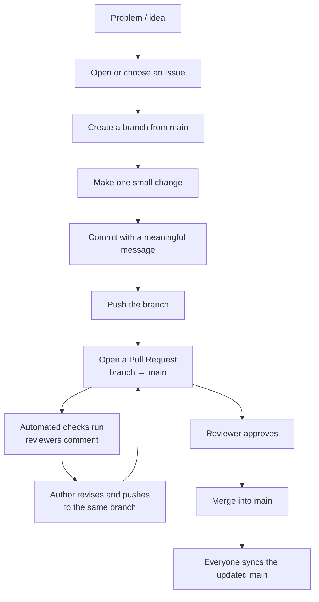

# Week 4 · Part 4 — GitHub in practice

You made an account and pushed one commit in
[Week 0 Part 1](../../getting-started/welcome-and-setup.md). This is the working
knowledge you need for Weeks 5–8, where your Proof of Work lives on GitHub.

::: important GitHub is not only for developers
**For the Academy, GitHub is the default home for your Proof of Work.**
Developers can store code there; researchers can publish analysis; data learners
can publish queries or notebooks; Product learners can publish a teardown or
documented proposal.
:::

## Learning objectives

- Use repositories, commits, branches, issues and pull requests appropriately
- Trace a small change from an Issue through branch, commit, pull request, review and merge
- Write a README someone can actually follow
- Explain why a licence matters, and choose one
- Explain how to credit sources and AI assistance honestly

## Core

### The vocabulary, in working order

| Term | What it is | When you use it |
|---|---|---|
| **Repository** | A project folder with full history | One per project |
| **Commit** | One saved change, with a message | Every meaningful step |
| **Branch** | A separate line of work used to make changes without immediately changing the main version | Developing a feature or fix without changing the main line |
| **Pull request** | A proposed change, opened for review | Contributing, or reviewing your own work |
| **Issue** | A tracked task, bug or question | Planning, and inviting help |
| **Fork** | Your own copy of someone else's repo | Contributing to a project you cannot push to |
| **README** | The front page | The first page people usually read |

::: tip Commit messages are documentation
`fix stuff` tells a future reader nothing. `fix: handle empty response from
faucet API` tells them what changed and why.

You will read your own history in Week 8 when writing up your Proof of Work.
Write for that person.
:::

### How people actually collaborate on GitHub

The vocabulary is useful only when you can see how the pieces work together. In
a real team, an Issue describes what needs changing, a branch keeps the work
separate from the shared version, and a pull request gives other people a place
to review the proposed change.



`main` is the shared accepted version in this simple model. A branch lets you
work without changing it immediately. Commits make the work reviewable in
small, dated steps. A pull request is not merely “uploading code”: it proposes
that one branch be merged into another and keeps the discussion attached to
that change.

| Step | What happens | Why teams use it |
|---|---|---|
| **Issue** | Someone records the context, problem or goal | The team can agree what it is trying to change before editing files |
| **Branch** | The author creates a separate line such as `docs/add-setup-guide` | Work can be tested and discussed without changing `main` |
| **Commit** | The author saves one meaningful step with a message | Reviewers and future collaborators can see what changed and why |
| **Pull request** | The branch is proposed for merging into `main` | The change has one place for its diff, explanation and review |
| **Checks** | Automated builds or tests run when configured | The team gets repeatable evidence before merging |
| **Review and revision** | A reviewer comments; the author edits and pushes more commits to the same branch | The PR updates automatically, so the discussion and newest version stay together |
| **Merge and sync** | An approved PR becomes part of `main`; collaborators pull the updated version | The shared project moves forward without losing the review history |

#### Same-repository collaborator or outside contributor?

The review loop is the same; the place where the branch lives differs:

| Access | Typical path |
|---|---|
| You have write access | Repository → branch → PR → review → merge |
| You do not have write access | Fork → branch in your fork → PR back to the upstream repository → review → merge |

You do not need a fork for every contribution. Use one when the repository does
not allow you to push branches directly.

#### What belongs in an Issue?

A useful Issue does not need heavy project management. It usually answers:

- **Context:** why is this being discussed?
- **Problem or goal:** what is missing, broken or worth trying?
- **Expected outcome:** what would count as done?
- **Evidence:** a link, screenshot, example or reproduction step when relevant
- **Environment:** browser, operating system, network or version information when it affects the problem

An Issue answers **“What are we trying to change?”** A PR answers **“Here is the
proposed change.”** Linking the two keeps the original goal visible while the
implementation is reviewed.

#### A complete example: missing setup instructions

Imagine the README does not explain how to run a project locally:

1. Open an Issue titled **Add local setup instructions**. Describe the missing
   steps and say that the definition of done is a new reader being able to run
   the project from a clean machine.
2. Create the branch `docs/add-setup-guide` from `main`.
3. Edit the README and test the instructions on a clean setup if possible.
4. Commit the focused change as `docs: add local setup instructions`.
5. Push the branch and open a PR. Explain what changed, why, and how you
   checked it.
6. A reviewer comments: **Please clarify the Node version.**
7. Edit the README and push another commit to the same branch. The PR updates
   automatically; you do not open a second PR.
8. The checks pass, the reviewer approves, and the PR is squash-merged according
   to the repository's convention.
9. The branch is deleted, and `main` now contains the accepted instructions.
10. Anyone continuing the work syncs their local copy with the updated `main`.

The point is the collaboration loop, not the number of Git commands. Review
comments are part of the work, not a private judgement about the person who
wrote it.

<figure class="academy-shot">
  <div class="academy-shot-pending" role="img" aria-label="Screenshot pending: a GitHub Issue titled Add local setup instructions, showing context, expected outcome, labels and any useful reproduction or environment details.">
    <span class="academy-shot-label">Screenshot needed</span>
    <span class="academy-shot-what">A GitHub Issue with a clear title, short context, definition of done, labels and any relevant evidence.</span>
  </div>
  <figcaption>An Issue gives the team a shared description of what needs changing.</figcaption>
</figure>

<figure class="academy-shot">
  <div class="academy-shot-pending" role="img" aria-label="Screenshot pending: a GitHub Pull Request showing the changed files, conversation with an inline review comment, passing checks and the merge controls, with no secrets or personal data visible.">
    <span class="academy-shot-label">Screenshot needed</span>
    <span class="academy-shot-what">A PR showing the diff, a reviewer comment, a follow-up revision, passing checks and the merge area.</span>
  </div>
  <figcaption>A PR keeps the proposed change, evidence and review conversation together.</figcaption>
</figure>

#### Commit messages: small labels for future readers

The exact prefix is a convention, not GitHub law. The useful property is that a
future collaborator can understand the change without opening every file.

| Prefix | Common meaning | Example |
|---|---|---|
| `feat:` | New functionality | `feat: add wallet balance view` |
| `fix:` | Bug fix | `fix: handle empty faucet response` |
| `docs:` | Documentation | `docs: add local setup instructions` |
| `test:` | Tests | `test: cover invalid address input` |
| `refactor:` | Internal restructuring without changing intended behaviour | `refactor: split search helpers` |
| `chore:` | Maintenance | `chore: update build script` |

#### Code review: what a useful PR tells a reviewer

A small PR normally answers:

- What changed?
- Why was it needed?
- How was it tested or checked?
- What might be affected?
- Is there anything that deserves special attention?

Small, focused PRs are easier to review than one giant change that mixes
unrelated fixes. A reviewer may ask whether the change solves the stated
problem, introduces another issue, has understandable reasoning, passes its
checks, updates the documentation and avoids secrets or security risks.

The social loop is simple:

```text
Comment → author revises → push → PR updates → reviewer re-checks
```

Keep important technical discussion in the Issue or PR rather than moving it to
private DMs. Disagreement is normal. Respond to the substance of a comment,
explain a different decision when needed, and review the change rather than the
person. Do not resolve a thread without addressing or explaining the issue.

::: details Optional command-line equivalent — not assessed
```bash
git switch main
git pull
git switch -c docs/add-setup-guide

# edit files

git add README.md
git commit -m "docs: add local setup instructions"
git push -u origin docs/add-setup-guide
```

The Issue, PR, review, checks and merge normally happen on GitHub. You can use
the website, GitHub Desktop or the command line; the collaboration model is the
same.
:::

<figure class="academy-reference-visual">
  
  <figcaption>A simple review workflow turns work into something others can inspect and improve.</figcaption>
</figure>

### The README is the front door to the deliverable

Most people spend weeks building and ten minutes on the README. Reviewers,
employers and collaborators read the README and often nothing else.

::: important A README that works
```markdown
# Project name

One sentence: what this is and who it is for.

## The problem

Two or three sentences. What is broken or missing?

## What this does

What it actually does today — not what you plan.

## How to view, reproduce or use it

Explain how someone can access, reproduce, run, or inspect the work. For code,
include setup/run steps. For research, data, or product work, explain how to
view or reproduce the output.

## How to run it (if applicable)

For code or another runnable component, give numbered steps someone else can
follow on a clean machine. Remove this section when it does not apply.

## What I learned

The part reviewers actually care about.

## Limitations and next steps

What does not work yet, and what you would do next.

## Sources and AI assistance

What you used, and where it came from.
```
:::

Two sections carry disproportionate weight.

**Limitations** signals judgement. A project claiming no weaknesses reads as
either dishonest or unexamined. Naming yours is the strongest signal in the
document.

**Access and reproduction steps** are where most fail. Instructions that work on
your machine because of something you set up months ago and forgot are not
reproducible instructions. Test them somewhere clean.

::: tip A direction-neutral delivery check
Before you share a repository, a reviewer should be able to answer four simple
questions:

- What is this, and what problem or question does it address?
- How can someone view, reproduce, run, or inspect the output?
- What evidence shows what you did or found?
- What are the limits, sources, and any important AI assistance?

The evidence can look different across the four directions: code output, a
research argument, a dataset or query, or a product walkthrough. The standard
is still the same — make the work understandable and checkable.
:::

### Licences

::: warning No licence means "all rights reserved"
Public code with no licence is **not** open source. Legally, nobody may use,
modify or distribute it. Most people assume the opposite.
:::

| Licence | Roughly |
|---|---|
| **MIT** | A common permissive software licence; reuse is allowed if the notice is kept |
| **Apache 2.0** | Like MIT, plus explicit patent terms |
| **GPL-3.0** | Derivatives must also be GPL |
| **CC BY 4.0** | For writing and documentation, not code |

For a simple software or code project, **MIT is a common, simple default**.
Written research and documentation may need a content-appropriate licence such
as Creative Commons. Choose a licence that matches what you are publishing;
[choosealicense.com](https://choosealicense.com/) walks you through software
options in two minutes.

Note the split this handbook itself uses — code under one licence, written
content under another. [Week 0 Part 3](../../getting-started/tools.md) touched on
this: a repository badge saying MIT usually refers to the *code*, not the
articles.

### Attribution, honestly

You will build on other people's work. That is normal and expected. What matters
is being straightforward about it.

| Situation | What to do |
|---|---|
| Used a library | Standard — respect its licence |
| Adapted someone's code | Credit them and link the source |
| Followed a tutorial | Say so. Nobody minds |
| Forked and modified | GitHub shows this automatically. Explain what you changed |
| Used AI substantially | Say what it produced — see [Part 5](./part-5-ai-native-building.md) |

::: important The Academy's position
**Using AI, tutorials and other people's code is expected, not penalised.**

The reviewer standard is not "did you write every line". It is
[*"can you explain what a piece of your submission does, and what would break if
it changed?"*](../week-3/anchor-mission.md)

Copying without understanding fails that test. Copying with understanding, and
saying so, is just how software gets built.
:::

## Landscape

- **`.gitignore`** — files Git should not track, such as local secrets or build output. It helps prevent accidental commits, but does not remove a secret already in history
- **GitHub Actions** — automation on a push or pull request. This handbook uses it to check that every PR builds before review
- **Branch conventions** — teams may use `main` with `feat/*`, `fix/*` and `docs/*` branches, or add `develop`, release branches or a trunk-based workflow. Repository convention wins; no single layout is universal
- **Merge methods** — merge commit, squash and merge, and rebase and merge are different ways to combine a PR. Small projects often prefer squash and merge for one clean final commit, but follow the repository's convention
- **GitHub Pages** — free static hosting for a project site. A published page is useful evidence, but it does not replace the repository's source
- **Releases and tags** — labels marking a version. They help someone return to the exact state behind a result
- **Gist** — a single-file snippet for sharing something small. It is useful for a short example, not a substitute for a maintained project repository
- **Stars, forks, watchers** — weak popularity signals. They show attention or reuse; commit history and working output say more about the work
- **CODEOWNERS** — a file saying who must review changes to which paths. It guides review, but does not make the code correct

::: danger Never commit secrets
Private keys, API keys, `.env` files, recovery phrases.

Deleting a secret in a later commit does not make it safe. Copies may already
exist in earlier history or clones. Assume anything committed to a public repo
is public.

If it happens: rotate the key immediately. Treat it as compromised, because it is.
:::

## Worked example

Two repositories from the same eight-week sprint. Same amount of work.

::: tabs
@tab The one nobody can use

```text
web3-project/
  main.py
  test.py
  notes.txt
```

- README: none, or one line
- Commits: `update`, `update`, `fix`, `asdf`
- Licence: none
- No indication of what it does or how to run it

A reviewer cannot tell what it is, whether it works, or what the member learned.
**The work may be excellent — it is unreadable, so it cannot count for anything.**

@tab The one that works

```text
sepolia-gas-tracker/
  README.md
  LICENSE
  .gitignore
  src/
  data/
  docs/screenshots/
```

- README: problem, what it does, how to run it, what was learned, limitations, sources
- Commits: `feat: add gas price fetcher`, `docs: add setup steps`, `fix: handle API timeout`
- Licence: MIT
- Screenshots showing it running

A reviewer understands it in two minutes without asking a question. So does
anyone else who finds it later.
:::

::: important The difference is about an hour of work
And it is the difference between something that counts as Proof of Work and
something that does not.

Your GitHub profile is the most durable thing you take out of this programme.
Week 8 will ask you to ship the second version — start building the habits now.
:::

::: details Further exploration — optional, not assessed
- [GitHub Skills](https://skills.github.com/) — short interactive courses; "Introduction to GitHub" takes about 20 minutes
- [GitHub Docs — GitHub flow](https://docs.github.com/en/get-started/using-github/github-flow) — the lightweight branch-based workflow
- [GitHub Docs — About pull requests](https://docs.github.com/en/pull-requests/get-started/about-pull-requests) — proposing, discussing and merging changes
- [GitHub Docs — About issues](https://docs.github.com/en/issues/tracking-your-work-with-issues/learning-about-issues/about-issues) — tracking ideas, bugs and work
- [GitHub Docs — Pull request reviews](https://docs.github.com/en/pull-requests/reference/pull-request-reviews) — comments, approvals and requested changes
- [Choose a License](https://choosealicense.com/) — two minutes, and settles the question
- Find a Web3 project you use and read its repository. Notice the README structure, the issue templates, and how contributions are reviewed
:::

::: details Sources and attribution
- [GitHub Docs — About repositories](https://docs.github.com/en/repositories/creating-and-managing-repositories/about-repositories) — Reuse (CC BY 4.0), adapted
- [GitHub Docs — About pull requests](https://docs.github.com/en/pull-requests/collaborating-with-pull-requests/proposing-changes-to-your-work-with-pull-requests/about-pull-requests) — Reuse (CC BY 4.0), adapted
- [GitHub Docs — About READMEs](https://docs.github.com/en/repositories/managing-your-repositorys-settings-and-features/customizing-your-repository/about-readmes) — Reuse (CC BY 4.0), adapted
- [GitHub Docs — GitHub flow](https://docs.github.com/en/get-started/using-github/github-flow) — Reuse (CC BY 4.0), adapted
- [GitHub Docs — About issues](https://docs.github.com/en/issues/tracking-your-work-with-issues/learning-about-issues/about-issues) — Reuse (CC BY 4.0), adapted
- [GitHub Docs — Pull request reviews](https://docs.github.com/en/pull-requests/reference/pull-request-reviews) — Reuse (CC BY 4.0), adapted
- [GitHub Skills — Introduction to GitHub](https://skills.github.com/) — Link, referenced only
- [Choose a License](https://choosealicense.com/) — Link, referenced only
- [Web3 Internship Handbook](https://web3intern.xyz/zh/smart-contract-development/) — Reuse (permission granted); GitHub workflow visual adapted with permission
:::
