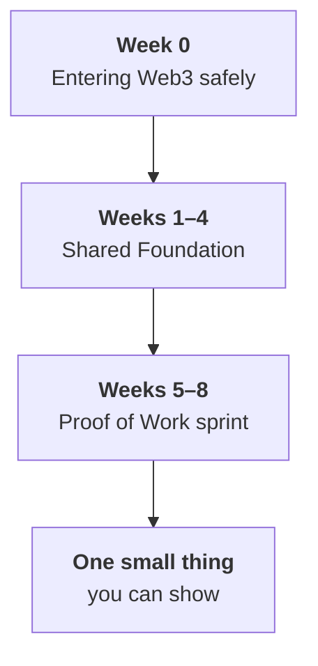

# Week 0 · Part 1 — Welcome, GitHub and the platform

You are about to spend eight weeks learning a subject where the most common
beginner experience is drowning in vocabulary, and the second most common is
losing money to something avoidable. This programme is built to prevent both.

Today is housekeeping — three accounts and a clear picture of how the Academy
works. It is the least interesting page in the handbook and the one that saves
you the most time later.

## Learning objectives

- Create a GitHub account and explain what a repository, commit and README are for
- Access the Academy platform and Telegram group, and say what each is used for
- State how missions are reviewed and what happens when one is rejected
- State the two rules that apply to every week of this programme

## Core

### How the Academy works



**Weeks 1–4 are the same for everyone.** They build a shared map of blockchains,
wallets, Ethereum, smart contracts and the wider industry. You do not choose a
specialism yet, because you cannot sensibly choose one before you know what is
out there.

**Weeks 5–8 are yours.** You pick one of four directions — Developer, Research,
Data, or Product & Ecosystem — and build one small, reviewable thing. Directions
are starting points, not restrictions.

### The weekly rhythm

Each Foundation week has a handful of short pages and **one Anchor Mission**.

| Item | Details |
|---|---|
| Anchor Missions | One per week, Weeks 1–8 |
| Points | 100 per Foundation mission, 400 for the sprint, **800 total** |
| Week 0 | No mission, no points |
| Review outcomes | **Completed** or **Rejected** — nothing in between |
| Rejected | Comes back with specific feedback. Resubmit as many times as you need |
| Deadlines | **None.** The weekly pace is a recommended rhythm |

::: important Read that last row twice
There is no penalty for taking longer. A rejection is **not a fail** — it means
something specific is missing, you will be told exactly what, and you send it
again.
:::

The pages each week are longer than the mission requires. That is on purpose:
**richer content, not heavier assessment.** Read the Core sections properly,
skim Landscape, treat Further Exploration as optional.

### Reading levels

| Level | What it means | Assessed? |
|---|---|---|
| <Badge type="danger" text="Core" /> | You should be able to explain or demonstrate this | Yes |
| <Badge type="warning" text="Landscape" /> | You should recognise it and roughly place it | No |
| <Badge type="info" text="Further Exploration" /> | Optional depth | No |

If you are short on time, Core is the part that matters.

### The three accounts you need

:::: tabs
@tab <Icon name="simple-icons:github" /> GitHub

Where developers — and increasingly researchers, analysts and product people —
keep their work in public. In this programme it serves two purposes: you will
read project code and documentation on it from Week 2, and your final Proof of
Work will live on it.

It is also, bluntly, a portfolio. A GitHub profile with real work on it is worth
more to an employer in this industry than most certificates.

@tab The Academy platform

Where cohort operations happen: your application, mission submissions, review
feedback, points and progress.

The handbook and the platform have a clean division of labour:

| Area | Handbook | Platform |
|---|---|---|
| Learning material | ✅ canonical | short operational copy |
| Anchor Mission instructions | ✅ canonical | short operational copy |
| Submitting work | — | ✅ |
| Review and feedback | — | ✅ |
| Points, progress, leaderboard | — | ✅ |

::: tip If the two ever disagree about what a mission requires
**The handbook is correct.**
:::

@tab <Icon name="simple-icons:telegram" /> Telegram

Where the cohort actually talks. Questions, stuck moments, announcements, and
the informal help that makes the difference between giving up on a broken setup
and fixing it in four minutes.

Use it. The single strongest predictor of finishing a programme like this is
whether you asked for help the first time you got stuck.

::: danger Public Web3 chat groups attract impersonators
Academy organisers will **never** DM you first asking for a seed phrase, a
private key, a wallet connection, a payment, or an "urgent verification".

Scammers copy real names and profile pictures. Verify in the main group before
acting on any direct message. See [Part 4](./safety.md).
:::
::::

### The two rules

::: danger These hold for all eight weeks and have no exceptions
**1. Testnet only.** Every hands-on activity uses a test network. Testnet coins
are free and worth nothing. No mission will ever require real money, mainnet, or
a wallet holding real assets. If a mission appears to ask this, stop and ask in
the group.

**2. Nobody asks for your keys.** No reviewer, organiser or committee member
will ever ask for your seed phrase or private key. Anyone who does is not who
they claim to be, regardless of what their profile says.
:::

## Landscape

Terms you will see on GitHub this week. Week 4 covers GitHub properly.

| Term | What it is |
|---|---|
| **Repository ("repo")** | A project folder with its full history. It gives collaborators one place to read, change and review the work |
| **Commit** | One saved change, with a message explaining what and why. Commits let you inspect how the project reached its current state |
| **README** | The front page of a repository, written in Markdown. It tells a new reader what the project is and how to use it |
| **Markdown** | Plain text with light formatting marks — this handbook is written in it. GitHub turns those marks into readable pages |
| **Issue** | A tracked task, bug or question. It keeps context and discussion attached to the work |
| **Pull request** | A proposed change, opened for review before it is merged. Reviewers can discuss and test it in one place |
| **Fork** | Your own copy of somebody else's repository. It lets you experiment or propose changes without directly changing the original |

## Guided walkthrough

:::: steps
1. **Create your GitHub account**

   Go to [github.com](https://github.com) and choose **Sign up**. Use an email
   address you will still have after you graduate.

   Pick a username you would be comfortable putting on a CV — it appears in
   every URL of every project you touch, and changing it later breaks existing
   links.

   Verify your email. *You should now be able to reach your profile at
   `github.com/your-username`.*

2. **Turn on two-factor authentication**

   **Settings → Password and authentication → Two-factor authentication.** An
   authenticator app is stronger than SMS. GitHub requires 2FA for accounts that
   contribute code, so doing it now avoids being locked out later.

   ::: tip Students
   The [GitHub Student Developer Pack](https://education.github.com/pack) is
   free with an NTU email and includes tools you will meet later. Optional, but
   it costs five minutes.
   :::

3. **Make your first repository**

   From your profile choose **Repositories → New**. Name it
   `blockchain-ntu-academy`, set it **Public**, tick **Add a README file**, and
   choose **Create repository**.

4. **Edit the README and commit**

   Open `README.md`, choose the pencil icon, and replace the contents:

   ```markdown
   # Blockchain@NTU Academy

   Learning notes and Proof of Work for Semester 1.

   ## What I want from this programme

   - Understand how blockchains actually work
   - Build something small I can show
   ```

   Choose **Commit changes**, write a short message like `docs: add README`, and
   commit. *You should now see your text rendered as a formatted page, and a
   commit count of 2.*

   That is the whole GitHub loop: **edit, describe the change, commit.**
   Everything else is a variation on it.

5. **Join the platform and the group**

   Complete your emerging.builders registration using the link in your
   acceptance email. *You should be able to see the Semester 1 programme and
   Week 1's mission slot.*

   Join the Academy Telegram group using the invite in the same email, and post
   a one-line introduction: what you study, and one thing you want to understand
   by Week 8.
::::

<figure class="academy-shot">
  <div class="academy-shot-pending" role="img" aria-label="Screenshot pending: the emerging.builders dashboard showing the Semester 1 programme and the Week 1 mission slot.">
    <span class="academy-shot-label">Screenshot needed</span>
    <span class="academy-shot-what">The emerging.builders dashboard, showing the Semester 1 programme and the Week 1 mission submission slot.</span>
  </div>
  <figcaption>What you should see once registration is complete.</figcaption>
</figure>

## Worked example

Here is what a good first week of setup looks like, and what it is worth.

Someone joining with no technical background creates a GitHub account under a
sensible username, turns on 2FA, and pushes one commit to a README. Total time:
about fifteen minutes. Nothing about it is impressive.

Eight weeks later, that same repository holds their Week 3 contract, their Week 4
Direction Card, and their final Proof of Work with a README explaining what they
built and what they would do next. The commit history shows it accumulating week
by week.

::: important The value is not any single commit
It is that there is a visible, dated trail of someone learning in public — which
is the thing this industry actually reads.
:::

::: details Further exploration — optional, not assessed
- [GitHub Skills](https://skills.github.com/) — short interactive courses. "Introduction to GitHub" takes about 20 minutes
- [GitHub Docs — Hello World](https://docs.github.com/en/get-started/start-your-journey/hello-world) — the official walkthrough, covering branches and pull requests
- [Markdown basic syntax](https://docs.github.com/en/get-started/writing-on-github/getting-started-with-writing-and-formatting-on-github/basic-writing-and-formatting-syntax) — worth ten minutes, because you will write Markdown every remaining week
:::

::: details Sources and attribution
- [GitHub Docs — Creating an account](https://docs.github.com/en/get-started/start-your-journey/creating-an-account-on-github) — Reuse (CC BY 4.0), adapted
- [GitHub Docs — Hello World](https://docs.github.com/en/get-started/start-your-journey/hello-world) — Reuse (CC BY 4.0), adapted
- [GitHub Docs — About README files](https://docs.github.com/en/repositories/managing-your-repositorys-settings-and-features/customizing-your-repository/about-readmes) — Reuse (CC BY 4.0), adapted
- [GitHub Skills](https://skills.github.com/) — Link, referenced only
:::
