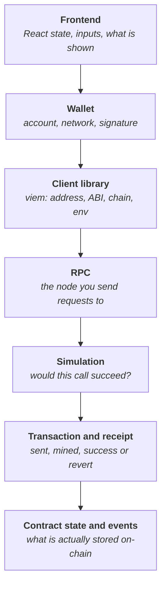

<!--
Author note (Education team): the lab app lives on the w6-2-broken-dapp branch
of the Builder starter repository. It is a finished W5-level app with planted
faults, one per layer, described to learners only as user bug reports in
LAB-W6-2.md. Do not name the faults or their fixes on this page. The model
answer and reviewer notes are kept outside the public handbook.
-->

# Week 6 · Part 2 — Simulation, debugging and tracing

> **Core question — when a Web3 app breaks, how do I find the layer that broke
> instead of guessing?**

In Week 5 you built an app where a click travels through many pieces before
anything happens on-chain. When it fails, the error usually shows up in the
browser, but the cause can be anywhere along that path: a setting, an
address, the wallet, the RPC, the contract or the page itself.

This Part teaches a method for walking that path one step at a time and
collecting evidence, so you fix the real cause rather than the first thing
that looks suspicious.

::: tip Picture a plumber tracing a leak
Water on the floor tells you something is wrong, not where. A plumber starts
at the tap and checks each joint back towards the mains until one is wet.

Where the picture stops: pipes do not change between checks, but app state
does. Re-run the same action after every change, or you may be looking at an
old result.
:::

## The hard skill

**Diagnose a failure across the Web3 stack by locating the layer that caused
it, proving it with evidence, and fixing it there.**

After this Part you can:

- name the layers a read or a write passes through;
- turn an error message into a guess about which layer failed;
- confirm or rule out that guess with a browser, an explorer or `cast`;
- write a short debugging log another developer could follow.

## Core / reference material

### The path of a request

Every read and every write in your app passes through these layers:



Reads skip the wallet and the transaction: the frontend asks viem, viem asks
the RPC, and the RPC answers from the contract's state. Writes go through
every layer.

### Where things usually go wrong

| Layer | Common failure | Typical symptom |
|---|---|---|
| Frontend | State not refreshed after a change | The page shows an old value until you reload |
| Wallet | Wrong network, rejected signature, no test ETH | Wallet error, or nothing happens after you click |
| Client library | Wrong address, wrong ABI, wrong chain, missing env variable | "returned no data", an empty list, a chain mismatch, a missing-setting error |
| RPC | Wrong URL, rate limit, outage | "HTTP request failed", timeouts |
| Simulation | The contract would revert | The custom error name, for example `EmptyRecord` |
| Transaction | Reverted on-chain, ran out of gas | A receipt with status `reverted` |
| Contract | The code does something you did not expect | Everything "works" but the stored value is wrong |

The same symptom can come from different layers. An empty activity list could
mean the contract emitted nothing, the query looked in the wrong place, or the
query asked for the wrong event. That is why you collect evidence before
changing code.

### A method that works

1. **Reproduce it.** Do the exact action again and note what you see.
2. **Read the whole error.** Copy the exact message. viem's short messages
   are usually specific: they name the function, the address or the chain.
3. **Guess the layer.** Use the table above. Ask: does it fail on a read too,
   or only on a write? Before the wallet pop-up, or after?
4. **Prove it.** Check that layer directly, outside your app. If the evidence
   does not match your guess, go back to step 3.
5. **Make the smallest fix** in that layer.
6. **Re-run the same action.** Confirm the symptom is gone, then check you
   did not create a new one.

### Tools for collecting evidence

**The browser's developer tools.** The Console tab shows errors. The Network
tab shows every request your page sends to the RPC, including the address and
method in the request body.

**A block explorer.** Paste an address into
[Sepolia Etherscan](https://sepolia.etherscan.io/) to see whether it is a
contract, which transactions it received and which events it emitted.

**`cast`, Foundry's command-line tool.** You installed it with Foundry in
Week 5. It talks to the chain directly, with no app in between, which makes it
ideal for checking one layer at a time. These commands are run against the
starter's Registry, so you can try them yourself:

```bash
# Which chain is this RPC on? Sepolia is 11155111.
cast chain-id --rpc-url $RPC_URL

# Is there contract code at this address? "0x" means there is none.
cast code 0xf3eea9aa5a43846490a638f1b2bebb29ac2938b1 --rpc-url $RPC_URL

# Read a value directly from the contract.
cast call 0xf3eea9aa5a43846490a638f1b2bebb29ac2938b1 "records(address)(string)" \
  0xE234F67EaB4638Cb6C7f93D1bfcD0bb9DCE09252 --rpc-url $RPC_URL

# Which topic does an event signature produce?
cast sig-event "RecordUpdated(address,string)"
```

*Expected results:* `11155111`; a long string of bytecode starting with
`0x6080…`; `"Hello from NTU Blockchain Builder Lab"`; and
`0xcbb1b4c2…` as the event topic. Run `source .env` first so `$RPC_URL` is
set.

**Simulation.** Before sending a write, the starter-style code calls
`simulateContract`. It runs the call against current state without spending
anything, so a revert shows up with its custom error name before the wallet
ever opens. If a write fails *before* the wallet pop-up, the problem is
probably in simulation or earlier.

### Worked example

**Report:** "The app works for me, but when my friend clicks *Save record* it
fails."

**Reproduce and read the error.** Using the friend's account, the app shows:

```text
Failed: The total cost (gas * gas fee + value) of executing this transaction exceeds the balance of the account.
```

Depending on the wallet, the same problem may appear as a warning inside
MetaMask instead.

**Guess the layer.** Reads work for the friend, so the RPC, address and ABI
are fine. The error mentions the account's balance, which points at the
**wallet** layer, not the code.

**Prove it.** Paste the friend's address into Sepolia Etherscan: the balance
is 0 SepoliaETH. Or, from the terminal:

```bash
cast balance <friend's address> --rpc-url $RPC_URL
```

which prints `0`.

**Fix.** Nothing in the code changes. The friend gets free test ETH from a
faucet, as in [Week 1 Part 7](../../../foundation/week-1/part-7-your-first-transaction.md).

**Re-run.** The save succeeds.

**Log entry:**

| Symptom | Layer | Evidence | Fix |
|---|---|---|---|
| Save fails with "total cost … exceeds the balance" for one user only | Wallet | Reads work for that user; explorer and `cast balance` show 0 SepoliaETH | Get test ETH from a faucet; no code change |

Notice the order: the error message suggested a layer, and independent
evidence confirmed it before anything changed.

::: details Landscape — transaction tracing
When a transaction is mined but does something unexpected, a **trace** shows
every call it made inside the contract, step by step. `cast run <tx hash>`
replays a mined transaction locally and prints its trace, and services such as
Tenderly show the same thing in a browser. You do not need traces for this
Part. They become useful when contracts call other contracts.
:::

## Hands-on task

The lab is on the `w6-2-broken-dapp` branch of your starter repository. It is
a finished version of the Registry app, with a wallet connection, your record,
a form to update it and an activity list, and it has been broken in several
places.

1. **Get the lab and run it.**

   ```bash
   git fetch origin
   git checkout w6-2-broken-dapp
   npm ci
   cp .env.example .env
   npm run dev
   ```

   Connect MetaMask on **Ethereum Sepolia**, using your Academy test wallet
   with a little test ETH.

2. **Work through the bug reports** in `LAB-W6-2.md`, in order. Fixing one
   fault can reveal the next.
3. **For each fault**, follow the method: reproduce, read the error, guess the
   layer, prove it with evidence from outside the app, make the smallest fix,
   re-run.
4. **Keep a debugging log** with one row per fault, like the worked example.
5. **Finish with a working app.** The page loads without errors, your record
   loads, the activity list shows events, saving works, and the new record
   appears without a page reload.

**Out of scope:** redesigning the app, adding features, changing the contract
and deploying anything new.

::: tip Use AI as a pair, not a replacement
An AI assistant can suggest what an error means. Treat the suggestion as a
guess about the layer, then prove it with your own evidence before you change
code. A fix you cannot explain is not a finished fix.
:::

## Evidence required

- Your fixed code (a link to your branch or commit, or the diff).
- Your debugging log: one row per fault with the symptom, the layer, the
  evidence that confirmed it, and the fix.
- One screenshot of the working app after a successful save, showing the
  updated record.

## Completion and revision

This Part is worth **100 points**. Completed / approved earns the full points;
incomplete or materially incorrect work is returned with specific feedback for
revision. There is no partial-score rubric.

::: details Further exploration — optional, not assessed
- Make the app tell the user *which* setting is wrong when the RPC is on the
  wrong chain, by checking `getChainId()` on start-up.
- Show a friendly message when the public RPC rate-limits you, and let the
  user retry, instead of a raw error.
- Try `cast run` on one of your own Sepolia transactions and read its trace.
:::

::: details Sources and attribution
- [viem — Errors](https://viem.sh/docs/error-handling) — Link, referenced only
- [viem — simulateContract](https://viem.sh/docs/contract/simulateContract) — Link, referenced only
- [Foundry Book — cast](https://getfoundry.sh/cast/overview) — Link, referenced only
- [Vite — Env variables and modes](https://vite.dev/guide/env-and-mode) — Link, referenced only
- [Blockchain@NTU Academy Builder starter](https://github.com/Blockchain-NTU-SG/academy-builder-starter) — Reuse (MIT), the `Registry` app and the `w6-2-broken-dapp` lab
:::
